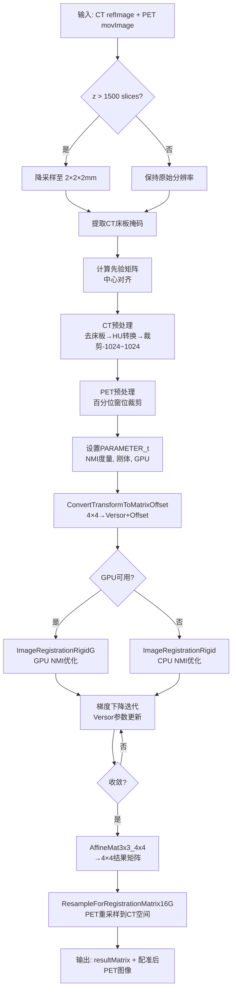

# CT-PET 刚体配准算法详细文档

> **文档定位**：本文档详细整理了联影医疗影像算法工程中 CT-PET（及 MR-PET）刚体配准的完整实现链路，涵盖从临床应用接口到底层 CUDA 内核的所有层级。

---

## 目录

1. [系统架构总览](#1-系统架构总览)
2. [类继承体系](#2-类继承体系)
3. [数据结构](#3-数据结构)
4. [CT-PET 配准完整流程](#4-ct-pet-配准完整流程)
5. [图像预处理](#5-图像预处理)
6. [先验矩阵初始化](#6-先验矩阵初始化)
7. [参数配置详解](#7-参数配置详解)
8. [相似性度量——归一化互信息 (NMI)](#8-相似性度量归一化互信息-nmi)
9. [变换模型——Versor 三维刚体](#9-变换模型versor-三维刚体)
10. [优化器——正则化梯度下降](#10-优化器正则化梯度下降)
11. [GPU 加速实现](#11-gpu-加速实现)
12. [重采样输出](#12-重采样输出)
13. [MR-PET 配准对比](#13-mr-pet-配准对比)
14. [关键代码索引](#14-关键代码索引)

---

## 1. 系统架构总览

CT-PET 刚体配准采用**四层架构**，自上而下依次为：

```
┌─────────────────────────────────────────────────────────────┐
│  应用层 (algo-fusion-app)                                    │
│  FusionRegistrationCT_PET                                    │
│  ├── AutoRegistration()          ← 自动配准入口              │
│  ├── RegistrationWithPriorMatrix() ← 带先验矩阵配准          │
│  └── RegistrationTool()          ← 核心配准工具（虚函数）     │
├─────────────────────────────────────────────────────────────┤
│  工具层 (McsfAlgoRegFusionCommon)                            │
│  AlgoFusion::DoRigidReg()       ← 刚体配准统一封装           │
│  ├── ConvertTransformToMatrixOffset()  ← 4×4矩阵→旋转+偏移   │
│  ├── ComputeSampleStep()        ← 自适应采样步长             │
│  └── AffineMat3x3_4x4()        ← 3×3+偏移→4×4矩阵           │
├─────────────────────────────────────────────────────────────┤
│  算法层 (algo-registration / algo-registrationgpu)           │
│  CPU: ImageRegistrationRigid()                               │
│  GPU: ImageRegistrationRigidG()                              │
│  ├── PARAMETER_t    ← 参数配置                               │
│  ├── coptimization  ← 优化器                                 │
│  ├── CMutualInformationMetric ← NMI 度量                     │
│  └── TransformModel ← 变换模型                               │
├─────────────────────────────────────────────────────────────┤
│  CUDA 内核层 (algo-registrationgpu)                          │
│  ├── MutualInformationMetricG.cu  ← GPU NMI 计算             │
│  ├── TransformModelG.cu          ← GPU 变换                  │
│  └── ResampleG.cu                ← GPU 重采样                │
└─────────────────────────────────────────────────────────────┘
```

### 核心设计理念

- **多模态配准**：CT 和 PET 是完全不同的成像模态（CT 反映组织密度 HU 值，PET 反映代谢活性 SUV 值），**不能使用 MSE（均方误差）**，必须使用 **NMI（归一化互信息）** 作为相似性度量
- **GPU 优先**：代码中 `bUseGPU=true` 被硬编码，GPU 路径为默认路径
- **先验矩阵驱动**：通过解剖关键点定位提供初始对齐，大幅缩短优化收敛时间

---

## 2. 类继承体系

```
FusionRegistrationBase (基类)
├── FusionRegistrationCT_CT    ← CT-CT 配准（同模态，用MSE或NMI）
├── FusionRegistrationCT_PET   ← CT-PET 配准（多模态，用NMI）★本文档重点
├── FusionRegistrationCT_MR    ← CT-MR 配准（多模态，用NMI）
├── FusionRegistrationMR_MR    ← MR-MR 配准
├── FusionRegistrationMR_PET   ← MR-PET 配准（多模态，用NMI）
└── FusionRegistrationPET_PET  ← PET-PET 配准
```

### `FusionRegistrationCT_PET` 类定义

```cpp
// 文件: algo-fusion-app/include/algo-fusion-app/McsfAlgoRegistrationApplicationFusion.h

/// \note refImage-CT, movImage-PET
class MCSF_ALGO_REGISTRATION_APPLICATION_FUSION_API FusionRegistrationCT_PET
    : public FusionRegistrationBase
{
public:
    FusionRegistrationCT_PET(std::shared_ptr<unsigned char>& pCTBedMask);

    virtual bool AutoRegistration(
        const CVolumeDataInfo& refImage,      // CT 图像
        const CVolumeDataInfo& movImage,      // PET 图像
        bool bIsSameFOR,                       // 是否同一坐标系
        double resultMatrix[16],               // 输出: 4×4 变换矩阵
        short* pOutImage = nullptr,            // 输出: 重采样后的PET图像
        bool bUseGPU = false,
        IProgress* pProgress = nullptr,
        bool bBrainData = false);

    virtual bool RegistrationWithPriorMatrix(...);

protected:
    virtual bool RegistrationTool(
        const CVolumeDataInfo& refImage,       // CT（已预处理）
        const CVolumeDataInfo& movImage,       // PET（已预处理）
        const double pPriorMatrix[16],         // 先验矩阵
        bool isAuto,
        double resultMatrix[16],
        short* pOutImage = nullptr,
        bool bUseGPU = false,
        IProgress* pProgress = nullptr);

private:
    unsigned char* m_pCTBedMask;  // CT 床板掩码
};
```

> **关键约定**：`refImage` 始终是 CT，`movImage` 始终是 PET。配准目标是找到变换矩阵 $T$，使得 $PET_{transformed}(x) \approx CT(x)$。

---

## 3. 数据结构

### 3.1 `CVolumeDataInfo` —— 体数据信息

```cpp
// 文件: algo-registration/include/algo-registration/McsfAlgoRegistration.h

class CVolumeDataInfo
{
public:
    short* pImage;              // 像素数据（short 类型）
    unsigned int uiSize[3];     // [Width, Height, SliceNum]
    double dSpacing[3];         // [spacingX, spacingY, spacingZ] (mm)
    double dPosition[3];        // 第一张切片的空间位置
    double dOrientation[6];     // 方向向量 [rowX,rowY,rowZ, colX,colY,colZ]
    double RescaleSlope;        // 斜率: HU = pixel * Slope + Intercept
    double RescaleIntercept;    // 截距
};
```

### 3.2 `PARAMETER_t` —— 配准参数

```cpp
class PARAMETER_t
{
private:
    unsigned int dim;                    // 维度 (3 for 3D)
    bool m_bAffine;                      // true=仿射, false=刚体
    bool m_bRotate;                      // 是否包含旋转
    unsigned int NumOfBins;              // 直方图bin数 (50~80)
    double MaxIterationStep;             // 最大步长
    double MinIterationStep;             // 最小步长（终止条件）
    unsigned int MaxIterationNum;        // 最大迭代次数
    double dRelaxationFactor;            // 松弛因子 (0,1)
    double dMagnitudeTolerance;          // 梯度模长容忍度
    unsigned int uiMetricOption;         // 1=NMI, 其他=MSE
    bool bMultiResolution;               // 多分辨率开关
    bool m_bResolutionControl;           // 分辨率控制（采样步长）
    bool m_bUseGPU;                      // GPU 开关
    bool m_bUseMultiThread;              // 多线程开关
    unsigned int m_SampleStep[3];        // 三轴采样步长
    double m_dMinEffectiveSampleRatio;   // 最小有效采样比例
    bool m_IfUsePriorMatrix;             // 是否使用先验矩阵
    double* m_PriorMatrix;               // 先验矩阵（旋转部分）
    bool m_IfUseSampleRegionMask;        // 是否使用采样区域掩码
    unsigned char* m_SampleRegionMask;   // 采样区域掩码
    short nSampleIntensityLevel;         // 采样强度下限
    // ...
};
```

---

## 4. CT-PET 配准完整流程

### 4.1 调用链路

```
用户调用
  │
  ▼
FusionRegistrationCT_PET::AutoRegistration(refCT, movPET, ...)
  │
  ├── 1. 大数据降采样 (if z>1500 slices → 2×2×2mm)
  ├── 2. CT 床板掩码提取 (ExtractBedMask_fast)
  ├── 3. 先验矩阵计算 (PreJudge → 中心对齐)
  │
  ▼
FusionRegistrationCT_PET::RegistrationWithPriorMatrix(refCT, movPET, pPriorMatrix, ...)
  │
  ├── (重复降采样和床板处理)
  ▼
FusionRegistrationCT_PET::RegistrationTool(refCT, movPET, pPriorMatrix, ...)
  │
  ├── 4. CT 预处理: 去床板 + HU转换 + 窗位裁剪 [-1024, 1024]
  ├── 5. PET 预处理: 降采样统计 + 百分位窗位裁剪
  ├── 6. 构造 bodyMask (CT非床板区域)
  ├── 7. 设置 PARAMETER_t 参数
  ▼
AlgoFusion::DoRigidReg(para, pCT_processed, pPET_processed, pPriorMatrix, ...)
  │
  ├── 8. ConvertTransformToMatrixOffset: 4×4先验矩阵 → Versor旋转 + 偏移
  ├── 9. 选择 CPU/GPU 路径
  │     ├── GPU: ImageRegistrationRigidG(...)
  │     └── CPU: ImageRegistrationRigid(...)
  │
  ├── 10. 优化迭代 (梯度下降)
  │      ├── 采样参考图像域
  │      ├── 计算 NMI 值和梯度
  │      ├── 更新变换参数 (Versor)
  │      └── 收敛判断
  │
  ├── 11. AffineMat3x3_4x4: 旋转+偏移 → 4×4结果矩阵
  ▼
返回 resultMatrix[16]
  │
  ▼
ResampleForRegistrationMatrix16G: 用 resultMatrix 重采样 PET → CT 空间
```

### 4.2 流程图



---

## 5. 图像预处理

### 5.1 CT 预处理（参考图像）

CT 预处理包含三个步骤：**去床板 → HU 值转换 → 窗位裁剪**。

```cpp
// 文件: algo-fusion-app/src/McsfAlgoRegAppFusion/src/McsfAlgoRegistrationApplicationFusion.cpp
// 函数: FusionRegistrationCT_PET::RegistrationTool (约1154行)

// ct preprocess: remove bedboard; convert to HU; HU clip
std::unique_ptr<short[]> pRefImageNoBed_HU_clip(new short[refImageLen]());
const short ct_HU_down = -1024;   // CT 窗位下限
const short ct_HU_up = 1024;      // CT 窗位上限

#pragma omp parallel for
for(int i = 0; i < (int)refImageLen; ++i)
{
    if (0 != m_pCTBedMask[i])  // 床板区域
    {
        pRefImageNoBed_HU_clip[i] = ct_HU_down;  // 床板设为空气
    }
    else
    {
        // DICOM 像素值 → HU 值: HU = pixel × Slope + Intercept
        short v = refImage.pImage[i];
        v = static_cast<short>(v * refImage.RescaleSlope + refImage.RescaleIntercept);
        // 窗位裁剪
        if (v < ct_HU_down) v = ct_HU_down;
        else if (v > ct_HU_up) v = ct_HU_up;
        pRefImageNoBed_HU_clip[i] = v;
    }
}
```

**设计原因**：
- **去床板**：床板在 CT 和 PET 中的表现完全不同，会干扰互信息计算
- **HU 转换**：不同 CT 扫描的原始像素值范围可能不同，转换到标准 HU 值保证一致性
- **窗位裁剪 [-1024, 1024]**：排除极端值（如金属植入物），使直方图分布更集中，提高 NMI 计算的稳定性

### 5.2 PET 预处理（浮动图像）

PET 预处理采用**自适应百分位窗位裁剪**：

```cpp
// 同一函数内 (约1190行)

// Step 1: 降采样到 10×10×10mm 用于快速统计
std::unique_ptr<short[]> pDownMov;
unsigned downMovSize[3] = {};
double downMovSpacing[3] = { 10, 10, 10 };
Resample2SpecificSpacing(movImage.pImage, movImage.uiSize, movImage.dSpacing,
                         downMovSize, downMovSpacing, pDownMov);
const unsigned downMovLen = downMovSize[0] * downMovSize[1] * downMovSize[2];

// Step 2: 第一次百分位统计 [0.01, 1.0] 获取初始范围
short pet_low = 0, pet_up = 0;
GetWinValue(pDownMov.get(), downMovLen, 0.01, 1.0, pet_low, pet_up);

// Step 3: 统计背景像素比例
float count = 0;
for (int i = 0; i < (int)downMovLen; ++i) {
    if (pDownMov[i] <= pet_low) ++count;
}
float back_ratio = count / (float)downMovLen;

// Step 4: 自适应上界 — 排除99%的非背景像素中的极端高值
float pet_up_ratio = back_ratio + (1 - back_ratio) * 0.99f;
GetWinValue(pDownMov.get(), downMovLen, 0.01, pet_up_ratio, pet_low, pet_up);

// Step 5: 对原始分辨率PET图像进行窗位裁剪
std::unique_ptr<short[]> pMovImageClip(new short[movImageLen]());
#pragma omp parallel for
for (int i = 0; i < (int)movImageLen; ++i) {
    short v = movImage.pImage[i];
    if (v < pet_low) v = pet_low;
    else if (v > pet_up) v = pet_up;
    pMovImageClip[i] = v;
}
```

**设计原因**：
- PET 图像动态范围极大（背景接近 0，高代谢区域可达数万），直接用于直方图会导致 bin 分布极不均匀
- 先降采样到 10mm 间距快速统计，再对原始图像裁剪，兼顾速度和精度
- 自适应上界 `pet_up_ratio = back_ratio + (1 - back_ratio) * 0.99` 确保排除最极端的 1% 非背景像素

### 5.3 采样区域掩码

```cpp
// 构造 bodyMask: CT 非床板区域为 1
std::unique_ptr<unsigned char[]> bodyMask(new unsigned char[refImageLen]());
for (int i = 0; i < (int)refImageLen; i++) {
    if (m_pCTBedMask[i] == 0) {
        bodyMask[i] = 1;  // 身体区域
    }
}
// 后续设置到参数中: para.SetSampleRegionMask(bodyMask.get());
```

**作用**：限制 NMI 采样点只在身体区域内，避免床板和空气区域的无信息采样影响配准精度。

---

## 6. 先验矩阵初始化

### 6.1 中心对齐（默认策略）

```cpp
// 文件: McsfAlgoRegistrationApplicationFusion.cpp
// 函数: FusionRegistrationBase::PreJudge

bool FusionRegistrationBase::PreJudge(
    const CVolumeDataInfo& refImage,
    const CVolumeDataInfo& movImage,
    std::unique_ptr<double[]>& pPriorMatrix)
{
    // 默认等中心对齐
    double c_dif[3] = { 0 };
    c_dif[0] = (movImage.dSpacing[0] * movImage.uiSize[0]
              - refImage.dSpacing[0] * refImage.uiSize[0]) / 2;
    c_dif[1] = (movImage.dSpacing[1] * movImage.uiSize[1]
              - refImage.dSpacing[1] * refImage.uiSize[1]) / 2;
    c_dif[2] = (movImage.dSpacing[2] * movImage.uiSize[2]
              - refImage.dSpacing[2] * refImage.uiSize[2]) / 2;

    // 构造纯平移先验矩阵
    pPriorMatrix[0] = 1;  pPriorMatrix[5] = 1;  pPriorMatrix[10] = 1;  pPriorMatrix[15] = 1;
    pPriorMatrix[3]  = c_dif[0];
    pPriorMatrix[7]  = c_dif[1];
    pPriorMatrix[11] = c_dif[2];
    // 其余为 0
    return true;
}
```

### 6.2 坐标系配准（同机扫描）

当 `bIsSameFOR=true`（同一扫描框架的 CT-PET），使用 DICOM 坐标信息直接计算先验矩阵：

```cpp
CoordinateRegistration(
    refImage.uiSize, refImage.dSpacing, refImage.dPosition, refImage.dOrientation,
    movImage.uiSize, movImage.dSpacing, movImage.dPosition, movImage.dOrientation,
    pPriorMatrix);
```

### 6.3 CT-CT 的关键点定位（对比参考）

CT-CT 配准使用 `McsfAlgoRegKeyptsLocalize` 进行解剖关键点定位，利用 14 个器官关键点（脑室、肺、肾脏、股骨等）的中位数差异作为先验平移。**CT-PET 不使用此方法**，因为 PET 无法可靠提取 CT 关键点。

---

## 7. 参数配置详解

### 7.1 CT-PET 参数设置

```cpp
// 文件: McsfAlgoRegistrationApplicationFusion.cpp (约1230行)
// 函数: FusionRegistrationCT_PET::RegistrationTool

Mcsf::PARAMETER_t para;
para.SetIfAffine(false);                          // 刚体变换（非仿射）
para.Init(3, 1000, 0.01);                         // 3D, 旋转scale=1000, 偏移scale=0.01
para.SetSampleIntensityLevel(ct_HU_down);         // 采样强度下限 = -1024
para.SetMaxIterationStep(3);                      // 最大步长
para.SetMinIterationStep(0.01);                   // 最小步长
para.SetRelaxationFactor(0.9);                    // 松弛因子
para.SetMaxIterationNum(200);                     // 最大迭代次数
para.SetMagnitudeTolerance(0.001);                // 梯度模长容忍
para.SetMetricOption(1);                          // ★ NMI (归一化互信息)
para.SetResolutionControl(true);                  // 使用采样步长控制分辨率
para.SetSampleRate(AlgoFusion::ComputeSampleStep(refImage.uiSize, refImage.dSpacing));
para.SetUseMultiThread(true);                     // 多线程
para.SetMinEffectiveSampleRatio(0.0125);          // 最小有效采样比例 1.25%
para.SetSampleRegionMask(bodyMask.get());         // 身体区域掩码
```

### 7.2 参数对比表

| 参数 | CT-PET | CT-CT | CT-MR | MR-PET |
|------|--------|-------|-------|--------|
| `SetIfAffine` | false (刚体) | false | false | false |
| `Init(dim, rotScale, offScale)` | (3, 1000, 0.01) | (3, 1000, 0.01) | (3, 1000, 0.01) | (3, 500, 0.01) |
| `SetMetricOption` | **1 (NMI)** | 1 (NMI) | **1 (NMI)** | **1 (NMI)** |
| `SetMaxIterationNum` | 200 | 200 | 500 | 500 |
| `SetRelaxationFactor` | 0.9 | 0.9 | 0.95 | 0.90 |
| `SetMaxIterationStep` | 3 | 3 | 3 | 3.0 |
| `SetMinIterationStep` | 0.01 | 0.01 | 0.01 | 0.01 |
| `SetMinEffectiveSampleRatio` | 0.0125 | 0.0125 | 0.0125 | 0.125 |
| `SetSampleIntensityLevel` | -1024 (HU) | -1024 (HU) | -1024 或 -200(脑) | 自适应灰度 |
| CT 预处理 | 去床板+HU+裁剪 | 去床板+HU | 去床板+HU | 无 |
| PET 预处理 | 百分位窗位裁剪 | — | — | 百分位窗位裁剪 |

### 7.3 采样步长自适应计算

```cpp
// 文件: McsfAlgoRegFusionCommon.cpp
// 函数: AlgoFusion::ComputeSampleStep

unsigned ComputeSampleStep(const unsigned uiSize[3], const double dSpacing[3])
{
    double maxSpacing = 0;
    Mcsf::Max(dSpacing, maxSpacing, 3);  // 取三轴最大间距
    return sample_step_single_axis(maxSpacing);
}

unsigned sample_step_single_axis(double dSpacing)
{
    // 分辨率截断到 [0.5, 5] mm
    double dSpacingClip = (std::min)(dSpacing, 5.0);
    dSpacingClip = (std::max)(dSpacingClip, 0.5);
    // [0.5, 5] → [4, 1] 线性映射
    unsigned ret = static_cast<unsigned>(1 + (5.0 - dSpacingClip) / (5.0 - 0.5) * (4.0 - 1.0) + 0.5);
    return ret;
}
```

**含义**：
- 间距 0.5mm → 步长 4（高分辨率，大步长降采样）
- 间距 5mm → 步长 1（低分辨率，不降采样）
- CT-PET 中 CT 通常为 0.5~1mm，PET 为 2~5mm，步长自适应平衡计算量

---

## 8. 相似性度量——归一化互信息 (NMI)

### 8.1 数学原理

对于多模态配准（CT-PET），两幅图像的灰度值没有线性对应关系，不能使用 MSE。**互信息**衡量两幅图像的统计相关性：

$$
MI(A, B) = H(A) + H(B) - H(A, B)
$$

其中：
- $H(A) = -\sum_i p_A(i) \log p_A(i)$ —— 参考图像的边缘熵
- $H(B) = -\sum_j p_B(j) \log p_B(j)$ —— 浮动图像的边缘熵
- $H(A,B) = -\sum_{i,j} p_{AB}(i,j) \log p_{AB}(i,j)$ —— 联合熵

**归一化互信息 (NMI)** 采用以下形式（工程实现中使用的是 Mattes 互信息）：

$$
NMI(A, B) = \sum_{i,j} p_{AB}(i,j) \log \frac{p_{AB}(i,j)}{p_A(i) \cdot p_B(j)}
$$

当两幅图像完全对齐时，联合概率分布 $p_{AB}(i,j)$ 最集中，$NMI$ 达到最大值。

### 8.2 工程实现

```cpp
// 文件: algo-registration/src/McsfAlgoRegistration/include/MutualInformationMetric.h

class CMutualInformationMetric : public CImageMetric
{
private:
    double* m_RefImagePDF;         // 参考图像边缘概率密度
    double* m_MovImagePDF;         // 浮动图像边缘概率密度
    double* m_JointPDF;            // 联合概率密度 (RefNumofBin × MovNumofBin)
    double* m_JointPDFDerivative;  // 联合PDF对变换参数的导数
    unsigned int* m_pWindowIndex;  // Parzen窗口索引

public:
    // 计算度量值和梯度
    double GetValueAndDerivative(double* const derivative) const;

    // 三种实现路径
    double GetValueAndDerivativeByGPU(double* const derivative) const;
    double GetValueAndDerivativeBySingleThread(double* const derivative) const;
    double GetValueAndDerivativeByMultiThread(double* const derivative) const;

    // Parzen窗口索引计算
    unsigned int ParzenWindowIndex(double ImageValue, double& WindowTerm,
                                    double BinSize, double NormMin,
                                    unsigned int NumofBin) const;

    // B-spline 系数计算
    double Evaluate(int Order, double Distance) const;
};
```

### 8.3 NMI 计算核心流程

```cpp
// 文件: MutualInformationMetric.cpp
// 函数: GetValueAndDerivativeBySingleThread (CPU版本)

double CMutualInformationMetric::GetValueAndDerivativeBySingleThread(
    double* const derivative) const
{
    // 1. 初始化所有 PDF 为 0
    for (i = 0; i < RefNumofBin; i++) {
        m_RefImagePDF[i] = 0.0;
        for (j = 0; j < MovNumofBin; j++)
            m_JointPDF[i * MovNumofBin + j] = 0.0;
    }

    // 2. 遍历采样点，构建联合直方图
    unsigned long nSamples = 0;
    for (i = 0; i < m_NumofSample; i++)
    {
        // 2a. 用当前变换参数变换采样点，插值得到浮动图像灰度值
        bool sampleOk;
        PhysicsCoordinate indexmapPoint;
        double movingImageValue = TransformPoint(i, sampleOk, indexmapPoint);
        if (!sampleOk) continue;
        ++nSamples;

        // 2b. 计算浮动图像的 Parzen 窗口索引（三次B样条）
        double movingImageParzenWindowTerm;
        unsigned int movingImageParzenWindowIndex = ParzenWindowIndex(
            movingImageValue, movingImageParzenWindowTerm,
            m_MoveImageData->GetdBinsize(),
            m_MoveImageData->GetNormalMin(), MovNumofBin);

        // 2c. 参考图像用零阶B样条（盒函数），直接累加
        m_RefImagePDF[m_pWindowIndex[i]] += 1.0;

        // 2d. 联合PDF用三次B样条平滑（4个bin的加权和）
        double* pdfPtr = m_JointPDF + m_pWindowIndex[i] * MovNumofBin;
        for (int k = -1; k <= 2; k++, pdfPtr++) {
            double arg = (m_pWindowIndex[i] + k) - movingImageParzenWindowTerm;
            *pdfPtr += Evaluate(3, arg);  // 三次B样条核函数
        }

        // 2e. 计算联合PDF对变换参数的导数
        // (使用二次B样条导数，参考 Thevenaz & Unser 论文公式47)
        double sd = Evaluate(2, arg + 0.5) - Evaluate(2, arg - 0.5);
        ComputeImageDerivatives(indexmapPoint, mg);  // 图像梯度
        // 组合链式法则: d(MI)/d(T) = ... (见下方公式)
    }

    // 3. 归一化 PDF
    // 4. 计算 NMI 值和梯度
    double sum = 0.0;
    for (i = 0; i < RefNumofBin; i++) {
        for (j = 0; j < MovNumofBin; j++) {
            double jointPDFValue = m_JointPDF[i * MovNumofBin + j];
            if (jointPDFValue > 1e-16 && m_MovImagePDF[j] > 1e-16) {
                double pRatio = jointPDFValue / m_MovImagePDF[j];
                if (m_fRefImagePDF[i] > 1e-16) {
                    // MI = Σ p(i,j) * log(p(i,j) / (p_A(i) * p_B(j)))
                    sum += jointPDFValue * log(pRatio / m_fRefImagePDF[i]);
                }
                double dRatio = log(pRatio);
                // 梯度: d(MI)/d(T_k) = -Σ d(p(i,j))/d(T_k) * log(p(i,j)/p_B(j))
                for (int k = 0; k < m_transform_dimension; k++) {
                    derivative[k] -= (*derivPtr) * dRatio;
                }
            }
        }
    }
    return sum * -1.0;  // 返回负值（因为优化器做梯度下降，MI要最大化）
}
```

### 8.4 Parzen 窗口

由于直方图是离散的，直接计数会导致目标函数不光滑。使用 **Parzen 窗口** 技术：

- **参考图像**：零阶 B 样条（盒函数）—— 简单直接计数
- **浮动图像**：三次 B 样条 —— 在相邻 4 个 bin 之间分配权重，使目标函数可微

```cpp
double Evaluate(int Order, double Distance) const
{
    // 三次B样条: β³(x) = {
    //   (2/3) - |x|² + |x|³/2,        0 ≤ |x| < 1
    //   (2-|x|)³/6,                    1 ≤ |x| < 2
    //   0,                             |x| ≥ 2
    // }
}
```

### 8.5 有效采样比例检查

```cpp
if (nSamples == 0 || static_cast<double>(nSamples) < m_NumofSample * m_dMinEffectiveSampleRatio)
{
    return 0.0;  // 有效采样点不足，返回0（避免虚假的MI值）
}
```

CT-PET 中 `m_dMinEffectiveSampleRatio = 0.0125`（1.25%），即至少需要 1.25% 的采样点落在浮动图像范围内。

---

## 9. 变换模型——Versor 三维刚体

### 9.1 Versor（四元数）表示

三维刚体变换有 6 个自由度：3 个旋转 + 3 个平移。系统使用 **Versor（四元数的虚部）** 表示旋转：

$$
q = (q_w, q_x, q_y, q_z) = (\cos\frac{\theta}{2}, \sin\frac{\theta}{2} \cdot \mathbf{u})
$$

其中 $\theta$ 是旋转角度，$\mathbf{u} = (u_x, u_y, u_z)$ 是旋转轴。

由于 $q_w = \sqrt{1 - q_x^2 - q_y^2 - q_z^2}$，只需存储 $(q_x, q_y, q_z)$ 三个分量。

### 9.2 旋转矩阵转换

```cpp
// 文件: McsfAlgoRegFusionCommon.cpp
// 函数: ConvertTransformToMatrixOffset (3D rigid 分支)

// 从 4×4 变换矩阵提取 Versor
double tr = TransformMatrix[0] + TransformMatrix[5] + TransformMatrix[10];
double qw, qx, qy, qz;

if (tr > 0) {
    double S = 2 * sqrt(tr + 1.0);
    qw = 0.25 * S;
    qx = (TransformMatrix[9] - TransformMatrix[6]) / S;
    qy = (TransformMatrix[2] - TransformMatrix[8]) / S;
    qz = (TransformMatrix[4] - TransformMatrix[1]) / S;
}
// ... 其他分支处理

// 归一化
double norm = sqrt(qx*qx + qy*qy + qz*qz);
if (norm >= 1.0 - epsilon) {
    qx /= (norm + epsilon * norm);
    qy /= (norm + epsilon * norm);
    qz /= (norm + epsilon * norm);
}

matrix[0] = qx;  // Versor x
matrix[1] = qy;  // Versor y
matrix[2] = qz;  // Versor z

// 偏移（考虑旋转中心）
offset[0] = TransformMatrix[3] - RefCenter[0]
          + TransformMatrix[0] * RefCenter[0]
          + TransformMatrix[1] * RefCenter[1]
          + TransformMatrix[2] * RefCenter[2];
// ... y, z 类似
```

### 9.3 Versor 旋转的梯度更新

Versor 的梯度更新与普通参数不同，使用**四元数乘法**：

```cpp
// 文件: Optimization.cpp
// 函数: coptimization::ResumeOptimization

if (3 == m_s_dimension && 6 == m_transform_dimension && m_bUseRotate)
{
    // 平移参数直接更新
    for (i = 3; i < 6; i++) {
        m_Parameter[i] += transformedGradient[i] * factor;
    }

    // Versor 旋转参数通过四元数乘法更新
    double cx = m_Parameter[0], cy = m_Parameter[1], cz = m_Parameter[2];
    double cw = sqrt(1 - norm * norm);  // 当前旋转

    // 梯度方向构造增量四元数
    double normGrad = sqrt(transformedGradient[0]² + transformedGradient[1]² + transformedGradient[2]²);
    double angle = factor * normGrad;
    double temp = sin(angle / 2.0) / normGrad;
    double gx = transformedGradient[0] * temp;
    double gy = transformedGradient[1] * temp;
    double gz = transformedGradient[2] * temp;
    double gw = cos(angle / 2.0);

    // 四元数乘法: new_q = current_q × delta_q
    m_Parameter[0] =  cw*gx - cz*gy + cy*gz + cx*gw;
    m_Parameter[1] =  cz*gx + cw*gy - cx*gz + cy*gw;
    m_Parameter[2] = -cy*gx + cx*gy + cw*gz + cz*gw;
}
```

> **为什么用 Versor 而不是欧拉角？** 欧拉角存在万向锁问题，且大角度旋转时参数化不唯一。Versor（四元数）无奇异性，适合任意角度的刚体配准。

---

## 10. 优化器——正则化梯度下降

### 10.1 算法流程

```cpp
// 文件: Optimization.cpp
// 类: coptimization
// 函数: ResumeOptimization

int coptimization::ResumeOptimization(bool bSuppressDebugInfo)
{
    // 1. 采样参考图像域
    m_pMetric->SampleFixedImageDomain(step);

    while (!flagStop)
    {
        // 2. 设置当前变换参数
        m_pMetric->SetTransformParamters(m_Parameter);

        // 3. 计算 NMI 值和梯度
        m_MetricInformation = m_pMetric->GetValueAndDerivative(m_Gradient);

        // 4. 梯度缩放（旋转和平移有不同的量纲）
        for (i = 0; i < m_transform_dimension; i++) {
            transformedGradient[i] = m_Gradient[i] / m_Scale[i];
        }

        // 5. 计算梯度模长
        gradientMagnitude = sqrt(Σ transformedGradient[i]²);

        // 6. 收敛判断
        if (gradientMagnitude < m_MagnitudeTolerance) {
            flagStop = true;  // 梯度足够小，收敛
        }
        else
        {
            // 7. 方向反转检测
            double scalarProduct = Σ (transformedGradient[i] × previousTransformedGradient[i]);
            if (scalarProduct < 0)  // 梯度方向反转
            {
                m_StepLength *= m_RelaxationFactor;  // 缩小步长
            }

            // 8. 步长终止判断
            if (m_StepLength < m_MinimumStepLength) {
                flagStop = true;  // 步长太小
            }
            else if (++m_Iteration > m_MaximumIterations) {
                flagStop = true;  // 超过最大迭代次数
            }
            else
            {
                // 9. 参数更新
                double factor = -1.0 * m_StepLength / gradientMagnitude;
                // Versor 3D: 四元数乘法更新
                // 其他: m_Parameter[i] += transformedGradient[i] * factor;
            }
        }
    }
}
```

### 10.2 参数缩放

```cpp
// CT-PET: Init(3, 1000, 0.01)
// 旋转 scale = 1000, 平移 scale = 0.01
```

**原因**：Versor 分量（$q_x, q_y, q_z$）的量级约 $10^{-2}$（对应几度旋转），而平移量级约 $10^0$（几毫米）。缩放使两类参数的梯度贡献均衡。

### 10.3 多分辨率策略

```cpp
if (para.GetResolutionControl())
{
    // 使用采样步长控制有效分辨率
    // step[3] 从 ComputeSampleStep 计算
    // m_iNumberofResolutionScales = -step (负值表示直接使用步长)
}
else if (para.GetMultiResolution())
{
    // 金字塔多分辨率
    if (min(refW, refH) >= 512) scales = 2;  // 降采样2级
    else if (min >= 128) scales = 1;         // 降采样1级
}
```

CT-PET 使用 `ResolutionControl=true`，通过采样步长（而非图像金字塔）控制计算量。

---

## 11. GPU 加速实现

### 11.1 GPU 配准入口

```cpp
// 文件: algo-registrationgpu/src/McsfAlgoRegistrationG/src/McsfAlgoRegistrationG.cpp

bool ImageRegistrationRigidG(
    Mcsf::PARAMETER_t para,
    const short* pReferenceImageData_h,  // CT 数据 (host)
    const short* pMovingImageData_h,     // PET 数据 (host)
    unsigned refWidth, refHeight, refSlice,
    unsigned movWidth, movHeight, movSlice,
    double refSpacingX/Y/Z,
    double movSpacingX/Y/Z,
    double* dResultMatrix_h,              // 输出: 3×3旋转矩阵
    double* dResultOffset_h,              // 输出: 3×1偏移
    double* dResultTranslation_h,
    double& dResultMetric,                // 输出: NMI值
    short* pOutImage_h,                   // 输出: 重采样图像
    IProgress* pProgress)
{
    // 1. 准备 GPU 图像数据
    auto pRef = make_shared<ImageDataG<short>>(pReferenceImageData_h, refSize_h, refSpacing_h1);
    auto pMov = make_shared<ImageDataG<short>>(pMovingImageData_h, movSize_h, movSpacing_h1);

    // 2. 初始化变换模型
    shared_ptr<TransformModelG> pModel;
    if (para.GetIfAffine() && para.GetIfRotate())
        pModel.reset(new Affine());
    else if (!para.GetIfAffine() && para.GetIfRotate())
        pModel.reset(new Rigid());       // CT-PET 使用此分支
    pModel->InitFromParam(para, refSize_h, refSpacing_h, movSize_h, movSpacing_h);

    // 3. 初始化相似性度量
    shared_ptr<ImageMetricG> pMetric;
    if (1 == para.GetMetricOption())
        pMetric.reset(new MutualInformationMetricG(pRef, pMov, pModel,
            para.GetSampleRegionMask(), para.GetSampleIntensityLevel(),
            para.GetSampleIntensityLevelMinMax(),
            para.GetMinEffectiveSampleRatio(), para.GetNumOfBins(),
            para.GetRefMinMax(), para.GetMovMinMax()));

    // 4. 初始化优化器
    shared_ptr<OptimizationG> pOptimizer(new OptimizationG(
        pMetric, para.GetMaxIterationNum(), para.GetMagnitudeTolerance(),
        para.GetMaxIterationStep(), para.GetMinIterationStep(),
        para.GetRelaxationFactor(), para.GetScale()));

    // 5. 执行配准
    if (para.GetResolutionControl())
        retValue = pOptimizer->ResumeOptimization(pSampleRate);

    // 6. 提取结果
    pModel->GetCurState(pRotate, pOffset);
    dResultMetric = pOptimizer->GetMetricInformation();

    // 7. 重采样输出
    if (pOutImage_h)
        ResampleG(refSize_h, refSpacing_h1, pMov, pRotate, pOffset, pOutImage_h, false, LINEAR);
}
```

### 11.2 GPU NMI 计算

GPU 版本的 NMI 计算将最耗时的部分并行化：

```cpp
// 文件: MutualInformationMetricG.cu

double CMutualInformationMetricG::GetValueAndDerivativeByGPU(double* derivative)
{
    // 1. 更新 CUDA 参数到 device
    UpdateCPMF(cpfm_host);

    // 2. CUDA 核函数: 并行计算联合直方图和导数
    CUDA_PDF_Calculate_And_GetResult(cpfm_host, cpfm_dev, &nSamples);

    // 3. 归一化联合 PDF
    float jointPDFSum = 0.0;
    for (i = 0; i < RefNumofBin; i++)
        for (j = 0; j < MovNumofBin; j++)
            jointPDFSum += m_fJointPDF[i * MovNumofBin + j];

    for (i = 0; i < RefNumofBin * MovNumofBin; i++)
        m_fJointPDF[i] /= jointPDFSum;

    // 4. 计算边缘 PDF
    for (i = 0; i < RefNumofBin; i++)
        m_fRefImagePDF[i] = Σ_j m_fJointPDF[i*MovNumofBin + j];

    for (i = 0; i < MovNumofBin; i++)
        m_MovImagePDF[i] = Σ_j m_fJointPDF[j*MovNumofBin + i];

    // 5. 计算 NMI 值和梯度（与CPU版本相同的公式）
    double sum = 0.0;
    for (i = 0; i < RefNumofBin; i++) {
        for (j = 0; j < MovNumofBin; j++) {
            double jointPDFValue = m_fJointPDF[i * MovNumofBin + j];
            if (jointPDFValue > 1e-16 && m_MovImagePDF[j] > 1e-16) {
                double pRatio = jointPDFValue / m_MovImagePDF[j];
                if (m_fRefImagePDF[i] > 1e-16) {
                    sum += jointPDFValue * log(pRatio / m_fRefImagePDF[i]);
                }
                double dRatio = log(pRatio);
                for (k = 0; k < m_transform_dimension; k++) {
                    derivative[k] -= m_fJointPDFDerivative[ir + k] * dRatio;
                }
            }
        }
    }
    return sum * -1.0;
}
```

### 11.3 GPU 内存估算

```cpp
// 文件: McsfAlgoRegistrationG.cpp
// 函数: GetGPUPeakMemUsed

double GetGPUPeakMemUsed(para, pRefImg, refSize, movSize)
{
    // 主要内存消耗:
    // 1. 图像数据: (refPixNum + 2*movPixNum) * sizeof(short)
    // 2. 掩码: refPixNum * sizeof(unsigned char)
    // 3. 采样数据: sampleNum * (1 + 3 + 1 + 3 + 3 + 1 + transformDim) * sizeof(float)
    // 4. NMI 直方图: binNum * binNum * sizeof(float) + binNum * binNum * 2560 * sizeof(float)
    // 5. 导数: sampleNum * transformDim * sizeof(float)
}
```

在配准前先检查 GPU 内存是否足够，避免 OOM。

---

## 12. 重采样输出

### 12.1 结果矩阵组装

```cpp
// 文件: McsfAlgoRegFusionCommon.cpp
// 函数: DoRigidReg (末尾)

// 优化器输出: pRotate[9] (3×3旋转) + pOffset[3] (偏移)
// 组装为 4×4 齐次矩阵
double centerX = (refSpacing[0] * (refSize[0] - 1)) / 2;
double centerY = (refSpacing[1] * (refSize[1] - 1)) / 2;
double centerZ = (refSpacing[2] * (refSize[2] - 1)) / 2;
AffineMat3x3_4x4(pRotate, pOffset, centerX, centerY, centerZ, retMat);
```

```cpp
// AffineMat3x3_4x4 组装逻辑:
// retMat = | R₃ₓ₃  (C - R×C + offset) |
//          |  0          1             |
// 其中 C = (centerX, centerY, centerZ) 是旋转中心
```

### 12.2 PET 重采样到 CT 空间

```cpp
// 文件: McsfAlgoRegistrationApplicationFusion.cpp
// 函数: FusionRegistrationCT_PET::AutoRegistration (末尾)

if (pOutImage != nullptr) {
    if (b_if_down) {
        // 大数据: 使用 long 版本（支持超过2GB）
        ResampleForRegistrationMatrix16G_long(3, movImage.pImage,
            refImage.uiSize[0], refImage.uiSize[1], refImage.uiSize[2],
            movImage.uiSize[0], movImage.uiSize[1], movImage.uiSize[2],
            refImage.dSpacing[0], refImage.dSpacing[1], refImage.dSpacing[2],
            movImage.dSpacing[0], movImage.dSpacing[1], movImage.dSpacing[2],
            resultMatrix, pOutImage);
    }
    else {
        // 普通数据
        ResampleForRegistrationMatrix16G(3, movImage.pImage,
            refImage.uiSize[0], refImage.uiSize[1], refImage.uiSize[2],
            movImage.uiSize[0], movImage.uiSize[1], movImage.uiSize[2],
            refImage.dSpacing[0], refImage.dSpacing[1], refImage.dSpacing[2],
            movImage.dSpacing[0], movImage.dSpacing[1], movImage.dSpacing[2],
            resultMatrix, pOutImage);
    }
}
```

`ResampleForRegistrationMatrix16G` 使用 GPU 三线性插值，将 PET 图像按 `resultMatrix` 变换到 CT 的图像网格上。

---

## 13. MR-PET 配准对比

MR-PET 与 CT-PET 的配准流程高度相似，主要差异在预处理：

| 方面 | CT-PET | MR-PET |
|------|--------|--------|
| 参考图像 | CT | MR |
| 床板去除 | 需要（CT床板掩码） | 不需要 |
| HU转换 | 需要 | 不需要 |
| 参考图像窗位 | 固定 [-1024, 1024] | 自适应（AutoSampleGrayLevel, 20%背景） |
| PET 窗位裁剪 | 自适应百分位 | 固定百分位 [0.001, 0.995] |
| 旋转Scale | 1000 | 500 |
| 最大迭代 | 200 | 500 |
| 松弛因子 | 0.9 | 0.90 |
| 最小有效采样比 | 0.0125 | 0.125 |

```cpp
// MR-PET 的 PET 预处理（更简单）
GetWinValue(movImage.pImage, movPixNum, 0.001, 0.995, lowValue, upValue);
for (int i = 0; i < movPixNum; ++i) {
    if (movImage.pImage[i] > upValue) pMovNew[i] = upValue;
    if (movImage.pImage[i] < lowValue) pMovNew[i] = lowValue;
}

// MR 参考图像自适应灰度
short grayLevel = 0;
AutoSampleGrayLevel(refImage.pImage, refPixNum, grayLevel, 0.2);
para.SetSampleIntensityLevel(grayLevel);
```

---

## 14. 关键代码索引

| 功能 | 文件路径 | 关键函数/类 |
|------|----------|-------------|
| CT-PET 应用接口 | `algo-fusion-app/src/McsfAlgoRegAppFusion/src/McsfAlgoRegistrationApplicationFusion.cpp` | `FusionRegistrationCT_PET::AutoRegistration` (L1021), `RegistrationWithPriorMatrix` (L1099), `RegistrationTool` (L1154) |
| Fusion 基类 | `algo-fusion-app/include/algo-fusion-app/McsfAlgoRegistrationApplicationFusion.h` | `FusionRegistrationBase`, `FusionRegistrationCT_PET` |
| 配准工具封装 | `algo-fusion-app/src/McsfAlgoRegAppFusion/src/McsfAlgoRegFusionCommon.cpp` | `DoRigidReg` (L318), `ComputeSampleStep` (L43), `ConvertTransformToMatrixOffset` (L73), `AffineMat3x3_4x4` (L243) |
| CPU 刚体配准 | `algo-registration/src/McsfAlgoRegistration/src/McsfAlgoRegistration.cpp` | `ImageRegistrationRigid` (L5133) |
| GPU 刚体配准 | `algo-registrationgpu/src/McsfAlgoRegistrationG/src/McsfAlgoRegistrationG.cpp` | `ImageRegistrationRigidG` (L48) |
| 参数类 | `algo-registration/include/algo-registration/McsfAlgoRegistration.h` | `PARAMETER_t`, `CVolumeDataInfo` |
| NMI 度量 (CPU) | `algo-registration/src/McsfAlgoRegistration/src/MutualInformationMetric.cpp` | `CMutualInformationMetric::GetValueAndDerivativeBySingleThread` |
| NMI 度量 (GPU) | `algo-registrationgpu/src/McsfAlgoRegistrationG/src/MutualInformationMetricG.cu` | `GetValueAndDerivativeByGPU` |
| 优化器 | `algo-registration/src/McsfAlgoRegistration/src/Optimization.cpp` | `coptimization::ResumeOptimization` |
| 度量基类 | `algo-registration/src/McsfAlgoRegistration/include/ImageMetric.h` | `CImageMetric` |
| GPU 重采样 | `algo-registrationgpu/include/algo-registrationgpu/McsfAlgoRegistrationG.h` | `ResampleForRegistrationMatrix16G` |
| MR-PET 接口 | `McsfAlgoRegistrationApplicationFusion.cpp` | `FusionRegistrationMR_PET::RegistrationTool` (L1713) |

---

## 附录：CT-PET 配准面试要点

### Q1: 为什么 CT-PET 用 NMI 而不是 MSE？

CT 反映组织密度（HU 值，-1024~3000），PET 反映代谢活性（SUV 值，0~数万）。两者灰度值没有线性对应关系，MSE 无法度量其相似性。NMI 基于统计相关性，能捕捉两幅图像灰度分布的统计依赖关系，是跨模态配准的标准选择。

### Q2: Versor 相比欧拉角的优势？

1. **无万向锁**：欧拉角在特定角度组合下会丢失一个自由度
2. **全局无奇异性**：任意旋转都有唯一的四元数表示（不考虑符号）
3. **计算高效**：四元数乘法比矩阵乘法更快
4. **插值自然**：球面线性插值（SLERP）保证旋转路径光滑

### Q3: Parzen 窗口的作用？

直方图是离散的，直接计数导致目标函数不可微，优化器无法计算梯度。Parzen 窗口通过 B 样条核函数将每个采样点的贡献分散到相邻 bin，使联合概率密度函数 $p(i,j)$ 成为变换参数的光滑函数，从而可以解析地计算梯度。

### Q4: 先验矩阵如何加速收敛？

不使用先验矩阵时，优化器从零开始搜索 6 维参数空间，容易陷入局部最优。先验矩阵通过中心对齐（或关键点定位）提供初始平移估计，将搜索空间缩小到旋转和小平移修正，大幅减少迭代次数并提高全局收敛概率。

### Q5: GPU 加速的关键点？

1. **并行采样**：数万个采样点的变换和插值并行执行
2. **并行直方图**：联合 PDF 的构建在 GPU 上原子操作完成
3. **纹理内存**：利用 GPU 纹理硬件加速三线性插值
4. **内存预分配**：`GetGPUPeakMemUsed` 预估内存，避免 OOM

### Q6: CT-PET 和 CT-CT 配准的核心差异？

| 维度 | CT-CT | CT-PET |
|------|-------|--------|
| 度量 | NMI 或 MSE | 必须 NMI |
| 床板处理 | 双方都去床板 | 只去 CT 床板 |
| 窗位 | 双方 HU 裁剪 | CT HU裁剪, PET 百分位裁剪 |
| 关键点定位 | 可用（双方都是CT） | 不可用（PET无解剖关键点） |
| 先验矩阵 | 关键点中位数差异 | 中心对齐 |
| 采样掩码 | 双方身体区域 | CT 身体区域 |
