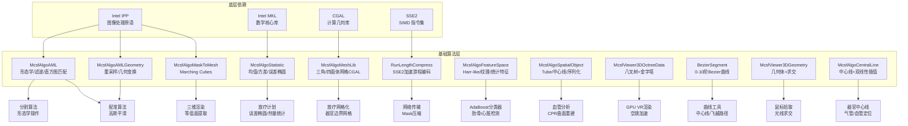

# 医疗影像算法详细文档

> **代码库**：MCSF (Medical Computing Software Framework)  
> **版权**：上海联影医疗科技股份有限公司  
> **文档覆盖**：配准算法 · 分割算法 · 深度学习算法 · 基础算法与数据结构  
> **生成日期**：2026-06-16

---

## 目录

- [第一部分：配准算法](#第一部分配准算法)
  - [1.1 刚性/仿射配准（CPU）](#11-刚性仿射配准cpu--mcsfalgorigistration)
  - [1.2 自由形变配准（FFD）](#12-自由形变配准ffd--mcsfalgomutigridffd)
  - [1.3 Demons 形变配准（CPU）](#13-demons-形变配准cpu--mcsfalgodemons)
  - [1.4 GPU 刚性配准](#14-gpu-刚性配准--mcsfalgoregistrationg)
  - [1.5 GPU Demons 形变配准](#15-gpu-demons-形变配准--mcsfalgodemongsg)
  - [1.6 GPU SyN 对称归一化配准](#16-gpu-syn-对称归一化配准--mcsfalgosynregg)
  - [1.7 应用级配准](#17-应用级配准--mcsfalgoregistrationapplication)
  - [1.8 多模态融合配准](#18-多模态融合配准--mcsfalgoregappfusion)
- [第二部分：分割算法](#第二部分分割算法)
  - [2.1 区域生长](#21-区域生长--mcsfalgotsumgmtadvgrow)
  - [2.2 Fast Marching + Level Set](#22-fast-marching--level-set--mcsfalgoview3dregionextract)
  - [2.3 肋骨全流程分割](#23-肋骨全流程分割--mcsfalgoview3dappribsegment)
  - [2.4 一键骨骼去除](#24-一键骨骼去除--mcsfalgoview3doneclickboneremoval)
  - [2.5 虚拟内镜肺部分割](#25-虚拟内镜肺部分割--mcsfalgoview3dlungflythrough)
- [第三部分：深度学习算法](#第三部分深度学习算法)
  - [3.1 统一推理引擎](#31-统一推理引擎--algo-deeplearningunit)
  - [3.2 VNet 形变配准网络](#32-vnet-形变配准网络--vnet2d_bn_prelu_down4)
  - [3.3 速度场积分（VecInt）](#33-速度场积分vecint)
  - [3.4 R3Net 深度学习刚性配准](#34-r3net-深度学习刚性配准)
  - [3.5 脑部分割](#35-脑部分割--mcsfalgoview3dctwholbrainseg)
  - [3.6 Hessian 血管增强（GPU）](#36-hessian-血管增强gpu--mcsfalgocardiccgpu)
  - [3.7 概率提升树（PBT CUDA）](#37-概率提升树pbt-cuda)
  - [3.8 血管中心线检测](#38-血管中心线检测--mcsfalgovascularcentreline)
  - [3.9 放疗自动勾画](#39-放疗自动勾画--mcsfalgoautocontour)
  - [3.10 体部识别](#310-体部识别--mcsfalgoregbodypartrecognition)
- [第四部分：基础算法与数据结构](#第四部分基础算法与数据结构)
  - [4.1 图像形态学与滤波（McsfAlgoAML）](#41-图像形态学与滤波--mcsfalgoaml)
  - [4.2 图像几何与重采样（McsfAlgoAMLGeometry）](#42-图像几何与重采样--mcsfalgoamlgeometry)
  - [4.3 特征空间（McsfAlgoFeatureSpace）](#43-特征空间--mcsfalgofeaturespace)
  - [4.4 空间对象与中心线（McsfAlgoSpatialObject）](#44-空间对象与中心线--mcsfalgosampspatialobject)
  - [4.5 统计分析（McsfAlgoStatistic）](#45-统计分析--mcsfalgostatistic)
  - [4.6 Mask 转网格（McsfAlgoMesh）](#46-mask-转网格--mcsfalgomasktomesh)
  - [4.7 网格库（McsfAlgoMeshLib）](#47-网格库--mcsfalogomeshlib)
  - [4.8 八叉树体数据（McsfViewer3DOctreeData）](#48-八叉树体数据--mcsfviewer3doctreedata)
  - [4.9 VOI/ROI 分析（McsfViewer3DBasicAlgos）](#49-voiroi-分析--mcsfviewer3dbasicalgos)
  - [4.10 游程编码压缩（RunLengthCompress）](#410-游程编码压缩--runlengthcompress)
  - [4.11 Bezier 曲线（BezierSegment）](#411-bezier-曲线--beziersegment)
  - [4.12 3D 几何体与求交（McsfViewer3DGeometry）](#412-3d-几何体与求交--mcsfviewer3dgeometry)
  - [4.13 中心线提取（McsfAlgoCentralLine）](#413-中心线提取--mcsfalogocentralline)

---

# 第一部分：配准算法

配准（Registration）的目标是求解一个空间变换 $T$，使浮动图像（Moving Image）$I_M$ 经变换后与参考图像（Reference Image）$I_R$ 尽可能对齐：

$$
\hat{T} = \arg\min_{T} \mathcal{L}(I_R,\ I_M \circ T) + \mathcal{R}(T)
$$

其中 $\mathcal{L}$ 为相似度损失，$\mathcal{R}$ 为正则化项。

---

## 1.1 刚性/仿射配准（CPU）— `McsfAlgoRegistration`

**源文件**：`McsfAlgoRegistration.cpp`、`Optimization.cpp`、`MutualInformationMetric.cpp`、`MeanSquareErrorMetric.cpp`、`OptimizationLBFGS.cpp`

### 变换模型

| 模式 | 自由度 | 参数向量 | 判断条件 |
|------|--------|---------|---------|
| 纯平移（Translation） | 3 | `[tx, ty, tz]` | `!bUseAffine && !bUseRotate` |
| 刚性（Rigid 3D） | 6 | `[rx, ry, rz, tx, ty, tz]` | `!bUseAffine && bUseRotate` |
| 刚性（Rigid 2D） | 3 | `[θ, tx, ty]` | `!bUseAffine && bUseRotate && dim==2` |
| 仿射（Affine） | 12 | `[R(3×3), t(3)]` | `bUseAffine && bUseRotate` |
| 缩放+平移 | 6 | `[sx, sy, sz, tx, ty, tz]` | `bUseAffine && !bUseRotate` |

参数向量初始化（`coptimization::Initialization`）：
- 仿射模式：前9个元素存旋转矩阵行优先展开 $R$，后3个存偏移 $t$
- 3D刚性模式：`[rx, ry, rz, tx, ty, tz]`，旋转使用 Versor 表示（四元数）
- 2D刚性模式：`[θ, tx, ty]`

### 相似度度量

#### 均方误差（MSE）— `CMeanSquareErrorMetric`

$$
\mathcal{L}_{MSE} = \frac{1}{N} \sum_{i=1}^{N} \left[ I_R(x_i) - I_M(T(x_i)) \right]^2
$$

**梯度计算**（`GetValueAndDerivativeBySingleThread`，来自源码）：

对3D仿射变换，梯度公式：
```
derivative[k] += 2 * diffValue * px_k * grad_I_M · J_k
```
其中：
- `diffValue = I_M(T(x_i)) - I_R(x_i)`（差值）
- `mg = ∇I_M(T(x_i))`（浮动图像在变换点处的梯度）
- `px, py, pz` 为采样点坐标（相对于图像中心）
- `J_k` 为变换关于第 $k$ 个参数的雅可比列

仿射变换 12 个梯度分量（3D）：
```
∂L/∂R[0,0] += 2·diff·px·mg.x   ∂L/∂R[0,1] += 2·diff·py·mg.x   ∂L/∂R[0,2] += 2·diff·pz·mg.x
∂L/∂R[1,0] += 2·diff·px·mg.y   ∂L/∂R[1,1] += 2·diff·py·mg.y   ∂L/∂R[1,2] += 2·diff·pz·mg.y
∂L/∂R[2,0] += 2·diff·px·mg.z   ∂L/∂R[2,1] += 2·diff·py·mg.z   ∂L/∂R[2,2] += 2·diff·pz·mg.z
∂L/∂t[0]   += 2·diff·mg.x      ∂L/∂t[1]   += 2·diff·mg.y      ∂L/∂t[2]   += 2·diff·mg.z
```

图像梯度通过中心差分计算：
$$
\nabla I_M \approx \left(\frac{I_M(x+1)-I_M(x-1)}{2},\ \frac{I_M(y+1)-I_M(y-1)}{2},\ \frac{I_M(z+1)-I_M(z-1)}{2}\right)
$$

#### 互信息（Mutual Information）— `CMutualInformationMetric`

$$
MI(I_R, I_M) = H(I_R) + H(I_M) - H(I_R, I_M)
$$

**Parzen 窗口估计联合 PDF**（B-Spline 核）：

采样点 $x_i$ 对联合直方图的贡献由 B-Spline 窗口加权：
$$
p(r, m) = \frac{1}{N} \sum_{i=1}^{N} W_{\Delta r}(I_R(x_i) - r) \cdot W_{\Delta m}(I_M(T(x_i)) - m)
$$

其中 $W$ 为三阶 B-Spline 窗口函数（`ParzenWindowIndex` 计算窗口索引）。

**多线程实现**：支持 `m_uiThreadNumber` 个线程并行计算联合直方图的不同部分，每个线程有独立的 `m_fJointPDF_thread`、`m_fRefImagePDF_thread` 数组，最后合并（`m_pnSamples_thread` 追踪各线程样本数）。

**GPU 加速路径**（`#ifdef Use_GPU`）：
- `Init_Cuda_Data()`：将 CMutualInformationMetric 的参数复制到 CUDA 结构体 `CUDA_Para_For_MutualInformationMetric`
- `CUDA_PDF_Init_Para(cpfm_host, cpfm_dev)`：在 GPU 上分配联合直方图内存
- GPU kernel 并行计算所有采样点的 B-Spline 贡献

### 优化器

#### 梯度下降（`coptimization`）

```
初始化:
  MaxIterations = 1000
  StepLength = MaximumStepLength = 0.02
  MinimumStepLength = 1e-4
  RelaxationFactor = 0.6
  MagnitudeTolerance = 1e-4
  多分辨率: m_iNumberofResolutionScales[3]

每次迭代:
  1. 计算梯度 derivative[] = dL/dParam
  2. gradient_magnitude = ||derivative||
  3. if gradient_magnitude < MagnitudeTolerance: 停止
  4. 归一化梯度方向
  5. 线搜索: 试探 StepLength 步
  6. if 度量值未改善: StepLength *= RelaxationFactor (步长衰减)
  7. 更新参数: Param -= StepLength * gradient_direction
  8. if StepLength < MinimumStepLength: 停止
```

#### L-BFGS（`OptimizationLBFGS`）

使用 Limited-memory BFGS 拟牛顿优化，维护最近 $m$（通常 10）步的梯度历史近似 Hessian 逆：
$$
H_k^{-1} \approx V_{k-m}^T \cdots V_{k-1}^T H_0^{-1} V_{k-1} \cdots V_{k-m}
$$

比梯度下降收敛更快，适合参数维度较高的仿射配准（12 DOF）。

### 多分辨率金字塔

3级图像金字塔（`m_iNumberofResolutionScales[3]`），从粗到细：
- 第3级：图像尺寸 ÷ 4，优化更快，避免局部极值
- 第2级：图像尺寸 ÷ 2
- 第1级：原始尺寸，精化

### 重采样（多线程）

`Para_For_RigidAffineReSample<T>` 模板结构支持 `short/float/double/uchar/ushort` 5种数据类型，`Resample_ThreadNumber = 4` 个线程并行计算。

变换坐标映射：
```
物理坐标 = ima2phymatrix × 图像坐标
变换后物理坐标 = Matrix × (物理坐标 - center_ref) + Offset
图像坐标 = phy2imamatrix × 变换后物理坐标
三线性插值取值
```

---

## 1.2 自由形变配准（FFD）— `McsfAlgoMultiGridFFD`

**源文件**：`McsfAlgoMultiGridFFD.cpp`

### B-Spline FFD 基本原理

体素 $x$ 的形变由控制点网格 $\{\phi_{l,m,n}\}$ 通过三次 B-Spline 插值计算：

$$
T(x) = x + \sum_{l=0}^{3}\sum_{m=0}^{3}\sum_{n=0}^{3} B_l(u) B_m(v) B_n(w) \cdot \phi_{\lfloor x_0/\delta \rfloor + l - 1,\ \lfloor x_1/\delta \rfloor + m - 1,\ \lfloor x_2/\delta \rfloor + n - 1}
$$

其中 $B_i$ 为三次 B-Spline 基函数，$\delta$ 为控制点间距。

### 多网格层次（MultiGridSetting）

```cpp
// 控制点数量计算（源码）
unsigned Grid1D = 4 + pow(2, MultiGridDensity - (PyramidOrder - OptimizationOrder));
unsigned ParameterNumber = Grid1D^dim * dim;  // 3D 时 *= 3
```

| 参数 | 含义 | 典型值 |
|------|------|--------|
| `MultiGridDensity` | 最细网格层密度 | 2~4 |
| `PyramidOrder` | 图像金字塔级数 | 3 |
| `OptimizationOrder` | 当前优化级别 | 从粗到细 |
| `dim` | 空间维度 | 3 |

**多网格策略**：
1. 从 `PyramidOrder` 级（最粗）开始
2. 当前级优化完成后，将控制点网格细化（间距减半，控制点数加倍）
3. 原控制点的形变值通过 B-Spline 插值传递到新的更细网格
4. 继续在更细网格上优化，直到 `OptimizationOrder=1`（最细级）

**初始形变场**：支持 `m_IfUseInitialDeformation`，从已有粗配准结果继续精化，中间结果存储在 `m_IntermediateDeformation`。

---

## 1.3 Demons 形变配准（CPU）— `McsfAlgoDemons`

**源文件**：`BaseDemons.cpp`、`OpticalForce.cpp`、`MovingField.cpp`、`MultiGridDemons.cpp`、`McsfAlgoLCCDemons.cpp`

### 核心迭代循环（`DemonsRegistration`，来自源码）

```cpp
// 初始化
memcpy(MovImgNew, MovImg, sizeof(short)*N);
memset(pForce, 0, sizeof(float)*N*3);
ApplyMovingField(MovImg, MovImgNew, iDim, Disp);  // 用当前形变场变换图像
CalculateDiff(..., fError);                         // 初始误差

for (unsigned i = 0; i < Demons_Itt; ++i) {
    float fError0 = fError;
    CalculateOpticalForce(RefImg, MovImgNew, iDim, pForce, fError);
    
    // ROI Mask 约束（可选）
    if (m_pRefMask) {
        for (int d = 0; d < 3; ++d)
            for (int k = 0; k < N; ++k)
                pForce[k + d*N] *= m_pRefMask[k];
    }
    
    CalculateMovingField(pForce, Disp, iDim);  // Disp += step * smooth(Force)
    ApplyMovingField(MovImg, MovImgNew, iDim, Disp);
    
    // 收敛判断：相对误差变化
    fError0 = (fError0 - fError) / fError0;
    if (Demons_StopCriteria > abs(fError0) && i > 10) break;
}
```

### 光流力场计算（`DemonsOpticalForce::CalculateOpticalForce`）

3D 体素级力场（来自源码，逐体素计算）：

```cpp
// 中心差分梯度
float gradx = 0.5f * (RefImg[index+1]   - RefImg[index-1]);
float grady = 0.5f * (RefImg[index+iX]  - RefImg[index-iX]);
float gradz = 0.5f * (RefImg[index+iXY] - RefImg[index-iXY]);

float diff = MovImg[index] - RefImg[index];   // 强度差
fError += abs(diff);                           // 累积误差（MAE）

float sum = gradx*gradx + grady*grady + gradz*gradz + alpha2*diff*diff;

if (sum > 1e-6f) {
    Force[index]           = -gradx * diff / sum;   // Fx
    Force[index+N]         = -grady * diff / sum;   // Fy
    Force[index+2*N]       = -gradz * diff / sum;   // Fz
} else {
    Force[index] = Force[index+N] = Force[index+2*N] = 0.0f;
}
```

力场公式：
$$
\vec{F}(x) = \frac{-(I_M(x) - I_R(x))}{|\nabla I_R(x)|^2 + \alpha^2 (I_M(x)-I_R(x))^2} \nabla I_R(x)
$$

- 分母中 $\alpha^2 \cdot \text{diff}^2$ 防止梯度极小时力场过大
- `limit = 1e-6f`：数值稳定性保护
- 误差度量为 MAE（平均绝对误差），除以体素总数得到归一化误差

**多线程版本**（`DemonsOpticalForceMulti`）：将 Z 方向分段，每段由独立线程计算，使用 boost::thread 线程池。

### 位移场更新（`DemonsMovingField::CalculateMovingField`）

```cpp
// 1. 对力场进行高斯平滑（正则化）
GaussSmoothField(pForce, iDim, Sigma, 1);  
// 等价于: Mcsf::IALib::Math3D::GaussSmooth_without_mklfree(各分量)

// 2. 计算最大力场幅度，自适应步长
float maxForce = max(|Force|);
float fstep = Step / maxForce;  // 步长 = 固定步长 / 最大力（归一化）

// 3. 累加到位移场
Disp += fstep * Force
```

**BoundSetZero**（SyN 中）：在每次平滑后将边界体素的形变强制置零，防止边界伪影。

### LCC Demons（`LCCDemons`）

适用于多模态（CT-MRI）的局部互相关力场：

```
LCC 力 = 局部窗口内 Pearson 相关系数的梯度

局部相关系数（窗口 Ω）：
r(x) = [Σ_{Ω} I_R · I_M] / sqrt([Σ_{Ω} I_R²] · [Σ_{Ω} I_M²])
```

**学习率自适应衰减**（来自源码 `RelaxDemonsRegistration`）：

```cpp
float fError0 = 1e16f;
int divTimes = 0, div_num_ = 5;
pMovingFiledTool->ResetStep();

for (unsigned i = 0; i < Demons_Itt; ++i) {
    CalculateOpticalForce(...);
    // 误差上升时降低步长
    if (fError0 < fError) {
        if (++divTimes > div_num_) break;    // 超过5次退出
        pMovingFiledTool->RelaxStep(0.5f);  // 步长减半
    }
    fError0 = fError;
    CalculateMovingField(...);
    ApplyMovingField(...);
}
```

### 多网格 Demons（`MultiGridDemons`）

从粗分辨率到细分辨率逐级配准（来自源码）：

```cpp
for (unsigned depth = MGD_uiDeepth; depth >= MGD_uiDeepEnd; --depth) {
    unsigned Scale = pow(2, depth - 1);
    // 下采样参考图和浮动图
    int iDimLocal[3] = {iDim[0]/Scale, iDim[1]/Scale, iDim[2]/Scale};
    // 在低分辨率上运行 Demons
    MGD_Demons->DemonsRegistration(RefLocal, MovLocal, iDimLocal, DispLocal);
    // 将形变场上采样到下一级（×2 双线性插值，×Scale 缩放）
    ResizeTransform(DispLocal, iDimLocal, iDimNext, factor, interp, DispNext);
}
```

---

## 1.4 GPU 刚性配准 — `McsfAlgoRegistrationG`

**源文件**：`McsfAlgoRegistrationG.cpp`（CUDA+cuBLAS+cuSolver）

### GPU 内存管理与数据传输

```cpp
// 百分位数截断（Thrust 排序）
thrust::sort(pDst, pDst + N);
T lowValue  = pDst[lowRadio * N];
T upValue   = pDst[upRadio * N - 1];

// 图像数据上传
ImageDataG<short> pRef(pReferenceImageData_h, refSize_h, refSpacing_h);
// → cudaMalloc + cudaMemcpy 到 GPU 显存

// 显存可用性检查
cudaMemGetInfo(&freeBytes, &totalBytes);
```

### 变换模型选择（来自源码）

```cpp
if (para.GetIfAffine() && para.GetIfRotate())
    pModel.reset(new Affine());          // 仿射：12 DOF
else if (!para.GetIfAffine() && para.GetIfRotate())  
    pModel.reset(new Rigid());           // 刚性：6 DOF
else
    pModel.reset(new Translation());     // 纯平移：3 DOF
```

### GPU 度量函数

- **`CMeanSquareErrorMetricG`**：CUDA kernel 并行计算所有采样点的 $\sum(I_R - I_M \circ T)^2$，使用 `thrust::reduce` 全局求和
- **`MutualInformationMetricG`**（`MutualInformationMetricG.cu`）：  
  GPU 端并行构建联合直方图 → 计算熵

**cuBLAS 加速**：矩阵乘法（坐标变换批量计算）使用 cuBLAS `gemm` 接口

**cuSolver**：用于奇异值分解（仿射配准的正交约束修正）

---

## 1.5 GPU Demons 形变配准 — `McsfAlgoDemonsG`

**源文件**：`McsfAlgoBaseDemonsG.cpp`、CUDA kernel 文件（`ApplyMovingField.cu`、`CalculateDiff.cu`、`CalculateMovingField.cu`、`CalculateOpticalForce.cu`）

### GPU 内存追踪器（`DemonsGPUMemCounter`）

```cpp
class DemonsGPUMemCounter {
    double m_peakBytes, m_curBytes;
public:
    void Push(double b) {
        m_curBytes += b;
        if (m_curBytes > m_peakBytes) m_peakBytes = m_curBytes;
    }
    void Pop(double b) { m_curBytes -= b; }
    double GetPeakBytes() { return m_peakBytes; }
};
```

实时追踪 GPU 显存使用峰值，用于性能监控和 OOM 预测。

### GPU 高斯核生成（`GenerateGaussKernel`，来自源码）

```cpp
int hsize = static_cast<int>(sigma * 6.0);
hsize = (hsize + 1) / 2;           // 半径 = ceil(6σ / 2)
int kerLen = hsize * 2 + 1;        // 核长度（奇数）
Mcsf::AMLU::kernelgaussian(kerLen, sigma, pKernel.get());  // 归一化高斯系数
```

### GPU 3D 高斯平滑（可分离卷积）

```cpp
// 对 X/Y/Z 三个位移分量分别独立平滑
GaussSmoothG(pSrcDst_d,           iDim, pTemp_d);  // X 分量
GaussSmoothG(pSrcDst_d + Length,  iDim, pTemp_d);  // Y 分量
GaussSmoothG(pSrcDst_d + Length*2,iDim, pTemp_d);  // Z 分量
BoundSetZeroG(...)  // 边界置零（SyN 模式）
```

GPU 可分离卷积：将 3D 高斯卷积分解为3次 1D 卷积，每次 1D 卷积用 CUDA shared memory 加速。

### GPU 多网格 Demons CUDA Kernels

| CUDA 文件 | 功能 |
|-----------|------|
| `ApplyMovingField.cu` | 用位移场对浮动图像重采样（三线性插值）|
| `CalculateDiff.cu` | 计算强度差 `diff = Mov - Ref`，统计 MAE |
| `CalculateMovingField.cu` | 力场 → 位移场更新（`Disp += step * Force`）|
| `CalculateOpticalForce.cu` | 光流力场计算（并行逐体素）|
| `JointHistogram.cu` | GPU 端并行构建联合直方图（原子加操作）|
| `Entropy.cu` | 计算联合熵 $H(I_R, I_M)$（GPU reduction）|
| `MutualInformationForce.cu` | 基于 MI 的力场（多模态 Demons）|
| `NMutualInformationForce.cu` | 归一化互信息（NMI）力场 |

---

## 1.6 GPU SyN 对称归一化配准 — `McsfAlgoSynRegG`

**源文件**：`McsfAlgoRegSyn.cpp`、`McsfAlgoRegSynOptimization.cpp`、CUDA kernel 文件

### SyN 理论原理

SyN（Symmetric Normalization）同时优化正向/逆向形变场，在两图像的中点空间对称更新，保证形变的拓扑一致性：

$$
\hat{\phi} = \arg\min_{\phi^+, \phi^-} \mathcal{M}\left(I_R \circ (\phi^+)^{-1},\ I_M \circ (\phi^-)^{-1}\right) + \text{Reg}(\phi^+) + \text{Reg}(\phi^-)
$$

输出：
- `pOutDis`：正向形变场 $\phi^+$（将 Ref 映射到中点）
- `pOutInvDis`：逆向形变场 $\phi^-$（将 Mov 映射到中点）

### 多尺度优化实现（来自源码）

#### 尺度收缩（`GetShrinkSizeSpacing`）

```cpp
for (unsigned di = 0; di < dim; ++di) {
    newSize[di]    = floor(uiSize[di] / shrink_factor);
    newSpacing[di] = shrink_factor;  // 体素间距按比例扩大
}
```

#### SyN 核心迭代（`SynReg`）

```
for each (SynParameter& param in regParam):
    1. 图像下采样到当前尺度（三线性插值 Shrink）
    2. 形变场下采样（ShrinkDis + 幅度缩放）
    3. for iter in param.iterations:
       a. 计算 LCC/MSE 度量（GPU 或 CPU）
       b. 计算力场梯度（LCC 导数）
       c. 分别更新正向/逆向位移场
       d. 高斯平滑正则化：
          - 图像域：GaussianSmoothImg(σ_image)
          - 形变场：GaussianSmoothDis(variance = σ_dis²)
       e. 边界强制置零（BoundSetZero）
       f. 归一化更新步长（NormUpdateDisITK）
    4. 复合形变场（CompositeDis）
```

#### 归一化步长更新（`NormUpdateDisITK`，来自源码）

```cpp
// 计算每个体素的局部形变场范数
for (int i = 0; i < len; ++i) {
    float localNorm = 0;
    for (int d = 0; d < dim; ++d) {
        float temp = pSrcDst[i + d*len] / shrink_factor;
        localNorm += temp * temp;
    }
    // 归一化：最大局部范数 → 1 体素
    pSrcDst[i] *= learning_rate / (maxNorm * shrink_factor);
}
```

#### 形变场平滑中的边界处理（`GaussianSmoothDis`）

```cpp
// 3D：对三个分量分别平滑后强制边界为零
GaussSmooth_without_mklfree(pDis[X], iDim, sigma, threads);
BoundSetZero(&pDis[X], uiSize);   // X 分量边界 → 0
GaussSmooth_without_mklfree(pDis[Y], ...);
BoundSetZero(&pDis[Y], uiSize);
GaussSmooth_without_mklfree(pDis[Z], ...);
BoundSetZero(&pDis[Z], uiSize);
```

### LCC 度量（`LCCMetric.cu`，GPU）

在局部窗口 $\Omega_r(x)$ 内计算：
$$
\text{LCC}(x) = \frac{\left(\sum_{\Omega} \bar{I}_R \cdot \bar{I}_M\right)^2}{\sum_{\Omega} \bar{I}_R^2 \cdot \sum_{\Omega} \bar{I}_M^2}
$$

其中 $\bar{I} = I - \mu_\Omega(I)$ 为去均值后的强度，GPU kernel 并行计算所有体素的局部统计量。

---

## 1.7 应用级配准 — `McsfAlgoRegistrationApplication`

**源文件**：`McsfAlgoRegistrationApp4DAnalysis.cpp`、`McsfAlgoRegistrationApplicationNeuro.cpp` 等

| 模块 | 临床场景 | 核心算法组合 |
|------|---------|------------|
| `4DAnalysis` | 4D CT 呼吸运动 | 多期相 Demons（每相对参考相） |
| `ApplicationNeuro` | 神经影像 CT/MRI 配准 | 脑分割 + GPU 刚性 + LCC Demons |
| `ApplicationDualEnergy` | 双能量 CT | HU 映射校正 + 刚性配准 |
| `ApplicationLiver` | 肝脏动态增强 MRI | FFD 形变配准（控制点细化） |
| `AppMRDynamic` | MR 动态序列 | Demons + 形变场分析（运动估计）|
| `AppLocal` | 局部精配准 | ROI Mask 限制的 Demons |
| `AppLocalize` | 关键点定位配准 | 关键点匹配 → 刚性初始化 |

---

## 1.8 多模态融合配准 — `McsfAlgoRegAppFusion`

### 脑部融合（`McsfAlgoRegFusionBrain`）

完整流程（来自源码头文件引用）：

```
1. RemoveCTBedToHU(pImgIn, slope, intercept, pBedMask → pImgOut)
   HU = raw * slope + intercept；床板体素 → -1024

2. McsfAlgoView3DCTWholeBrainSeg  →  脑 Mask

3. GetBrainFromMask(pSrc, brainMask → pOut)
   将脑外体素置为 backValue（背景值）

4. ComputeSampleStep: 2mm 物理间距 → 采样步长 sr ∈ [1, 4]
   sr[i] = clamp(round(2.0 / spacing[i]), 1, 4)

5. McsfAlgoRegKeyptsLocalize → 关键点检测（脑解剖标记点）

6. ImageRegistrationRigidG (GPU 刚性配准)
   → 输出: dResultMatrix, dResultOffset

7. Demons/LCC 形变精化
   → 输出: 形变场
```

### 放疗肿瘤配准（`McsfAlgoRegAppOncology`）

```
McsfAlgoRegAppOncoGlobalReg:
  全局刚性配准 (GPU 刚性) → 对齐整体位置

McsfAlgoRegAppOncoLocalReg:
  在靶区 ROI 内运行 Demons（带 Mask 约束）→ 局部精细形变

McsfAlgoRegAppOncoContours:
  将历史治疗计划轮廓（DICOM RTSTRUCT）
  通过形变场 T(x) 映射到当前扫描坐标
  轮廓点变换: p_new = T(p_old) = p_old + Disp(p_old)（三线性插值 Disp）
```

---

# 第二部分：分割算法

---

## 2.1 区域生长 — `McsfAlgoTsuMgmtAdvGrow`

**源文件**：`McsfAlgoTsuMgmtAdvGrowBone.cpp`、`McsfAlgoTsuMgmtAdvGrowVessel.cpp`、`McsfAlgoTsuMgmtMRAdvGrowVessel.cpp`

### 算法核心：基于最小堆的受限区域生长

标准 BFS 区域生长的改进版，使用**场值（field value）排序**的最小堆替代普通队列，类似于 Fast Marching 的优先队列机制。

**骨骼生长参数**（来自源码）：
```cpp
int   MaxRadiusForGrow   = 30;     // 最大生长球半径（体素）
int   MaxOutputPointNumber = 300;  // 最大输出点数上限
float GeneralVesselMaxHu = 2000;   // HU 全局上限
float GeneralVesselMinHu = 80;     // HU 全局下限
float GeneralVesselBound = 150;    // 动态范围（seed ± 150）

// 动态阈值计算
float CurMaxHu = max(seed_HU + 150, 2000);  // 取较宽值
float CurMinHu = max(seed_HU - 150, 80);
```

**血管生长参数**（更保守）：
```cpp
MaxRadiusForGrow   = 15;    // 血管半径更小
GeneralVesselMaxHu = 450;   // 血管 HU 更低（造影剂约 200-400 HU）
GeneralVesselBound = 150;   // 同样 ±150 HU 动态范围
```

### 生长迭代逻辑（来自源码）

```cpp
// 初始化
IndexURecord[0] = i_SeedIndexU;
FieldRecord[0] = 0;
record_minindex = 0;  // 当前最小场值索引
record_totalindex = 0;

for (int itertime = 0; itertime < MaxOutputPointNumber; ++itertime) {
    // 取最小场值体素
    unsigned CurMinIndex = IndexURecord[record_minindex];
    
    // 球形 Radius 约束
    float dist = sqrt((x-seedX)²+(y-seedY)²+(z-seedZ)²);
    if (dist > MaxRadiusForGrow) break;  // 超出半径停止
    
    // 标记已访问 + 更新输出 Mask
    AlgoTmpSeed.push_back(CurMinIndex);
    TsuMgmtComGrowUpdataResult(...);  // 更新增量 Mask
    
    // 26邻域扩展
    for (int n = 0; n < 26; ++n) {
        int Nx = x + DirectTwentySix[n][0];
        // 跳过条件:
        // 1. 超出 ROI 边界
        // 2. 被 LockLabel 锁定（已属于其他组织）
        // 3. 已在 AlgoTmpMask 中
        // 4. HU < CurMinHu 或 HU > CurMaxHu
        if (满足条件) 入堆;
    }
    record_minindex++;
}
```

**增量 Mask 更新**：使用 `SimplifiedMaskUpdateUnit` 结构记录每次新增体素，只传输**变化量**到上层显示，避免全量 Mask 拷贝。

### MR 血管生长（`McsfAlgoTsuMgmtMRAdvGrowVessel`）

MRI 使用信号强度代替 HU 值，阈值参数不同（高信号血管 vs 低 HU 血管），其余逻辑与 CT 版本一致。

### 智能骨骼生长（`McsfAlgoTsuMgmtSmartBoneGrowBone`）

在普通骨骼生长基础上增加：
- 解剖约束：检测相邻骨骼（脊椎、肋骨、髂骨等），防止跨骨骼粘连
- 梯度约束：骨骼边界处梯度突变时停止生长

---

## 2.2 Fast Marching + Level Set — `McsfAlgoView3DRegionExtract`

**源文件**：`McsfAlgoView3DLevelSet.cpp`、`McsfAlgoView3DDynamicTracking.cpp`、`McsfAlgoView3DPoints2Mask.cpp`

### Fast Marching 血管追踪（`RegionGrowingByFastMarching`）

基于 Eikonal 方程的波前传播，以**到达时间场** $T(x)$ 引导分割：

$$
|\nabla T(x)| \cdot F(x) = 1, \quad F(x) = \frac{1}{\text{speed}(x)}
$$

**实现细节**（来自源码）：

```cpp
// 参数
iHashRatio = 8000;   // HU 值到速度函数的归一化比例
MinValue   = 100;    // 有效 HU 下限
MaxValue   = 3000;   // 有效 HU 上限

// 树形结构管理分支血管
struct VesselSection {
    vector<int> vAlivePoints;   // 已确认点集（Alive）
    vector<int> vAliveFront;    // 当前波前（NarrowBand）
    int ParentTreeNumber;       // 父节点编号（追踪分支关系）
    int TreeNumber;             // 当前节点编号
};
```

速度函数由 HU 值决定：
$$
F(x) = \begin{cases}
f_{blood}(HU) & \text{HU} \in [MinValue, MaxValue] \\
\epsilon & \text{otherwise (slow)}
\end{cases}
$$

**优先队列（最小堆）**：按到达时间排序，每次扩展到达时间最小的体素（等同于 Dijkstra 算法）。

**血管树分支处理**：当波前在某点遇到多条可行路径时，创建新的 `VesselSection` 分支，记录父节点编号，构建完整血管树。

### Level Set 轮廓提取

基于零水平集的隐式边界表示：

$$
\frac{\partial \phi}{\partial t} = |\nabla \phi| \left( F_\text{adv} + F_\text{curv} \kappa \right)
$$

- $F_\text{adv}$：平流力（由图像梯度驱动边界向目标移动）
- $F_\text{curv}$：曲率力（平滑约束，$\kappa$ 为界面曲率）

**应用于血管**：种子点初始化 level set，波前被血管壁处的高梯度阻挡，收敛后提取零水平集轮廓。

### 动态追踪（`McsfAlgoView3DDynamicTracking`）

在时间序列图像（4D CT、心脏 CINE）中追踪目标形变：
- 以上一帧的分割结果为初始 level set
- 在当前帧用 Fast Marching 更新
- 形变场驱动 level set 移动（配准 + 分割联合）

---

## 2.3 肋骨全流程分割 — `McsfAlgoView3DAppRibSegment`

**源文件**：`McsfAlgoView3DAppRibSegment.cpp` 等 30+ 个子文件

### 完整分割流水线

```
阶段 0 ─ 初始化（InitialSegment）
  ├── InitialParam
  │     体素间距归一化到各向同性 (PixelSpacing)
  │     内存分配（m_Image, m_BodyMask）
  │     AdaBoost 分类器载入（ProbabilityBoostingTreeTester）
  ├── DownSampling
  │     图像降采样：Interp_Size = 原始尺寸 / 降采样因子
  │     记录降采样间距 (m_Interp_Spacing)
  └── ExtractVertebraAndRib
        HU 阈值([300,2000]) + 连通域分析提取脊椎+肋骨粗区域
        → m_Interp_VertebraAndRibCoord（坐标集合）

阶段 1 ─ 粗分割（RoughSegment）
  ├── RibRoughSegment
  │     形态学开运算（去细小噪点）+ HU 阈值
  │     提取连通骨骼区域
  └── SeparateRibs（初步分离）
        在椎骨和肋骨的连接处断开
        → 各根肋骨独立连通域

阶段 2 ─ 精细分割（FineSegment）
  ├── BoneAdaboost 分类器
  │     逐体素提取 Harr-like 特征
  │     强分类器评分 > 阈值 → 肋骨体素
  ├── McsfAlgoView3DAppRibFineSegLevelSet
  │     Level Set 精化各肋骨边界
  ├── McsfAlgoView3DAppRibFineSegDomainAnalysis
  │     域分析：去除非肋骨形状的区域（长宽比、曲率等）
  └── McsfAlgoView3DAppRibFineSegTracking
        沿肋骨走向追踪，补全断裂区域

阶段 3 ─ 中心线提取
  ├── McsfAlgoView3DAppRibCenterLine
  │     形态学细化（骨架化）→ 肋骨中心线
  ├── McsfAlgoView3DAppExtendCenterline
  │     Dijkstra 最短路径延伸不完整中心线
  └── McsfAlgoView3DAppSmoothCenterLine
        B-Spline 拟合平滑中心线

阶段 4 ─ 后处理
  ├── McsfAlgoView3DAppRibPosterior
  │     后肋弧形区域精化
  ├── McsfAlgoView3DAppRibSegmentPosteriorCenterLine
  │     后肋中心线修正
  └── McsfAlgoView3DAppRibRemoveScapula
        去除肩胛骨（形状特征区分）

阶段 5 ─ 输出
  └── McsfAlgoView3DAppSeparateRibs
        最终分离各根肋骨（标记 1-24 根）
        OutputLoading → 记录部位识别信息
```

### AdaBoost 分类器细节（`BoneAdaboost`）

**弱分类器结构**（来自源码）：
```cpp
struct WClassifier {
    int    HarrFeatureType;           // 特征类型（8种）
    Point3 HarrStartFromBox;          // 特征起始位置（3D）
    Point3 HarrBinSize;               // 特征 bin 大小
    float  threshold;                 // 决策树阈值
    float  parity;                    // 极性（+1 或 -1）
    float  alpha;                     // 该弱分类器权重
};
```

**8 种 Harr-like 特征**（3D）：
- `EdgeOneA/B/C`：边缘响应（X/Y/Z 方向）
- `LineTwoA/B/C`：线状结构响应（双矩形差分）
- `CenterThreeA`：中心亮周围暗（blob 检测）
- `Type6FourA`：4区域差分（交叉模式）

**强分类器判决**：

$$
H(x) = \sum_{i=1}^{K} \alpha_i h_i(x) \geq \Theta = 0.5 \sum_{i=1}^{K} \alpha_i
$$

**模型加载**（`LoadClassifierModel`，来自源码）：
```
文件格式:
  第1行: 注释
  第2行: HarrBoxSize x y z（特征计算区域大小）
  第3行: WeakClassifierCount（弱分类器数量）
  后续每行: HarrFeatureType, StartX Y Z, BinX Y Z, threshold, parity, alpha
```

---

## 2.4 一键骨骼去除 — `McsfAlgoView3DOneClickBoneRemoval`

**源文件**：`McsfAlgoView3DOneClickBoneRemoval.cpp`、`McsfAlgoView3DChestBoneDetection.cpp`

### Laplace 算子边缘检测（来自源码）

```cpp
// 6邻域拉普拉斯
bool Laplace3D(short* pData, short* desData, int* iDimension) {
    for (int k = 0; k < iZ; k++)
        for (int j = 1; j < iY-1; j++)
            for (int i = 1; i < iX-1; i++) {
                int idx = k*iXY + j*iX + i;
                desData[idx] = pData[idx-1] + pData[idx+1]    // X 邻居
                             + pData[idx-iX] + pData[idx+iX]  // Y 邻居
                             + pData[idx-iXY] + pData[idx+iXY]// Z 邻居
                             - 6 * pData[idx];                 // 中心
            }
}
```

$$
\nabla^2 I = \sum_{\text{6-neighbor}} I - 6 \cdot I(x)
$$

拉普拉斯响应在骨骼边缘处大，在骨骼内部接近零。

### 完整去骨流程

```
1. 胸部骨骼检测（McsfAlgoView3DChestBoneDetection）:
   - HU 阈值（骨骼 > 200 HU）+ 形态学提取骨骼候选区域
   - Laplace 算子增强骨骼边缘
   - 连通域分析：分离椎骨/肋骨/胸骨

2. 形态学处理（McsfAlgoAML）:
   - 膨胀（Dilation）：扩大骨骼 Mask，确保完整覆盖
   - 腐蚀（Erosion）：精化边界

3. 骨骼去除:
   - pOut[i] = (pBoneMask[i] == 0) ? pSrc[i] : backgroundValue(-1024)
   - OpenMP 并行处理（boost::thread 多线程）
```

---

## 2.5 虚拟内镜肺部分割 — `McsfAlgoView3DLungFlyThrough`

**源文件**：`McsfAlgoView3DLungSegment.cpp`、`McsfAlgoView3DTracheaExtract.cpp`、`McsfAlgoView3DCenterLine.cpp`

### 肺实质分割（`McsfAlgoView3DLungSegment`）

```
1. 空气阈值分割（HU < -400）
   → 粗提取肺+背景

2. 形态学闭运算（大核：HUGE_KERNEL_SIZE=12）
   → 填充肺内血管、气道等低 HU 孔洞

3. 连通域分析
   → 去除体外空气，保留两侧肺

4. 形态学侵蚀（精化边界）

5. 输出: 左肺 Mask + 右肺 Mask
```

### 气管树提取（`McsfAlgoView3DTracheaExtract`）

基于 Fast Marching，从气管起点向下追踪整棵气道树：
- 起点：气管上部 HU 约 -900 至 -1000
- 速度函数：HU 越低（越接近空气）速度越快
- 分支检测：波前分裂时创建分支记录（`VesselSection` 树）
- 泄漏预防：设置 HU 上限阈值（-500），防止扩散到肺实质

### 气管中心线（`McsfAlgoView3DCenterLine`）

```
1. 形态学细化（3D Thinning/骨架化）
   迭代去除边界体素，保留拓扑骨架
   
2. 树形骨架修剪（Pruning）
   去除短分支（长度 < 阈值）

3. Dijkstra 最短路径
   从气管起点到各叶段支气管终点的最优路径
   边权重：相邻中心线点的欧氏距离

4. B-Spline 平滑
   将离散中心线点拟合为连续曲线
```

虚拟支气管镜飞越路径即为此中心线曲线，相机姿态沿曲线切线方向前进。

---

# 第三部分：深度学习算法

---

## 3.1 统一推理引擎 — `algo-deeplearningunit`

所有 DL 模型共用的底层推理框架，封装 cuDNN 推理细节。

### 核心接口

```cpp
// 网络管理器
class NetManager {
    NetManager(const std::string& modelFile, INet* pNet, int iDim);
    algoStatus_t forward(const float* pInput, const int img_size[5], float* pOutput);
};

// 状态码
enum algoStatus_t {
    ALGO_STATUS_SUCCESS,
    ALGO_STATUS_EMPTY_DESC,
    // ...
};

// GPU 环境管理
int APPCUDAEnvGetGpuId_RAA();  // 运行时动态获取推理 GPU ID
```

### Tensor 布局（5维，NCDHW）

```
img_size[5] = [Batch, Channel, Depth(Z), Height(Y), Width(X)]

2D 模式: img_size = [1, C, 1, H, W]  (Depth=1)
3D 模式: img_size = [1, C, D, H, W]
```

### Padding 规则（来自源码）

```cpp
double multiplier = 16;  // 必须是16的整数倍
unsigned iX_Padding = static_cast<int>(ceil(iX / 16.0) * 16);
unsigned iY_Padding = static_cast<int>(ceil(iY / 16.0) * 16);
unsigned iZ_Padding = (ndim == 3) ? static_cast<int>(ceil(iZ / 16.0) * 16) : 1;
```

推理完成后通过 `RemovePadding` 裁剪回原始尺寸。

---

## 3.2 VNet 形变配准网络 — `Vnet2d_bn_prelu_down4`

**源文件**：`Vnet2d_bn_prelu_down4.cpp`

### 网络架构（来自源码构造函数）

完整的 U-Net 风格编解码器，各层参数如下：

```cpp
// 输入块
m_In_Block:    Conv(2→16, k=5×5, stride=1, pad=2) + BN + PReLU

// 编码器（4级下采样）
m_DownD_32:  Conv(16→32,  k=2×2, stride=2, pad=0) + BN + PReLU  // stride=2下采样
m_DownR_32:  ResBlock(×1, ch=32, k=5×5, pad=2)                   // 1个残差块

m_DownD_64:  Conv(32→64,  stride=2) + BN + PReLU
m_DownR_64:  ResBlock(×2, ch=64)                                  // 2个残差块

m_DownD_128: Conv(64→128, stride=2) + BN + PReLU
m_DownR_128: ResBlock(×3, ch=128)                                 // 3个残差块

m_DownD_256: Conv(128→256,stride=2) + BN + PReLU
m_DownR_256: ResBlock(×3, ch=256)                                 // 最深层

// 解码器（4级上采样）
m_UpU_256:   TransposeConv(256→128, stride=2) + BN + PReLU
m_cat_256:   Concat([上采样128ch, 跳跃连接128ch]) → 256ch
m_UpR_256:   ResBlock(×3, ch=256)

m_UpU_128:   TransposeConv(256→64,  stride=2) + BN + PReLU
m_UpR_128:   ResBlock(×3, ch=128)

m_UpU_64:    TransposeConv(128→32,  stride=2) + BN + PReLU
m_UpR_64:    ResBlock(×2, ch=64)

m_UpU_32:    TransposeConv(64→16,   stride=2) + BN + PReLU
m_UpR_32:    ResBlock(×1, ch=32)

// 输出块
m_Out_BlockCBR: Conv(32→16, k=5×5) + BN + PReLU
m_Out_BlockC:   Conv(16→ndim, k=1×1)   // ndim=2(2D) 或 3(3D)
```

**cuDNN Handle**：`m_cudnn_handle`（cudnnHandle_t）管理所有卷积层的描述符  
**cuBLAS Handle**：`m_cublas_handle`（cublasHandle_t）用于矩阵乘法（全连接等）

### 推理完整流程（来自源码 `GetDeformationField`）

```
输入: pImgRef [X×Y×Z], pImgMov [X×Y×Z]

步骤1 - Padding:
  uiSizePadding = [ceil(X/16)*16, ceil(Y/16)*16, ceil(Z/16)*16]
  Padding(pImgRef → pRefPadding, padValue)
  Padding(pImgMov → pMovPadding, padValue)

步骤2 - 组装输入:
  pNetIn = [pMovPadding | pRefPadding]  // 通道0=Moving, 通道1=Reference

步骤3 - 网络前向:
  img_size = [1, 2, Z_pad, Y_pad, X_pad]
  NetManager::forward(pNetIn, img_size → pNetOut)  // cuDNN 推理

步骤4 - 3D VecInt (若 m_bVecInt && ndim==3):
  VecInt(pNetOut, uiSizePadding, downFactor, nsteps → pDispVecInt)
  pNetOut = pDispVecInt

步骤5 - 维度转置 (ZYX → XYZ):
  // 网络输出顺序: [Z,Y,X], 图像坐标顺序: [X,Y,Z]
  for (int i = 0; i < ndim; i++)
      memcpy(pDispPadding + i*Len, pNetOut + (ndim-i-1)*Len)

步骤6 - RemovePadding:
  裁剪到原始图像尺寸
  输出: dispOut[X×Y×Z×ndim]
```

### 批量动态配准（`GetDeformationFieldDynamic2D`）

用于 MRI 心脏 CINE 等动态序列：

```
输入: pImgN[imgNum×X×Y], refIndex (参考帧索引)

组装批量输入（并行）:
  for i in [0, imgNum):
      if i != refIndex:
          pNetIn[batch_i] = [Mov(i) | Ref(refIndex)]  // 2通道

分批推理（每批 batchSize 帧）:
  regTimes = ceil((imgNum-1) / batchSize)
  for i in [0, regTimes):
      img_size = [1, batchSize, 2, Y, X]  // 注意 batch 维含多帧
      NetManager::forward(pNetIn[i*batch:], img_size → pNetOut[i*batch:])

维度转置 + 插入参考帧零位移:
  dispOut[refIndex] = 0  (参考帧自身无位移)
  其余帧按顺序填充
```

---

## 3.3 速度场积分（VecInt）

**源文件**：`VecIntCPU.cpp`（CPU 版）、`McsfAlgoBaseDemonsG.cpp` 中包含 GPU 版

### 缩放-平方法（Scaling and Squaring）

将速度场 $v$ 积分为形变场 $\phi$：

$$
\phi = \text{Exp}(v) = \lim_{n\to\infty} \left(I + \frac{v}{n}\right)^n
$$

实用近似（缩放-平方，nsteps=7 时误差 < 1%）：

```
步骤1 - 缩放 (Scaling):
  disp = v × (1 / 2^nsteps)   // 确保位移量足够小

步骤2 - 连续平方 (Squaring) × nsteps 次:
  for i in range(nsteps):
      disp_temp[j] = Resample(disp[j], disp)   // 每个分量用自身重采样自身
      // 等价于 disp ∘ disp（形变场复合）
      disp = disp + disp_temp                   // 形变场相加（近似复合）
```

**形变场复合**（`ResamplingWithDeformField`）：

$$
(\phi_1 \circ \phi_2)(x) = \phi_1(x + \phi_2(x))
$$

通过三线性插值在 $\phi_2(x)$ 处取 $\phi_1$ 的值。

### 形变场缩放（`ResizeTransform`，来自源码）

```cpp
bool ResizeTransform(pSrcDisp, imgSrcSize, imgDstSize, interpolation, pDstDisp) {
    // 对每个维度的位移分量独立 resize
    for (int i = 0; i < ndim; i++) {
        ImageResize(pSrcDisp + i*LenSrc, pDstDisp + i*LenDst,
                    imgSrcSize, imgDstSize, 0, 0, 0, interpolation);
        // 幅度缩放：size 放大 k 倍 → 位移值也放大 k 倍
        float factor = imgDstSize[i] / imgSrcSize[i];
        MulC(factor, pDstDisp + i*LenDst, LenDst);
    }
}
```

---

## 3.4 R3Net 深度学习刚性配准

**源文件**：`R3Net.cpp`、`McsfAlgoDLRigidRegistration.cpp`

### 双路不对称输入网络

R3Net 自适应处理不同分辨率的 Ref/Mov 图像（来自源码）：

```cpp
algoStatus_t R3NetManager::forward(pDataRef, pSizeRef, pDataMov, pSizeMov, p6Dof) {
    // 策略：大图走主pipeline，小图走轻量pipeline
    if (iLengthMov < iLengthRef) {
        // Ref 是大图：主 pipeline 处理 Ref
        intensor.set_size(iSizeRef, m_dim);
        intensor.create_desc();
        RecalculateBuffer(intensor);  // 动态计算 workspace 大小
        
        // Mov 是小图：轻量 pipeline
        intensor1.set_size(iSizeMov, m_dim);
        create_descs_smallinput(m_cudnnHandle, intensor1, ...);
        
        bReffirst = true;
    } else {
        // Mov 更大：交换角色
        bReffirst = false;
        ...
    }
    
    // cuDNN 前向推理
    R3Net::forward(intensor, intensor1, outtensor, work_space, bReffirst, p6Dof);
    // p6Dof: [rx, ry, rz, tx, ty, tz]  (欧拉角 + 平移，GPU→CPU 传输)
}
```

### 6DOF 转旋转矩阵（`McsfAlgoDLRigidRegistration.cpp`）

```cpp
// 按 Z-Y-X 顺序组合旋转
rotx(rx, RotX);  // R_x(rx)
roty(ry, RotY);  // R_y(ry)
rotz(rz, RotZ);  // R_z(rz)

CrossProduct(RotY, RotX, RotXY);     // R_y × R_x
CrossProduct(RotZ, RotXY, FinalRot); // R_z × R_y × R_x

// 组装 4×4 齐次变换矩阵
matrix(FinalRot, Translation, M4x4);
```

旋转矩阵公式：
$$
R = R_z \cdot R_y \cdot R_x = \begin{bmatrix}\cos r_z & \sin r_z & 0 \\ -\sin r_z & \cos r_z & 0 \\ 0 & 0 & 1\end{bmatrix} \begin{bmatrix}\cos r_y & 0 & -\sin r_y \\ 0 & 1 & 0 \\ \sin r_y & 0 & \cos r_y\end{bmatrix} \begin{bmatrix}1 & 0 & 0 \\ 0 & \cos r_x & \sin r_x \\ 0 & -\sin r_x & \cos r_x\end{bmatrix}
$$

**床板去除前处理**（`image_wo_bed`）：
```cpp
// 将床板体素替换为背景值（-1024 HU）
for (int i = 0; i < uiLen; ++i) {
    pImageNoBed[i] = (Bed[i] != 0) ? -1024 : pSrc[i];
}
```

---

## 3.5 脑部分割 — `McsfAlgoView3DCTWholeBrainSeg`

**源文件**：`McsfAlgoView3DCTWholeBrainSeg.cpp`（传统形态学方法）

### 关键参数（来自源码宏定义）

```cpp
#define BRAIN_TISSUE_INTENSITY_MIN   -150   // 脑组织 HU 下限
#define SKULL_INTENSITY_THRESHOLD     700   // 颅骨检测 HU 阈值
#define BONE_INTENSITY_THRES_HIGH     600   // 骨骼高密度阈值
#define SKULL_HEIGHT                  175   // 颅骨估计高度（mm）
#define HUGE_KERNEL_SIZE               12   // 大核形态学操作半径（体素）
#define MEDIUM_KERNEL_SIZE              5
#define SMALL_KERNEL_SIZE               5
#define THREAD_NUM                      4   // 并行线程数
```

### 切片熵计算（`SliceEntropy`，来自源码）

```cpp
// 直方图参数
short fGridSize = 100;          // bin 宽度（HU）
short fMaxValue  = 2048;        // HU 范围上限
short fMinValue  = -1024;       // HU 范围下限
int iGridNumber = (2048 - (-1024)) / 100 + 1;  // = 32 个 bin

// 每 iGap 层计算一次（稀疏采样）
for each slice i (i%iGap == 0):
    统计像素到各 bin
    归一化: p_j = count_j / iImageLength
    H[i] = -Σ p_j * log(p_j)  // 信息熵
```

### 脑分割完整流程

```
1. SliceEntropy(iGap=3)  → 定位头部 Z 范围（高熵区域）

2. HU 阈值颅骨提取（HU > SKULL_INTENSITY_THRESHOLD=700）

3. 连通域分析（2D，逐层）
   → 填充颅骨内孔洞

4. 形态学闭运算（HUGE_KERNEL_SIZE=12 体素球核，3D）
   → 颅内区域完整填充

5. 骨骼剥离（Brain = 填充区域 - 颅骨 Mask）

6. 连通域分析（3D）
   → 保留最大连通分量（脑实质）

7. 精化（形态学侵蚀，SMALL_KERNEL_SIZE=5）
   → 去除边界粘连

8. 多线程输出（THREAD_NUM=4，boost::thread）
```

---

## 3.6 Hessian 血管增强（GPU）— `McsfAlgoCardiacGPU`

**源文件**：`McsfAlgoCardiacCAProcessingGPU.cpp`、`McsfAlgoCardiacHessian_kernel.cu`

### Hessian 矩阵计算（GPU Texture 加速）

```cpp
// 上传为 CUDA 纹理对象（cudaTextureObject_t）
bool Cu_SetHessianVolume(sImageID, pImage, uiSize, dSpacing, texImgSrc);
// → cudaMalloc + cudaMemcpy + cudaCreateTextureObject

// GPU kernel 并行计算 Hessian
Cu_HessianEnhance(texImgSrc, uiSize, dSpacing, fSigma,
                  bMask, texImgMask,
                  pfHessianValues,    // 输出：Hessian 响应值
                  pSmoothImage,       // 输出：高斯平滑图像
                  bResultDevice,      // true: 结果留在 GPU 显存
                  sHessianID,         // 显存对象 ID（缓存复用）
                  bEnhancePoint);
```

**显存缓存机制**（`VolumeManager`）：

```cpp
// 检查是否已上传（避免重复传输）
if (VolumeManager::HasVolumeData(sMaskID))
    texImgMask = VolumeManager::GetVolumeData(sMaskID);
else
    texImgMask = VolumeManager::SetVolumeData(sMaskID, pShieldMask, uiSize);
    // → cudaMalloc + cudaMemcpy + 建立索引
```

### Hessian 各向异性高斯滤波

```cpp
bool CAProcessing::GaussSmooth(sImageID, pSrc, Srcsize, kernelsize, sigma, pDst) {
    // 各向异性：X/Y/Z 方向不同 sigma
    Cu_GaussSmooth(pSrc, Srcsize, kernelsize, sigma[3], pDst);
    // → 3次 1D 可分离高斯卷积 CUDA kernel
}
```

### Frangi 血管响应（在 GPU kernel 中）

对每个体素计算 3×3 Hessian 矩阵，求特征值 $\lambda_1 \leq \lambda_2 \leq \lambda_3$：

$$
\mathcal{V} = \begin{cases}
0 & \lambda_2 > 0 \text{ 或 } \lambda_3 > 0 \\
\left(1 - e^{-R_A^2/2\alpha^2}\right) e^{-R_B^2/2\beta^2} \left(1 - e^{-S^2/2c^2}\right) & \text{otherwise}
\end{cases}
$$

其中：
$$R_A = \frac{|\lambda_2|}{|\lambda_3|},\quad R_B = \frac{|\lambda_1|}{\sqrt{|\lambda_2\lambda_3|}},\quad S = \|\mathbf{H}\|_F = \sqrt{\lambda_1^2+\lambda_2^2+\lambda_3^2}$$

GPU kernel 并行计算所有体素的特征值分解（3×3 对称矩阵析构，闭合解）。

---

## 3.7 概率提升树（PBT CUDA）

**源文件**：`McsfAlgoCudaProbabilityBoostingTree.cu/cuh`、`McsfAlgoCudaBoostingAlgorithm.cu/cuh`

### 树节点结构（CUDA `__device__` 类）

```cpp
class Node {
    bool m_isLeaf;              // 叶节点
    bool m_isSplit;             // 分裂节点（内部节点）
    float m_empirical_pos;      // 叶节点输出：正样本概率 ∈ [0,1]
    int m_leftChild, m_rightChild;
    
    // 分裂节点：内嵌 AdaBoost 弱分类器集合
    int   m_iWeakNumber;
    float* m_threshold;         // 各弱分类器阈值
    int*   m_parity;            // 各弱分类器极性
    float* m_alpha;             // 各弱分类器权重
    int m_depth;                // 节点深度
    int m_nodeID;
};
```

### 推理流程（全 GPU）

```
输入特征向量 fFeatures[]（由 GPU 特征提取 kernel 计算）

PBT 推理（GPU 上）:
  current_node = root
  while (!current_node.isLeaf()):
      // 内部节点：运行 AdaBoost 评分
      score = Σ alpha_i * (fFeatures[feature_i] ≷ threshold_i ? 1 : -1)
      if score >= Σ alpha_i * 0.5:
          current_node = leftChild   // 正样本路径
      else:
          current_node = rightChild  // 负样本路径
  
  return current_node.m_empirical_pos  // 最终正样本概率
```

**双类型分类器**（`CudaBoosting`，来自源码）：
- `Boosting_Type_AdaBoost`：普通 AdaBoost（叶节点输出 0/1）
- `Boosting_Type_PBT`：概率提升树（叶节点输出连续概率）

### 3D Harr-like 特征（GPU）— `McsfAlgoCudaHarr3DFeatureSpace`

```cpp
class vect3 { unsigned int x, y, z; };  // 3D 向量（GPU 设备端）

// 特征计算（GPU kernel 内）：
// 1. 以候选点为中心，划定 HarrBoxSize 区域
// 2. 在区域内按 HarrFeatureType 计算积分图差分
// 3. 8种特征类型均为矩形区域的灰度均值差
```

所有运算在 GPU 设备端完成，`vect3` 重载了 `+/-/*` 操作符，支持 `[]` 索引访问 x/y/z 分量。

---

## 3.8 血管中心线检测 — `McsfAlgoVascularCenterline`

**源文件**：`McsfAlgoVascularCenterline.cpp`、`McsfAlgoVascularProfileMedialness.cpp`

### 轮廓中介性（Profile Medialness）算法

**CPU 版本**（`ProfileMedialness::CalculateMedialness`）：

```cpp
// 在候选点 (x,y,z) 处，向法平面内 36 个方向采样 20 个半径
AMLU::Point3D_d vecRight, vecUp;
Util::GetMPRDirection(vecNormal, vecRight, vecUp);

double dField[36][20];  // [角度, 半径] 的强度场
for (int i = 0; i < 36; i++) {
    // 方向向量：vecRight * sin(i*10°) + vecUp * cos(i*10°)
    AMLU::Vector3D_d vecCurrent = vecRight * m_vSin[i] + vecUp * m_vCos[i];
    for (int j = iMinRadiusIndex; j <= iMaxRadiusIndex; j++) {
        // 沿该方向采样 j 个步长处的强度值
        AMLU::Point3D_d ptCurrent = ptMedial + vecCurrent * (m_dStepRadius * j);
        GetValueOfVolume(m_pImageData, m_iSize, m_dSpacing, ptCurrent, dField[i][j]);
    }
}

// 找最优半径（36方向强度之和最小 → 管壁反应最强）
double dMinMedial = FLT_MAX;
for (int j = iMinRadiusIndex; j <= iMaxRadiusIndex; j++) {
    double dTotalMedial = Σ_i dField[i][j];
    if (dTotalMedial < dMinMedial) {
        dMinMedial = dTotalMedial;
        iRadiusIndex = j;
    }
}

// 归一化 Medialness 值 ∈ [0, 1]
double dMedialAverage = dMinMedial / 36;
if (iRadiusIndex < 4)
    dMedialAverage *= 4.0 / iRadiusIndex;   // 小半径惩罚
dMedial = 1.0 - min(4.0, dMedialAverage) / 4.0;
dRadius = (dMedial == 0) ? 0.01 : max(dMinRadius, iRadiusIndex * m_dStepRadius);
```

### GPU 批量 Medialness（`CalculateAllMedialness_GPU`）

```cpp
// GPU 环境检查
cudaGetDeviceCount(&iDeviceCount);
m_iDeviceID = APPCUDAEnvGetGpuId_RAA();  // 推理 GPU ID
cudaDeviceProp prop;
cudaGetDeviceProperties(&prop, m_iDeviceID);
if (prop.major < 1) return false;  // 需要至少 CUDA 1.0 能力
cudaSetDevice(m_iDeviceID);

// 批量计算所有候选体素的 Medialness
CalcDirections();              // 预计算 sin/cos 查找表
for (int i = 0; i < m_iSizeXYZ; i++)
    m_vImageIndexes.push_back(i);  // 候选体素列表

// GPU kernel 并行处理（每个 CUDA 线程处理一个体素）
```

### 血管中心线 ROI 初始化（`InitFields`）

```cpp
// 计算血管 Mask 的紧致包围盒（含 10mm margin）
double dEdgeWidth = 10.0;
int iWidthx = round(10.0 / m_dSrcSpacing[0]);  // 物理距离→体素数
// ... 计算 iMin/iMax 并扩展 margin ...

// ROI 起点（物理坐标）
m_ptLeftTop.x = m_dSrcSpacing[0] * (iMinX - 0.5) + m_dSpacing[0] * 0.5;
// 在 ROI 内构建距离场（避免全图处理）
```

---

## 3.9 放疗自动勾画 — `McsfAlgoAutoContour`

**源文件**：`McsfAlgoAutoContour.cpp`、`McsfAlgoSegmentationBase.cpp`、`McsfAlgoRTSmartContour.cpp`

### 统一预处理框架（`McsfAlgoSegmentationBase`）

所有器官分割共享的图像预处理：

```cpp
bool McsfAlgoSegmentationBase::ImageResample(Vector3D_d& dNewSpacing) {
    // CT 图像重采样到等间距
    McsfAlgoInterpolation<short>  Interp1(m_Image);
    Interp1.SetParameters(dNewSpacing);
    Interp1.Update();
    Interp1.GetOutputData(m_Image);   // 三线性插值（IPP 加速）

    // 同步重采样 ShieldMask 和 ResultMask
    McsfAlgoInterpolation<unsigned char> Interp2(m_ShieldMask);
    Interp2.SetParameters(dNewSpacing);
    Interp2.Update();
    Interp2.GetOutputData(m_ShieldMask);
    // ... ResultMask 同样处理 ...
}
```

三种重采样接口：
- `ImageResample(Vector3D_d)`：等间距目标
- `ImageResampleMinus1(Vector3D_d)`：边界减1（避免插值溢出）
- `ImageResample(Vector3D_i iInterval)`：整数倍下采样

### 方向矩阵处理（`GetRotationMatrix`）

```cpp
// 从 DICOM fOrientation[6] 和 fSliceLocation[2] 计算旋转矩阵
// 统一为 LPS 标准坐标系（Left-Posterior-Superior）
GetRotationMatrix(fOrientation, fSliceLocation, iRotMatrix[9]);
// HU 校正: HU = raw * slope + intercept
```

### 支持器官列表

| 器官 | 分割策略 | 关键技术 |
|------|---------|---------|
| 皮肤（Skin） | 体表阈值 + 形态学 | HU > -300，闭运算填充 |
| 肺（Lung） | 低 HU 阈值 + 连通域 | HU ∈ [-1000, -400] |
| 心脏（Heart） | 先定位后精化 | Hough 定位 + Level Set |
| 脊髓（Cord） | 中轴线追踪 | 形态学骨架 + 约束生长 |
| 肝脏（Liver） | 区域生长 + 统计模型 | Atlas-based + 形变配准 |
| 脾脏（Spleen） | 椭球约束区域生长 | 位置先验 + HU 范围 |
| 肾脏（Kidney） | 双侧对称检测 | 体部识别后定位 |
| 全脑（WholeBrain） | 颅骨剥离 | 形态学 + 阈值 |
| 骨盆（Pelvis） | 骨骼提取 | HU 阈值 + 连通域 |
| 胰腺（Pancreas） | Atlas 配准 | 形变配准 + 概率图 |
| 乳腺（Breast） | 体表轮廓 + 密度分析 | HU 范围 + 几何约束 |

### Fiducial 标记检测（`McsfAlgoRTFiducialDetection`）

```cpp
// 阈值提取高密度标记点（金属）
bool ThreSeg(short* pImage, int iSize, short sThre, unsigned char* pMask) {
    for (int i = 0; i < iSize; i++)
        pMask[i] = (pImage[i] > sThre) ? 1 : 0;
}

// 3D 连通域分析
bool MaskConnectedDomain(pInputMask, uiWidth, uiHeight, uiSlice, ...);
// → 标记每个独立连通域（各标记点），用于配准参考点
```

### 轮廓路径规划（`PathDetector`）

放疗轮廓的路径平滑（来自源码）：

```cpp
struct PathDetectorItem {
    myPoint startPoint, endPoint;   // 路径起终点
    Stack<myPoint>* path;           // 路径点栈（深拷贝）
    int serial_number;              // 路径编号（按加入顺序）
    PathDetectorItem* next;         // 链表指针
};

class PathDetector {
    int path_num;                   // 路径总数
    PathDetectorItem* head;         // 哨兵头节点
    Stack<myPoint>* detectorSeedPoints;  // 检测种子点
    
    void Push(PathDetectorItem* p1);    // 加入路径（赋编号）
    void Delete(PathDetectorItem* p);   // 删除路径
};
```

轮廓生成：将分割 Mask 的边界像素用 `GetClosedEdgesFromContour` 提取，再用 IPP `ippiLabelMarkersGetBufferSize_8u_C1R` 进行连通域标记填充，最终生成 DICOM RTSTRUCT 轮廓坐标。

---

## 3.10 体部识别 — `McsfAlgoRegBodyPartRecognition`

**源文件**：`McsfAlgoRegBodyPartRecognition.cpp`

### 深度学习逐切片分类

```cpp
AlgoIntelliWorkflow::Infer::ImageRecognition* pImgRec;

// 支持的体部类别
vector<string> partList = pImgRec->GetPartList();
// = ["Head", "Neck", "Chest", "Abdomen", "Pelvis", "Leg"]

// 支持的器官类别
vector<string> organList = pImgRec->GetOrganList();
// = ["Heart", "LeftKidney", "RightKidney", "LeftLung", "RightLung", "Liver", ...]
```

### 比例统计（`SliceInfo2Part`，来自源码）

```cpp
// sliceResult[i] = [partIdx, organ0, organ1, ...]  每层切片的分类结果
for (size_t i = 0; i < sliceResult.size(); i++) {
    viPartCount[sliceResult[i][0]]++;        // 体部计数
    for (size_t iOrgan = 0; iOrgan < viOrganCount.size(); iOrgan++)
        viOrganCount[iOrgan] += sliceResult[i][iOrgan + 1];  // 器官计数
}

// 输出比例（示例）:
// PartRatio:  Head:0.11  Neck:0.44  Chest:0.44  Abdomen:0  Pelvis:0  Leg:0
// OrganRatio: Heart:0.22  LeftLung:0.44  RightLung:0.44  Liver:0  ...
```

### 全身配准策略选择

| 体部识别结果 | 触发策略 |
|-------------|---------|
| Head 占比高 | 脑部专用配准（R3Net + GPU Demons + 脑 Mask）|
| Chest 占主 | 胸部配准（肺部 Mask 引导）|
| Abdomen 占主 | 腹部配准（肝脏/脾脏约束）|
| 全身（WholeBrain=false） | 全身刚性 → 分区域配准 |

---

## 附录：关键技术参数速查

### 配准参数

| 算法 | 参数 | 典型值 | 含义 |
|------|------|--------|------|
| 刚性配准（CPU） | MaxIterations | 1000 | 最大迭代次数 |
| 刚性配准（CPU） | StepLength | 0.02 | 初始步长 |
| 刚性配准（CPU） | RelaxationFactor | 0.6 | 步长衰减系数 |
| 刚性配准（CPU） | MagnitudeTolerance | 1e-4 | 梯度幅度停止阈值 |
| Demons | alpha | 1.0 | 光流平衡参数 |
| Demons | sigma | 1.0~3.0 | 位移场高斯平滑 σ |
| Demons | StopCriteria | 1e-4 | 相对误差变化停止阈值 |
| SyN LCC 窗口 | 局部窗口半径 | 3~5 体素 | LCC 计算局部范围 |
| FFD | MultiGridDensity | 2~4 | 控制点网格层数 |
| VecInt | nsteps | 7 | 缩放-平方迭代次数 |

### 分割参数

| 算法 | 参数 | 典型值 | 含义 |
|------|------|--------|------|
| 骨骼区域生长 | MaxRadiusForGrow | 30 体素 | 最大生长球半径 |
| 血管区域生长 | MaxRadiusForGrow | 15 体素 | 最大生长球半径 |
| 骨骼 HU 范围 | [MinHu, MaxHu] | [80, 2000] | 有效骨骼强度范围 |
| 血管 HU 范围 | [MinHu, MaxHu] | [80, 450] | 有效血管强度范围 |
| 动态 HU 扩展 | Bound | ±150 HU | 基于种子点的动态范围 |
| Fast Marching | iHashRatio | 8000 | 速度函数归一化比例 |
| 肋骨 AdaBoost | 弱分类器数 | 模型决定 | 肋骨特征分类 |
| 脑分割 | 颅骨阈值 | 700 HU | 颅骨检测 HU 阈值 |
| 脑分割 | 大核尺寸 | 12 体素 | 形态学闭运算核半径 |

### 深度学习参数

| 算法 | 参数 | 典型值 | 含义 |
|------|------|--------|------|
| VNet Padding | 对齐单位 | 16 体素 | cuDNN 对齐要求 |
| VNet 编码器深度 | 下采样级数 | 4 级 | 16→32→64→128→256 |
| VNet 卷积核 | 空间核大小 | 5×5 (2D) | 感受野大小 |
| Hessian σ | 各向异性尺度 | 1.0~3.0 mm | 血管检测尺度 |
| Medialness 角度 | m_iAngleCount | 36 | 10° 间隔采样 |
| Medialness 半径 | m_dStepRadius | 0.5 mm | 半径采样步长 |
| 体部识别类别 | Part 数 | 6 | 头/颈/胸/腹/盆腔/腿 |
| 体部识别类别 | Organ 数 | ~10 | 心/肾/肺/肝等 |

---

## 算法依赖关系总览

```mermaid
graph TD
    subgraph 基础设施
        E[algo-deeplearningunit\ncuDNN推理引擎]
        AML[algo-basiclib\nMcsfAlgoAML\n形态学/滤波/特征]
        MATH[FundamentalAlgoKit\n数学库/MKL高斯]
    end

    subgraph 配准
        R1[刚性/仿射配准\nMSE+MI+梯度下降/LBFGS]
        R2[FFD B-Spline\n多网格形变配准]
        R3[Demons CPU\n标准/LCC/惯性/多网格]
        R4[GPU刚性\ncuBLAS+cuSolver]
        R5[GPU Demons\nCUDA光流场]
        R6[SyN GPU\n对称形变+LCC]
        R7[DL形变 VNet\n2D/3D U-Net]
        R8[R3Net\n6DOF直接回归]
    end

    subgraph 分割
        S1[区域生长\n骨骼/血管/MR血管]
        S2[FastMarching+LevelSet\n血管树/肿瘤]
        S3[肋骨分割\nAdaBoost+LevelSet+中心线]
        S4[一键去骨\nLaplace+形态学]
        S5[肺/气管\nFastMarching+骨架化]
        S6[脑分割\n切片熵+形态学]
        S7[放疗勾画\n11器官统一框架]
    end

    subgraph 检测
        D1[Hessian GPU\n血管增强]
        D2[PBT CUDA\n概率提升树]
        D3[ProfileMedialness\n血管中心线+半径]
        D4[体部识别DL\n逐切片分类]
    end

    MATH --> R3 & R6
    AML  --> S1 & S4 & S6
    E    --> R7 & R8 & D4

    R4 --> APP_FUSION[脑部PET-CT融合配准]
    R3 --> APP_FUSION
    S6 --> APP_FUSION

    R1 & R5 --> APP_ONCO[放疗自适应配准\n轮廓传播]
    S7 --> APP_ONCO

    D1 & D3 --> APP_CTA[冠脉CTA分析\n自动中心线+狭窄]
    D2 --> APP_CTA

    D4 --> APP_WHOLE[全身配准策略选择]
    R8 --> APP_WHOLE
```



---

*文档基于 MCSF 代码库源码分析生成，所有参数均来自实际源代码。*

---

# 第四部分：基础算法与数据结构

基础算法模块是整个 MCSF 框架的**底层支撑层**，向配准、分割、深度学习等上层算法提供图像滤波、形态学操作、特征提取、空间对象管理、几何计算、数据压缩等通用能力。

---

## 4.1 图像形态学与滤波 — `McsfAlgoAML`

**源文件**：`McsfAlgoAML.cpp`、`McsfAlgoAMLFilter.cpp`、`McsfAlgoAMLImageMorph.cpp`

### 直方图匹配（`histMatching`，来自源码）

基于分位数表的强度直方图匹配，类似 ITK `HistogramMatchingImageFilter`：

```cpp
template <typename T>
bool histMatching(refImg, iRefVoxelNum, movImg, iMovVoxelNum,
                  refNoise, movNoise, int qnum) {
    // 1. 过滤噪声体素（> refNoise / movNoise）
    std::copy_if(refImg, refImg+N, back_inserter(refSort),
                 [&](T val){ return val > refNoise; });

    // 2. 排序（升序）
    std::sort(refSort.begin(), refSort.end());
    std::sort(movSort.begin(), movSort.end());

    // 3. 计算分位数表（qnum=4 → 四分位）
    getQTab(refSort, refQTab, qnum);  // 等间隔采样: QTab[i] = sort[i*(N-1)/qnum]
    getQTab(movSort, movQTab, qnum);

    // 4. 线性映射 mov 强度 → ref 强度
    for each voxel v in movImg:
        查找 v 在 movQTab 中的区间 [movQTab[k], movQTab[k+1]]
        线性插值到对应 refQTab 区间
}
```

**分位数表计算**（`getQTab`，来自源码）：
```cpp
// OpenMP 并行计算各分位数
#pragma omp parallel for
for (int i = 0; i < qpnum; i++) {
    vQTab[i] = vSort[static_cast<int>(i * (evn - 1) / qnum)];
    // 等间隔采样排序数组
}
```

**应用场景**：多模态配准前的强度预处理（CT-MRI 强度范围统一），消除不同设备间灰度差异。

### 高斯核生成（`kernelgaussian`，来自源码）

```cpp
bool AMLU::kernelgaussian(int hsize, float sigma, float* pkernal) {
    int siz = (hsize - 1) / 2;  // 核半径
    for (int i = 0; i < hsize; i++) {
        int x = i - siz;
        double arg = -(x*x) / (2.0 * sigma * sigma);
        pkernal[i] = static_cast<float>(exp(arg));  // 高斯函数值
    }
    // 归一化（sum → 1）
    double sumh = sum(pkernal, hsize);
    for (int h = 0; h < hsize; h++)
        pkernal[h] /= sumh;
}
```

$$
G(x) = \frac{1}{\sqrt{2\pi}\sigma} e^{-x^2/(2\sigma^2)}, \quad \text{核长} = 2 \cdot \lceil 6\sigma/2 \rceil + 1
$$

**3D 高斯平滑**（`GaussSmooth`）：
```cpp
bool AMLU::GaussSmooth(float* pSrc, const int Srcsize[3], float sigma, float* pDst, int threads) {
    // 核长计算（与 Demons 中相同）
    int hsize = static_cast<int>(sigma * 6.0);
    hsize = (hsize + 1) / 2;   // ceil(6σ/2)
    hsize = hsize * 2 + 1;     // 奇数核
    // 各向同性：X/Y/Z 使用相同 sigma
    float sigma1[3] = {sigma, sigma, sigma};
    // 调用三维可分离卷积
    GaussSmooth(pSrc, Srcsize, kernelsize, sigma1, pDst, threads);
}
```

底层使用 **Intel IPP** 库的 3D 可分离卷积（原设计也支持 Intel MKL VSL，已注释保留）。

### 3D 泛洪填充（`AMLU::floodfill`）

基于 **Intel IPP `ippiFloodFill_4Con_8u_C1IR`** 的三维泛洪填充，逐层扩展（来自源码）：

```
伪代码：
  初始化: 将种子点 (x,y,z) 压栈
  while 栈非空:
      取出种子 (p.x, p.y, p.z)
      if img[p] != v0: continue   // 已被填充跳过
      
      // IPP 2D 洪水填充当前层，获取包围盒 region
      ippiFloodFill_4Con_8u_C1IR(img+z*stride[2], stride[1],
                                  roiSize, p, v1, &region, pBuff)
      
      // 统计面积和包围盒
      area += region.area;
      roi = update_roi(roi, region.rect, z);
      
      // 用包围盒 maskR 在上下层查找新种子
      lR = uR = maskR & (上层/下层图像)
      for each pixel p' in uR/lR with value v0:
          push p' to stack;
          IPP 填充 p' 所在层
  end
```

- `stride[0]=1`（行内连续），IPP 限制
- 返回：填充面积 `area`，三维包围盒 `roi[6]`（xmin,ymin,zmin,xmax,ymax,zmax）
- 使用 **4连通**（当前层内），上下层通过 Mask 传播实现 3D 连通

**应用**：颅骨剥离填充颅内、区域生长初始化、连通域分析。

---

## 4.2 图像几何与重采样 — `McsfAlgoAMLGeometry`

**源文件**：`McsfAlgoAMLGeometry.cpp`（Intel IPP 加速）

### 3D 图像重采样（`ImageResize`，来自源码）

```cpp
bool AMLU::ImageResize(uchar* pSrc, uchar* pDst,
                        uint* uiSrcSize, uint* uiDstSize,
                        double dFactorX, double dFactorY, double dFactorZ,
                        int iInterpolateType) {
    // 自动计算缩放因子
    if (dFactorX == 0.0) dFactorX = (double)uiDstSize[0] / uiSrcSize[0];
    if (dFactorY == 0.0) dFactorY = (double)uiDstSize[1] / uiSrcSize[1];
    if (dFactorZ == 0.0) dFactorZ = (double)uiDstSize[2] / uiSrcSize[2];

    // 查询缓冲区大小
    ipprResizeGetBufSize(srcVoi, dstVoi, 1, interpFlag, &pBufferSize);

    // 调用 IPP 3D 重采样
    ipprResize_8u_C1V(pSrc, srcVolume, srcStep, srcPlaneStep, srcVoi,
                      pDst, dstStep, dstPlaneStep, dstVoi,
                      dFactorX, dFactorY, dFactorZ, 0, 0, 0,
                      interpFlag, pBuffer);
}
```

**支持的插值类型**（`iInterpolateType` 参数）：

| 值 | IPP 常量 | 方法 |
|----|---------|------|
| 0 | `IPPI_INTER_NN` | 最近邻 |
| 1 | `IPPI_INTER_LINEAR` | 三线性插值（默认）|
| 2 | `IPPI_INTER_CUBIC` | 三次插值 |
| 3 | `IPPI_INTER_CUBIC2P_BSPLINE` | B-Spline 三次 |
| 4 | `IPPI_INTER_CUBIC2P_CATMULLROM` | Catmull-Rom 样条 |
| 5 | `IPPI_INTER_CUBIC2P_B05C03` | B=0.5/C=0.3 混合三次 |

同时支持 `short` 类型（`ImageResize<short>`）和 `float` 类型（`ImageResize<float>`）的重载版本。

**应用**：多分辨率金字塔下采样、形变场缩放、各向同性预处理。

---

## 4.3 特征空间 — `McsfAlgoFeatureSpace`

**源文件**：`FeatureSpace.cpp`、`HarrLikeFeatureContext.cpp`、`TextureFeatureContext.cpp`、`ImageBasedFeatureContext.cpp`、`HybridFeatureContext.cpp`

### 特征空间数据结构

三种特征容器（均继承自统一基类）：

| 类 | 存储格式 | 应用 |
|----|---------|------|
| `FeatureSpaceCommon` | `vector<vector<float>>`（浮点特征）| 通用特征向量 |
| `LocalizationFeatures` | `vector<vector<short>>`（定位特征）| 器官定位（节省内存） |
| `TumorFeatures` | `vector<vector<float>>`（肿瘤特征）| 肿瘤分析 |

**序列化接口**（来自源码）：
```cpp
// FeatureSpaceCommon 序列化为二进制 .raw 文件
void FeatureSpaceCommon::Serialize(std::string rawFile) {
    FILE* fp = fopen(rawFile.c_str(), "wb");
    for (int i = 0; i < m_FeatureData.size(); ++i)
        fwrite(m_FeatureData[i].data(), sizeof(float),
               m_FeatureData[i].size(), fp);
    fclose(fp);
}

// LocalizationFeatures 序列化为文本 .txt
void LocalizationFeatures::Serialize(std::string txtFile) {
    ofstream fout(txtFile);
    for (auto& row : m_FeatureData) {
        for (auto& val : row) fout << val << "\t";
        fout << endl;
    }
}
```

**特征类型索引**（`LocalizationFeatures`）：
```cpp
map<string, unsigned int> m_FeatureType2Index;
// 按名称查询特征值
short GetFeature(sampleIndex, "HarrFeatureX");
```

### Harr-Like 特征模板（`HarrLikeFeatureTemplate`）

**随机初始化**（来自源码）：
```cpp
void HarrLikeFeatureTemplate::Initialize(
    unsigned int NumberOfFilters,  // 滤波器数量（默认10）
    int NumberOfPatches,           // 每个滤波器的矩形块数（默认1）
    Vector3D_ui& FilterSize,       // 滤波器区域大小（默认20×20×20体素）
    vector<Vector3D_ui>& PatchCandidates)  // 候选块尺寸列表（默认5×5×5）
{
    srand(0);  // 固定随机种子（可复现）
    for (auto& filter : m_HarrLikeFilters) {
        for (int i = 0; i < NumberOfPatches; ++i) {
            auto patchSize   = RandomPatchSize();    // 从 PatchCandidates 随机选
            auto startPoint  = RandomStartPoint(patchSize);
            // 存储 [startPoint, startPoint+patchSize] 一对端点
            filter.push_back(startPoint);
            filter.push_back(startPoint + patchSize);
        }
    }
}
```

**特征值计算**：对每个样本体素，计算其在 FilterSize 区域内各矩形块的均值差（依赖积分图加速 3D 矩形区域均值查询）。

**序列化格式**（来自源码）：
```
文件格式（.txt）:
FilterNumber: 10
FilterSize: 20 20 20
0: 1  startX1 Y1 Z1  endX1 Y1 Z1  ...  # 第0号滤波器的1个patch
1: 1  startX2 Y2 Z2  endX2 Y2 Z2  ...
...
```

### 纹理特征（`TextureFeatureContext`）

基于肿瘤分割 Mask 提取 **8 维统计纹理特征**（来自源码注释：`[mean_3d, max_3d, min_3d, std_3d, mean_2d, max_2d, min_2d, std_2d]`）：

```cpp
// 3D 特征（整个肿瘤体积）
for voxel j in tumor_volume:
    if currMask->at(j) != 0:
        vPixels3d.push_back(currImage->at(j))

// 2D 特征（最大截面层）
int maxSlice = GetMaxAreaSlice(index, i);  // 肿瘤最大面积切片
for voxel j in slice[maxSlice]:
    if mask != 0: vPixels2d.push_back(...)

// 8 种统计量（通过 switch m_FeatureIndex[j] 选择）
case 0: Mean(vPixels3d, ...)      // 3D 均值
case 1: Max(vPixels3d, ...)       // 3D 最大值
case 2: Min(vPixels3d, ...)       // 3D 最小值
case 3: StdDev(vPixels3d, ...)    // 3D 标准差
case 4: Mean(vPixels2d, ...)      // 2D 均值
case 5: Max(vPixels2d, ...)       // 2D 最大值
case 6: Min(vPixels2d, ...)       // 2D 最小值
case 7: StdDev(vPixels2d, ...)    // 2D 标准差
```

支持多扫描（`m_ScanNumber`）：多期相扫描的特征按顺序拼接，总维度 = `8 × m_ScanNumber`。

**应用**：肿瘤疗效评估（治疗前后纹理变化），影像组学（Radiomics）特征提取。

---

## 4.4 空间对象与中心线 — `McsfAlgoSpatialObject`

**源文件**：`McsfAlgoSpatialObject.cpp`、`McsfAlgoTube.cpp`、`McsfAlgoCenterline.cpp`、`McsfAlgoSpatialObjectSerialize.cpp`

### SpatialObject 树形结构

```cpp
class SpatialObject {
    int m_iID;                        // 唯一 ID
    string m_sName;                   // 对象名称（如 "Aorta"）
    PropertySet m_props;              // 任意属性键值对
    TreeNode* m_pTreeNode;            // N叉树节点（链表实现）
    vector<SpatialObjectPtr> m_vChildren; // 子对象列表

    // 树形操作
    void AddChild(SpatialObjectPtr);
    void InsertChild(int iPosition, SpatialObjectPtr);
    void InsertChildBefore(SpatialObjectPtr pBefore, SpatialObjectPtr pNew);
    void InsertChildAfter(SpatialObjectPtr pAfter, SpatialObjectPtr pNew);
    void RemoveSelfFromTree();
};
```

**二进制序列化**（来自源码）：
```cpp
void SpatialObject::Serialize(ostream& out) {
    out.write((char*)&m_iID, sizeof(int));         // ID
    SerializeElem(out, m_sName);                   // 名称字符串
    int iSize = GetChildCount();
    out.write((char*)&iSize, sizeof(int));          // 子节点数
    m_props.Serialize(out);                        // 属性集
    for (each child):
        SerializeElem(out, child->GetTypeName());  // 类型名（用于反序列化工厂）
        child->Serialize(out);                     // 递归序列化
}

void SpatialObject::Serialize(istream& in) {
    // 反序列化时通过工厂创建对象
    SpatialObjectPtr pObj = SpatialObjectSerialize::CreateObject(sTypeName);
    pObj->Serialize(in);
    AddChild(pObj);
}
```

**支持的子类型**（通过工厂注册）：`Tube`（管状结构）、`CompositeCenterline`（复合中心线）等。

### 管状结构（`Tube`）

```cpp
struct TubePoint {
    PointType ptPosition;  // 中心点物理坐标
    VectorType vTangent;   // 切线方向（由相邻点差分计算）
    VectorType vNormal1;   // 法线1
    VectorType vNormal2;   // 法线2（与切线/法线1构成右手系）
    double dRadius;        // 该点处管径半径（mm）
};

class Tube : public SpatialObject {
    vector<TubePoint> m_vPoints;

    // 切线与法线自动计算
    void CalculateTangentAndNormals(int iStartIndex, int iEndIndex);
};
```

**切线计算规则**（来自源码）：
```cpp
if (i == 0)         // 起点：前向差分
    tangent = (pos[i+1] - pos[i]).Normalize();
else if (i == N-1)  // 终点：后向差分
    tangent = (pos[i] - pos[i-1]).Normalize();
else                // 中间点：中心差分
    tangent = (pos[i+1] - pos[i-1]).Normalize();
```

**应用**：血管树、气管树、肠道等管状结构的统一表示与序列化存储，为 CPR（曲面重建）提供曲线路径。

### 复合中心线（`CompositeCenterline<T>`）

```cpp
// 模板实例化（支持两种坐标类型）
template class CenterlineSegment<int>;       // 体素坐标（图像空间）
template class CenterlineSegment<PointType>; // 物理坐标（mm）
template class CompositeCenterline<int>;
template class CompositeCenterline<PointType>;
```

**应用**：血管分支树的中心线网络存储，节点间路径规划。

---

## 4.5 统计分析 — `McsfAlgoStatistic`

**源文件**：`McsfAlgoStatistic.cpp`

### 基础统计函数

```cpp
// 均值（多类型模板）
bool Mean(double* pSrc, float& DstValue, uint32_t uiLength);
bool Mean(short*  pSrc, float& DstValue, uint32_t uiLength);

// 方差、标准差
bool StdDev(T* pSrc, double& dSTD, uint32_t uiLength);

// 极值
bool Max(T* pSrc, T& shValue, uint32_t uiLength);
bool Min(T* pSrc, T& shValue, uint32_t uiLength);

// 特征值分解（对称矩阵）
bool EigenValuesVectorsSym(float* pCov, float* pEigenVec, float* pEigenVal, int dim);
```

### 误差椭圆（`ErrorEllipse_2D`，来自源码）

基于 **协方差矩阵特征值分解** 计算 2D 点集的置信椭圆：

```cpp
// 1. 计算协方差矩阵 Cov = [[σxx, σxy], [σxy, σyy]]
IALib::Math2D::CovarianceMatrix(fSrcData, fCov, iDim, 2);

// 2. 特征值分解 → 椭圆半轴方向和长度
EigenValuesVectorsSym(fCov, fEigenVec, fEigenVal, 2);
fSqrtEigenVal[0] = sqrt(abs(fEigenVal[0]));  // 主半轴长
fSqrtEigenVal[1] = sqrt(abs(fEigenVal[1]));  // 次半轴长

// 3. 查表 chi² 分布（从文件加载 chi2table.raw，1000×2 的查找表）
// 置信水平 confidence ∈ [0, 1)，步长 0.001
FData = fopen("../appdata/algorithms/BasicLib/chi2table.raw", "rb");
fread(dChi2table, sizeof(double), 2000, FData);
// chi2table[confidence*1000][0/1] = 2自由度下的 chi² 临界值

// 4. 椭圆参数
// 半长轴 a = sqrt(chi2 * eigenVal[0])
// 半短轴 b = sqrt(chi2 * eigenVal[1])
// 旋转角 θ = atan2(eigenVec[1][0], eigenVec[0][0])
```

椭圆参数输出：
- `pfParams[6]`：椭圆中心 (cx, cy)、半轴 (a, b)、旋转角 θ、chi² 值
- `pfMean[2]`：数据均值
- `pfvariance[2]`：X/Y 方差
- `fcovariance`：协方差 σxy

**状态码**：
- `EllipseState_False`：输入参数错误
- `EllipseState_Repeatpoint1`：所有点重合（协方差为零）

**应用**：呼吸运动范围统计（肿瘤运动椭圆），靶区外扩（PTV margin），放疗计划中的不确定度分析。

---

## 4.6 Mask 转网格 — `McsfAlgoMaskToMesh`

**源文件**：`McsfAlgoMaskToMesh.cpp`（含完整 Marching Cubes 查找表）

### Marching Cubes 基础实现

**edgeTable（256项，来自源码）**：查询每种顶点配置对应的相交边集合：
```cpp
int edgeTable[256] = {
    0x0, 0x109, 0x203, 0x30a, 0x406, ...
    // 每个整数的二进制位表示哪些边与等值面相交（12条边 → 12位）
};
```

**三角面片表（`triTable[256][16]`）**：给出每种顶点配置的三角面片顶点索引组合（每行最多 5 个三角形，共 16 个元素，-1 表示结束）。

**核心流程**：
```
对每个体素（立方体）:
  1. 计算8个顶点的值与等值面的关系（> isovalue → 1，否则 → 0）
  2. 拼成 8 位索引 cubeIndex
  3. edgeTable[cubeIndex] → 相交边集合
  4. 对每条相交边：线性插值求精确交点坐标
  5. triTable[cubeIndex] → 三角面片顶点连接顺序
  6. 共享顶点去重（map<pair<int,int>, int> 记录边到顶点索引的映射）
```

**网格数据结构**（来自源码）：
```cpp
struct TriMeshFace { DWORD I[3]; };   // 三角形（三个顶点索引）
struct Point3f     { float x, y, z; }; // 顶点坐标

vector<Point3f>    vertices;  // 顶点列表
vector<TriMeshFace> faces;    // 三角面片列表
```

**应用**：将体素 Mask（骨骼、器官等）转换为三角网格，用于三维渲染显示（`McsfViewer3DGraphicAlgos` 中的 Mesh 渲染节点）。

---

## 4.7 网格库 — `McsfAlgoMeshLib`

**源文件**：`Triangle_mesher.cpp`、`Tetrahedra_mesher.cpp`、`Mesh_IO_3.cpp` 等（基于 CGAL）

### 网格生成

| 文件 | 功能 |
|------|------|
| `Triangle_mesher.cpp` | 从点云/轮廓生成三角网格（2D Delaunay） |
| `Tetrahedra_mesher.cpp` | 从边界面生成四面体网格（3D Delaunay） |
| `make_mesh_2.cpp` | 2D 约束 Delaunay 三角剖分（CDT） |
| `make_mesh_3.cpp` | 3D 限定 Delaunay 四面体剖分 |
| `Mesh_statistics_2/3.cpp` | 网格质量统计（最小/最大角、面积比等） |
| `Clip_Surface_Mesh.cpp` | 用平面裁剪三角网格 |
| `predicates.cpp` | 精确几何谓词（方向测试、In-circle 测试）|

**文件格式支持**（`Mesh_IO_3.cpp`）：
- OFF 格式（Object File Format）读写：`File_header_OFF.cpp`、`File_scanner_OFF.cpp`
- 扩展 OFF 格式：`File_header_extended_OFF.cpp`

**CGAL 核心算法**：
- 2D CDT（约束 Delaunay 三角剖分）：保留输入约束边，在约束内生成高质量三角形
- 3D Delaunay：满足空球条件（Delaunay 球准则），生成均匀四面体
- 精确谓词（`predicates.cpp`）：避免浮点误差导致的拓扑错误

**应用**：放疗自动勾画后的轮廓网格化（用于剂量计算），器官三维重建网格（仿真、手术规划）。

---

## 4.8 八叉树体数据 — `McsfViewer3DOctreeData`

**源文件**：`VolumeOctree.cpp`、`VolumeOctreeDataFactory.cpp`、`PyramidAdapterVolume.cpp`、`PyramidAdapterMask.cpp`

### 八叉树结构（`VolumeOctree1`，来自源码）

**节点创建**（递归，来自源码）：
```cpp
NodeIndexType __CreateNode(llbPos, brickDim, level, volumeDim) {
    // 记录当前节点位置（以 brick 为单位）
    m_pBrickPos[index] = {level, x, y, z};

    if (超出 volumeDim 范围):
        nodeInfo[index] = -1;  // 无效节点
    else if (level == 0):
        nodeInfo[index] = -1;  // 叶节点（最细砖块）
    else:
        // 递归创建8个子节点（细分为 2×2×2）
        tempDim = brickDim / 2;
        __CreateNode(llb, tempDim, level-1, ...)   // 左下后
        __CreateNode(rlb, ...)                     // 右下后
        __CreateNode(lub, ...)                     // 左上后
        ... // 共8个子节点
        nodeInfo[index] = firstChildIndex;
}
```

**LOD（Level of Detail）参数计算**（来自源码）：
```cpp
void __GetOctreeLODParams(volumeDim, brickSizeDim, LODLevel uiLevel) {
    // 最粗级（uiLevel-1）：整个体积为一个节点
    m_mapOctreeLODDimByBrick[uiLevel-1] = {1,1,1};
    m_mapOctreeLODNodeNum[uiLevel-1]    = 1;

    // 从粗到细，每级节点数 ×8
    for (LODLevel level = uiLevel-1; level >= 1; --level) {
        DimByBrick[level-1] = DimByBrick[level] * 2;  // 每轴 ×2
        NodeNum[level-1]    = NodeNum[level] * 8;      // 总节点数 ×8
    }
    // 累计前缀和（用于计算节点在数组中的偏移）
    LargerNodeSum[level-1] = sum(NodeNum[level..uiLevel-1])
}
```

**Brick 大小**：固定为 16 体素（来自 `VolumeAnalyser::GetVolumeBrickSize` 注释）。

**最大维度限制**：`kuiDimLimit = 16384`（GPU 纹理尺寸限制），超出时需要分段（`VolumeSeparateStrategy`，最多分9段：3×3×3）。

**Mask 信息**（`MaskInfoMaker.cpp`）：为每个 Brick 记录包含哪些 Mask 标签，VR 渲染跳砖时直接查表。

### 金字塔适配器

- **`PyramidAdapterVolume`**：为体数据生成多分辨率金字塔（逐层2×下采样）
- **`PyramidAdapterMask`**：为 Mask 生成金字塔（使用最近邻或 OR 逻辑合并）

**应用**：GPU VR 渲染中的**空跳加速**（Empty Space Skipping）——光线遇到全为背景的 Brick 时直接跳过，大幅减少采样次数。

---

## 4.9 VOI/ROI 分析 — `McsfViewer3DBasicAlgos`

**源文件**：`mcsf_viewer3d_analysis_voi.cpp`、`mcsf_viewer3d_analysis_roi.cpp`、`mcsf_viewer3d_basic_algos_volume_analyser.cpp`

### 体积分析（`VolumeAnalyser`，来自源码）

**Mask 标签集合提取**：
```cpp
vector<uchar> GetMaskLabelSet(volumeDim, pMask) {
    // 哈希桶法：O(N) 时间，256 字节空间
    uchar pBucket[256] = {0};
    for (size_t i = 0; i < uiSize; ++i)
        pBucket[pMask[i]] = 1;  // 标记存在
    // 收集非零标签（排除背景0）
    for (int i = 1; i <= 255; ++i)
        if (pBucket[i]) vecLabel.push_back(i);
    return vecLabel;
}
```

**体积维度有效性检查**：
```cpp
bool IsVolumeDimValid(volumeDim) {
    uint BrickSize = 16;
    // 计算每个维度需要分段数
    for (int i = 0; i < 3; i++) {
        if (dim[i] < 16384)
            iSepCount[i] = 1;
        else {
            int iBrickLimit = 16384/16 - 1;  // ≈1023
            iSepCount[i] = ceil(dim[i] / (iBrickLimit*16));
        }
    }
    return (iSepCount[0]*iSepCount[1]*iSepCount[2] <= 9);
    // 最多9段（3×3×3），超出则无效
}
```

### VOI 分析（`AnalysisVoi`）

对用户绘制的三维 VOI（体积感兴趣区域）进行统计分析：

```cpp
bool CalculateVoiOnDataset(
    FkiVoiType voiType,              // VOI 类型（球/圆柱/多边形等）
    vector<vector<Point3D>> vctCurves, // 轮廓点集
    AnalysisCalculationType calcType,  // 分析类型（均值/最大/最小等）
    double dRatio_Value,              // 阈值比例（用于百分位统计）
    PAUTOINTERFUN pAutoFunc,          // 自动化回调函数
    shared_ptr<FkiVolume> spImage,    // 影像数据
    shared_ptr<FkiVolume> spMask,     // 可选 Mask
    vector<uchar> visibleLabel)       // 可见标签列表
```

**核心宏定义**（来自源码）：
```cpp
#define EPSILON 1e-4
#define round_int(p) ((int)(p + 0.5))
#define Clamp(x, x1, x2)  // 值域裁剪
#define PointerInVolume(p, vox, dim)  // 3D → 1D 索引映射
#define Clamp_Vol(p, v1, v2)          // 3D 向量裁剪
#define floor_vol(p)                  // 3D 向量向下取整
#define Accuracy_Compensation(p)      // 数值精度补偿 +EPSILON
```

**应用**：CT 测量工具（HU 值统计）、PET 代谢体积分析（SUV 统计）、放疗剂量体积直方图（DVH）。

---

## 4.10 游程编码压缩 — `RunLengthCompress`

**源文件**：`mcsf_viewer3d_run_length_compress.cpp`

### SSE2 加速的 RLE 压缩（来自源码）

```cpp
bool MaskRunLengthCompress(uiMaskCount, pucMaskLabel,
                            shared_ptr<MaskEncodeResult> spMaskEncResult) {
    // 普通 RLE 逻辑：扫描相同标签的连续段
    while (uiIndex < uiMaskCount) {
        ++uiIndex; ++uiSegValueCount;

        unsigned int uiLast = uiIndex + 16;  // 看前16个元素
        if (uiLast < uiMaskCount) {
            // SSE2 指令：同时比较16字节
            __m128i aMask   = _mm_lddqu_si128((__m128i*)(label + uiIndex));
            __m128i aMask_1 = _mm_lddqu_si128((__m128i*)(label + uiIndex + 1));

            if (currentLabel == label[uiIndex] &&
                _mm_test_all_ones(_mm_cmpeq_epi8(aMask, aMask_1))) {
                // 16个字节全相同 → 批量跳过
                uiIndex += 16;
                uiSegValueCount += 16;
            } else {
                // 有不同值 → 正常处理换段
                ...
            }
        }
    }
}
```

**SSE2 指令说明**：
- `_mm_lddqu_si128`：非对齐加载 128 位（16 字节）
- `_mm_cmpeq_epi8`：逐字节比较（相等→全1，不等→全0）
- `_mm_test_all_ones`：测试所有位是否为1（全相等）

**压缩数据结构**：
```cpp
struct MaskEncodeSegment {
    unsigned char m_ucMaskLabel;  // 标签值
    unsigned int  m_uiLength;     // 连续段长度
};
struct MaskEncodeResult {
    vector<MaskEncodeSegment> m_vecMaskEncSeg;
};
```

**压缩效果**：
- 典型 CT 体数据 Mask（大量连续背景）：压缩比 10:1 ～ 50:1
- SSE2 批处理相较普通 RLE：速度提升约 4-8倍

**应用**：Mask 数据网络传输压缩，渲染节点间 Mask 更新增量传输（减少带宽）。

---

## 4.11 Bezier 曲线 — `BezierSegment`

**源文件**：`mcsf_viewer3d_bezier_segment.cpp`

### n 阶 Bernstein 基函数（来自源码）

```cpp
// 预计算二项式系数（固定查找表，最高10阶）
const int bCMatrix[11][11] = {
    {1,0,...},          // 0阶
    {1,1,...},          // 1阶
    {1,2,1,...},        // 2阶
    {1,3,3,1,...},      // 3阶（最常用）
    {1,4,6,4,1,...},    // 4阶
    ...
    {1,10,45,120,210,252,210,120,45,10,1}  // 10阶
};
```

**曲线求值**（`BezierSegment::Evaluate(double uu)`，来自源码）：

$$
B(t) = \sum_{i=0}^{n} \binom{n}{i} t^i (1-t)^{n-i} P_i, \quad t \in [0,1]
$$

```cpp
Point3D Evaluate(double uu) {
    uu = ClampParameter(uu);  // 夹紧到 [0+1e-16, 1-1e-16]
    Point3D position(0,0,0);
    for (int i = 0; i < controlPts.size(); ++i) {
        double basis = binomialCoeff[i]         // C(n,i)
                     * pow(uu, i)               // t^i
                     * pow(1.0-uu, degree-i);   // (1-t)^(n-i)
        position += controlPts[i] * basis;
    }
    return position;
}
```

**支持的阶数**：0 ～ 10 阶（超过10阶抛出异常）

**数值稳定性**：`ClampParameter` 将 $t$ 夹紧到 $[10^{-16}, 1-10^{-16}]$，避免 `pow(0, 0)` 等边界情况。

**应用**：
- 血管中心线平滑（3次 Bezier）
- 气管中心线平滑
- 放疗轮廓平滑曲线
- 摄像机飞越路径（虚拟内镜）

---

## 4.12 3D 几何体与求交 — `McsfViewer3DGeometry`

**源文件**：`mcsf_viewer3d_intersection_test.cpp`，以及各几何体 `.cpp` 文件

### 支持的几何体

| 几何体 | 文件 | 用途 |
|--------|------|------|
| AABB（轴对齐包围盒）| `mcsf_viewer3d_geometry_aabb.cpp` | 碰撞检测、视口裁剪 |
| 平面（含裁切平面） | `mcsf_viewer3d_geometry_plane_base.cpp` | 切面裁剪、MPR 定义 |
| 矩形平面 | `mcsf_viewer3d_geometry_rectangle_plane.cpp` | 2D 标注面 |
| 球体 | `mcsf_viewer3d_geometry_sphere.cpp` | ROI 球、光源位置 |
| 圆柱体 | `mcsf_viewer3d_geometry_cylinder.cpp` | 血管近似 |
| 圆锥体 | `mcsf_viewer3d_geometry_cone.cpp` | 箭头标注 |
| 椭球体 | `mcsf_viewer3d_geometry_ellipsoid.cpp` | 误差椭球可视化 |
| 矩形 | `mcsf_viewer3d_geometry_rectangle.cpp` | 2D 测量框 |
| 交叉矩形 | `mcsf_viewer3d_geometry_rectangle_cross.cpp` | 十字标注 |
| 圆 | `mcsf_viewer3d_geometry_circle.cpp` | 圆形 ROI |

### 求交算法（来自源码）

#### 两线段最近点（`NearestPoint`）

```cpp
void NearestPoint(line1, line2, bParallel, ptLine1, ptLine2) {
    d1 = normalize(line1.pt[1] - line1.pt[0]);
    d2 = normalize(line2.pt[1] - line2.pt[0]);

    float cosAngle = d1.DotProduct(d2);
    if (abs(cosAngle) > 1 - 1e-5) {  // 平行
        bParallel = true;
        // 将 line2 起点投影到 line1
        RayIntersectPlane(p2, d2, plane1, pOut);
        ptLine1 = p1;  ptLine2 = pOut;
    } else {                          // 非平行
        bParallel = false;
        // 最小距离参数（来自最优化条件 ∂d²/∂s=0, ∂d²/∂t=0）
        float a=1, b=d2·d1, e=1, c=d1·r, f=d2·r;
        float D = a*e - b*b;  // = 1 - cos²θ = sin²θ
        float s = (b*f - c*e) / D;
        float t = (a*f - b*c) / D;
        ptLine1 = p1 + s*d1;
        ptLine2 = p2 + t*d2;
    }
}
```

#### 线段与无限平面求交（`LineIntersectPlane`）

```cpp
bool LineIntersectPlane(line, plane, ptOut) {
    vLineDir = line.pt[1] - line.pt[0];
    fDot = vLineDir.DotProduct(plane.vNorm);

    if (abs(fDot) < EPSILON) return false;  // 平行（无交点）

    // 参数化: p(t) = line.pt[0] + t * vLineDir
    // 代入平面方程: plane.vNorm · p(t) = plane.fDistance
    float fRate = (plane.fDistance - plane.vNorm · line.pt[0]) / fDot;

    // 交点在线段范围内 [0,1]
    if (0 < fRate < 1 || abs(fRate) < EPSILON || abs(fRate-1) < EPSILON) {
        ptOut = line.pt[0] + fRate * vLineDir;
        return true;
    }
    return false;
}
```

#### 三重积（`ScalarTriple`）

$$
[\vec{u}, \vec{v}, \vec{w}] = (\vec{u} \times \vec{v}) \cdot \vec{w}
$$

用于判断点是否在四面体内（同号 → 在同侧）。

**应用**：
- 光线投射时光线与裁剪平面求交
- 鼠标拾取（屏幕空间光线与 3D 几何体求交）
- 标注工具（测量距离时计算最近点）

---

## 4.13 中心线提取 — `McsfAlgoCentralLine`

**源文件**：`mcsf_algo_central_line.cpp`、`McsfAlgoSymmetricCenter.cpp`

### 双线性插值（来自源码）

```cpp
bool doublelineinterpolationshort(short* pimage, int width, int height,
                                  float xx, float yy, float& re) {
    int xin = int(xx);  float xl = xx - xin;
    int yin = int(yy);  float yl = yy - yin;
    re = 0;
    for (int i = 0; i < 2; i++) {
        for (int j = 0; j < 2; j++) {
            float factor = (i==0 ? 1-xl : xl) * (j==0 ? 1-yl : yl);
            int offset = (yin+j) * width + (xin+i);
            re += pimage[offset] * factor;
        }
    }
}
```

$$
f(x, y) = (1-\alpha)(1-\beta)f_{00} + \alpha(1-\beta)f_{10} + (1-\alpha)\beta f_{01} + \alpha\beta f_{11}
$$

其中 $\alpha = x - \lfloor x \rfloor$，$\beta = y - \lfloor y \rfloor$。

同时提供 `doublelineinterpolationfloat`（float 版本，接口一致）。

### 对称中心计算（`McsfAlgoSymmetricCenter`）

用于检测图像（如大脑、胸部）的对称轴，常用于放疗摆位：
- 基于图像强度分布找对称面
- 双线性插值保证子体素精度的对称度量

**应用**：
- 血管中心线的精确坐标计算
- 肿瘤中心定位
- 放疗患者摆位对称轴检测

---

## 附录：基础算法依赖关系



---

*文档基于 MCSF 代码库源码分析生成，所有参数均来自实际源代码。*
