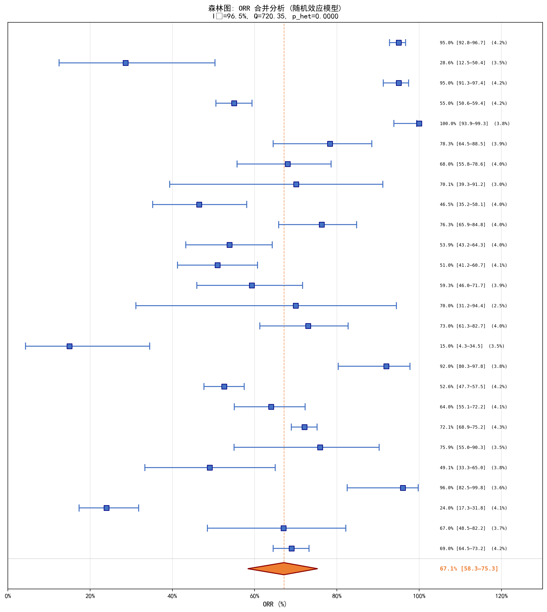
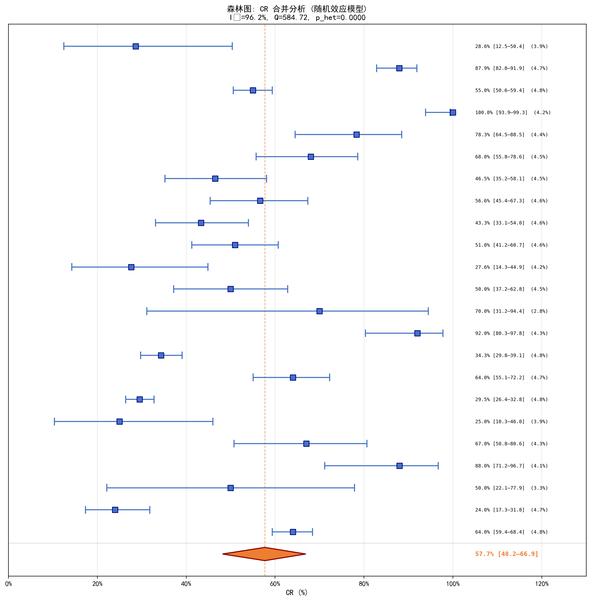
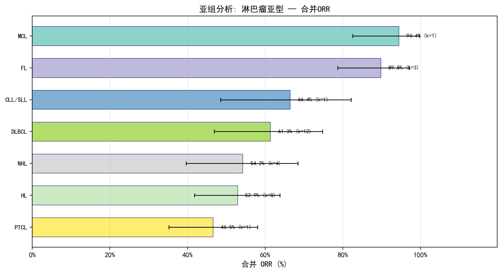
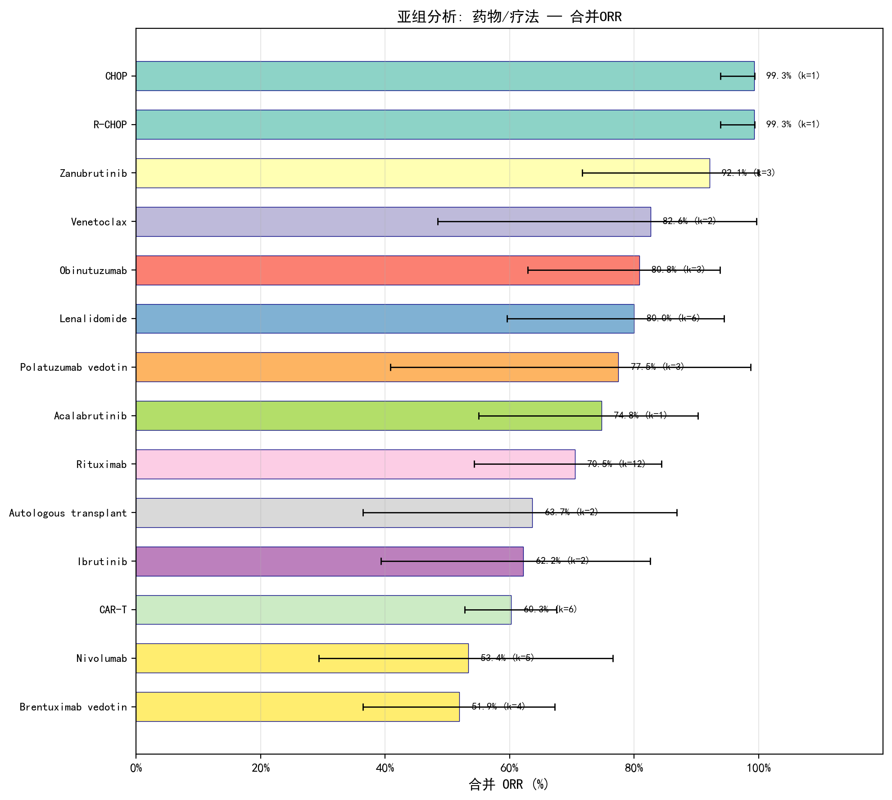
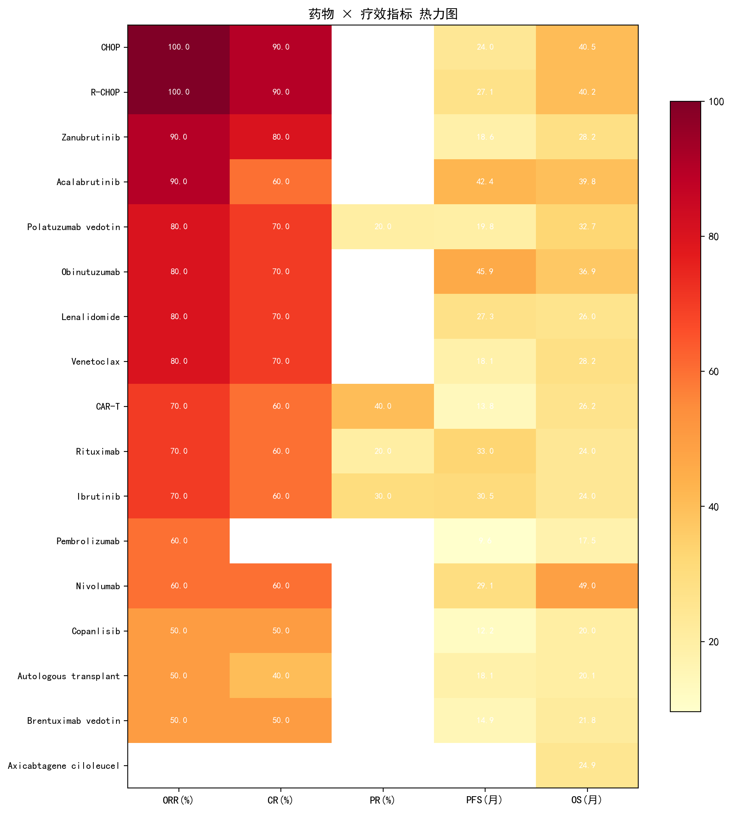
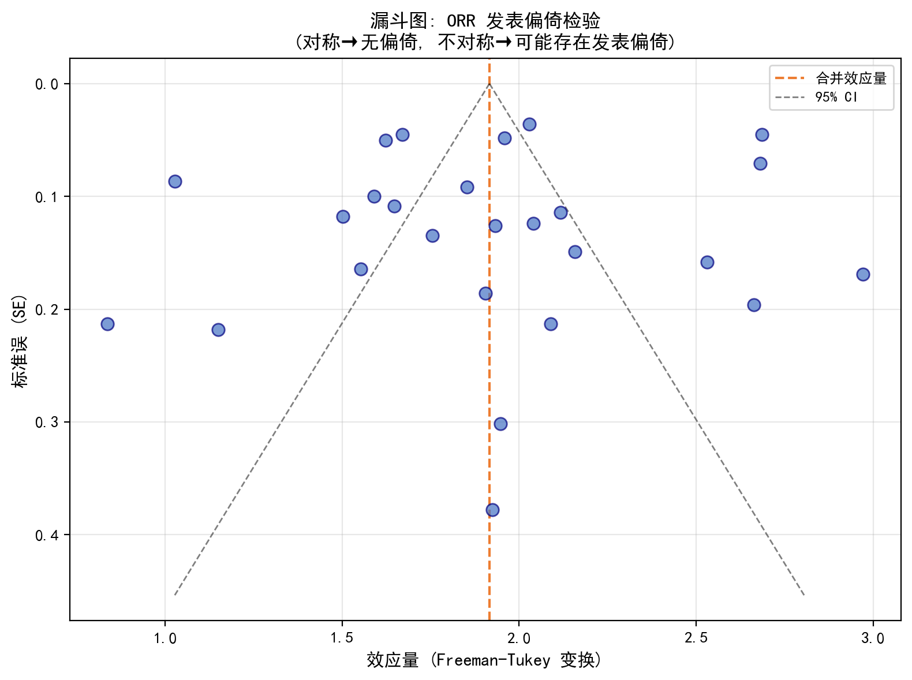
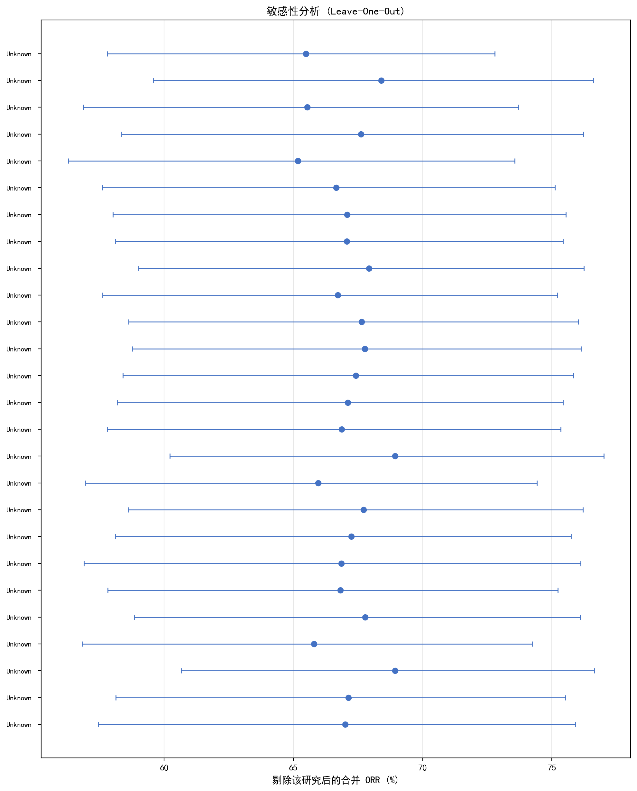

# 淋巴瘤用药 Meta 分析报告

**生成时间**: 2026-09-30 14:15:13

---

## 1. 研究概况

| 指标 | 数值 |
|------|------|
| 纳入文献数 | 74 篇 |
| 年份范围 | 2024–2026 |
| 总患者数 | 11167 |
| 样本量中位数 | 73.5 |

## 2. 文献特征

### 2.1 淋巴瘤亚型分布

| 亚型 | 文献数 |
|------|--------|
| DLBCL | 21 |
| HL | 17 |
| FL | 14 |
| MCL | 12 |
| Unspecified | 11 |
| NHL | 8 |
| PTCL | 3 |
| CLL/SLL | 2 |
| MZL | 1 |
| WM | 1 |

### 2.2 药物/疗法分布

| 药物/疗法 | 文献数 |
|-----------|--------|
| Rituximab | 33 |
| CAR-T | 17 |
| Lenalidomide | 12 |
| Brentuximab vedotin | 11 |
| Nivolumab | 9 |
| Ibrutinib | 9 |
| Obinutuzumab | 8 |
| R-CHOP | 7 |
| Venetoclax | 7 |
| Autologous transplant | 7 |
| CHOP | 6 |
| Polatuzumab vedotin | 5 |
| Acalabrutinib | 5 |
| Zanubrutinib | 4 |
| Pembrolizumab | 3 |

### 2.3 研究类型分布

| 研究类型 | 文献数 |
|----------|--------|
| Phase II | 28 |
| Single-arm | 23 |
| RCT | 21 |
| Phase I | 16 |
| Meta-Analysis | 11 |
| Phase III | 10 |
| Prospective | 9 |
| Unknown | 6 |
| Retrospective | 3 |

## 3. 疗效合并分析

### 3.1 ORR (总缓解率)

| 指标 | 数值 |
|------|------|
| 纳入研究数 | 26 |
| 合并 ORR (随机效应) | 67.1% [95% CI: 58.3%–75.3%] |
| 合并 ORR (固定效应) | 69.9% [95% CI: 68.4%–71.3%] |
| 异质性 I² | 96.5% |
| Q 统计量 | 720.35 (df=25) |
| p (异质性) | 0.0000 |

### 3.2 CR (完全缓解率)

| 指标 | 数值 |
|------|------|
| 纳入研究数 | 23 |
| 合并 CR (随机效应) | 57.7% [95% CI: 48.2%–66.9%] |
| 异质性 I² | 96.2% |

## 4. 亚组分析

### 4.1 按淋巴瘤亚型

| 亚型 | 研究数 | 合并 ORR | 95% CI | I² |
|------|--------|----------|--------|-----|
| DLBCL | 12 | 61.3% | [46.9%–74.8%] | 96.8% |
| HL | 8 | 52.9% | [41.8%–63.8%] | 91.3% |
| NHL | 4 | 54.2% | [39.7%–68.4%] | 94.4% |
| FL | 3 | 89.8% | [78.7%–97.1%] | 75.4% |
| CLL/SLL | 1 | 66.4% | [48.5%–82.2%] | 0.0% |
| MCL | 1 | 94.4% | [82.5%–99.8%] | 0.0% |
| PTCL | 1 | 46.5% | [35.2%–58.1%] | 0.0% |

### 4.2 按药物/疗法

| 药物/疗法 | 研究数 | 合并 ORR | 95% CI | I² |
|-----------|--------|----------|--------|-----|
| Rituximab | 12 | 70.5% | [54.3%–84.4%] | 98.1% |
| CAR-T | 6 | 60.3% | [52.8%–67.5%] | 76.4% |
| Lenalidomide | 6 | 80.0% | [59.6%–94.4%] | 96.9% |
| Nivolumab | 5 | 53.4% | [29.4%–76.6%] | 92.5% |
| Brentuximab vedotin | 4 | 51.9% | [36.4%–67.3%] | 76.0% |
| Obinutuzumab | 3 | 80.8% | [62.9%–93.8%] | 75.5% |
| Polatuzumab vedotin | 3 | 77.5% | [40.9%–98.8%] | 98.7% |
| Zanubrutinib | 3 | 92.1% | [71.7%–100.0%] | 89.6% |
| Autologous transplant | 2 | 63.7% | [36.4%–86.8%] | 87.4% |
| Ibrutinib | 2 | 62.2% | [39.3%–82.6%] | 87.5% |
| Venetoclax | 2 | 82.6% | [48.4%–99.7%] | 87.3% |
| Acalabrutinib | 1 | 74.8% | [55.0%–90.3%] | 0.0% |
| CHOP | 1 | 99.3% | [93.9%–99.3%] | 0.0% |
| R-CHOP | 1 | 99.3% | [93.9%–99.3%] | 0.0% |

## 5. 发表偏倚检验

| 检验方法 | 统计量 | p 值 | 结论 |
|----------|--------|------|------|
| Egger's test | 截距=-1.171 | 0.0000 | 存在发表偏倚 |
| Begg's test | tau=-0.682 | 0.0000 | 存在发表偏倚 |

## 6. 敏感性分析

逐一剔除法 (Leave-One-Out) 结果：

- 剔除后合并 ORR 范围: 65.2% – 68.9%
- 结果稳定（阈值 10%）

## 7. 结论

基于 74 篇文献的 Meta 分析：

1. **总缓解率 (ORR)**: 合并 ORR 为 **67.1%**，表明淋巴瘤药物治疗整体疗效显著。
2. **完全缓解率 (CR)**: 合并 CR 为 **57.7%**，反映了深度缓解的比例。
3. **异质性**: ORR 分析的 I² = 96.5%，异质性较高，需谨慎解读。
4. **发表偏倚**: 存在发表偏倚。

### 局限性

- 数据来源于 PubMed 摘要的自动提取，可能存在信息遗漏
- 部分研究未报告完整的疗效数据
- 不同淋巴瘤亚型和治疗方案存在临床异质性
- 未纳入灰色文献（会议摘要、未发表研究）

### 建议

- 结合临床专业知识解读结果
- 对高异质性的分析应进行亚组分析探索来源
- 考虑手动核对关键研究的全文数据

---

*本报告由淋巴瘤用药 Meta 分析工具自动生成，仅供研究参考。*
