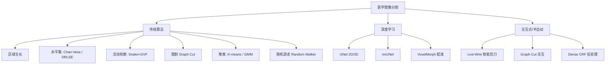

# 医学影像算法面试准备资料

> 涵盖：图像配准 · 医学图像分割 · AI模型训练与部署
> 基于实际项目代码整理，包含原理、公式、工程实现和面试高频问题

---

## 目录

- [第一部分：图像配准](#第一部分图像配准)
- [第二部分：医学图像分割](#第二部分医学图像分割)
- [第三部分：AI模型训练与部署](#第三部分ai模型训练与部署)
- [第四部分：高频面试问题速查](#第四部分高频面试问题速查)

---

## 第一部分：图像配准

### 1.1 配准问题本质

**核心定义**：寻找一个空间变换 $T$，使浮动图像 $I_M$ 在变换后与参考图像 $I_R$ 在空间上对齐。

**统一优化框架**：

$$T^* = \arg\min_{T} \underbrace{\mathcal{L}(I_R(\mathbf{x}),\ I_M(T(\mathbf{x})))}_{\text{相似度项}} + \lambda \underbrace{\mathcal{R}(T)}_{\text{正则化项}}$$

**坐标约定**：工程中统一使用 **Pull-back（向后映射）**：
$$I_{warped}(\mathbf{x}) = I_M(\mathbf{x} + \mathbf{u}(\mathbf{x}))$$

> **面试要点**：向后映射对每个输出像素找源图像中的位置，通过插值取值，避免输出图像出现空洞。

### 1.2 变换模型分类

| 变换类型 | 自由度 | 数学表示 | 适用场景 |
|---------|--------|---------|---------|
| **刚体 (Rigid)** | 6 (3平移+3旋转) | $p' = Rp + t$ | CT-PET、脑配准 |
| **仿射 (Affine)** | 12 (含缩放/剪切) | $p' = Ap + t$ | MR多序列 |
| **B-Spline FFD** | 控制点×3 | 三次样条插值 | 肿瘤局部形变 |
| **Demons形变** | 3N (稠密场) | 光流位移场 | CT-CT肝/肺 |
| **微分同胚** | 速度场指数映射 | $\phi = \exp(v)$ | 拓扑保持要求 |

### 1.3 相似度度量

#### MSE（均方误差）— 同模态

$$\text{MSE} = \frac{1}{N}\sum_i (I_R(i) - I_M(i))^2$$

> 仅适用于同模态（CT-CT），多模态时无效。

#### NMI（归一化互信息）— 多模态必选

$$\text{NMI} = \frac{H(I_R) + H(I_M)}{H(I_R, I_M)}$$

其中 $H(X) = -\sum_i p(i)\log p(i)$ 为信息熵。

> **面试要点**：CT-PET 必须用 NMI。CT 反映组织密度（HU值），PET 反映代谢活性（SUV值），两者无线性关系，但统计上相关，互信息能捕获这种非线性统计依赖。

#### NCC（局部归一化互相关）— 深度学习配准常用

$$\text{NCC}(I_R, I_M) = \frac{\sum (I_R - \bar{I_R})(I_M - \bar{I_M})}{\sqrt{\sum(I_R - \bar{I_R})^2 \cdot \sum(I_M - \bar{I_M})^2}}$$

> 深度学习配准（VoxelMorph）中使用局部窗口（如9×9）的NCC，对亮度线性变换不变。

### 1.4 刚体配准全流程

#### 四层架构（工业级实现）

```
应用层  FusionRegistrationCT_PET::AutoRegistration()
       │  CT去床板+HU裁剪, PET百分位裁剪, 先验矩阵, 参数配置
工具层  AlgoFusion::DoRigidReg()
       │  4×4矩阵→Versor+Offset, 采样步长计算, CPU/GPU路径选择
算法层  ImageRegistrationRigidG() (GPU) / ImageRegistrationRigid() (CPU)
       │  NMIMetric、Versor变换、OptimizationG
CUDA层  TransormPointKer、ComputeSdJHTG_Ker、ComputeGradient_Ker
```

#### 多分辨率金字塔

```
Level L-1 (最粗, 1/2^L 分辨率)  → 捕获大位移, 快速收敛
    ↓  结果缩放到下一层（平移×sX, 旋转不变）
Level 0  (原始分辨率)            → 精化到亚体素精度
```

> **面试要点**：
> - 降采样前先做高斯平滑（σ=1.0）防止**混叠伪影**
> - 平移参数按比例缩放：`init.tx *= sX`（sX = 下层宽/原始宽）
> - 旋转参数**不需要缩放**（弧度是无量纲量）

#### 单层梯度下降优化

**Step 1**：计算基线度量 $\text{base} = -\text{NMI}(\text{ref}, T(\text{mov};\mathbf{p}))$

**Step 2**：有限差分估计6个参数的梯度
$$\frac{\partial \mathcal{M}}{\partial \theta_i} \approx \frac{\mathcal{M}(\theta + \varepsilon \cdot e_i) - \mathcal{M}(\theta)}{\varepsilon}$$

- 平移：$\varepsilon_T = 0.5$ 体素
- 旋转：$\varepsilon_R = 0.003$ 弧度，梯度乘以体对角线长度 $d = \sqrt{W^2+H^2+D^2}$ 统一量纲

**Step 3**：归一化梯度 + 沿负梯度方向更新
$$\mathbf{p}_{t+1} = \mathbf{p}_t - \text{step} \cdot \frac{\nabla \mathcal{M}}{|\nabla \mathcal{M}|}$$

**Step 4**：步长松弛（类模拟退火）
- 度量变好 → 接受新参数
- 度量变差 → 拒绝，步长 `× 0.95`，直到 `step < minStep` 收敛

### 1.5 Versor 四元数变换

#### 为什么用四元数而非欧拉角

| 方式 | 问题 |
|------|------|
| 欧拉角 | **万向节锁**（Gimbal Lock）：特定角度下失去1个自由度 |
| 旋转矩阵 | 9参数但只有3自由度，需正交化约束，优化困难 |
| **四元数** | 4参数（实际3个，1个约束 $\|q\|=1$），无奇异，乘法更新保持单位化 |

#### 四元数存储与更新

存储 $(q_x, q_y, q_z)$，$q_w = \sqrt{1-q_x^2-q_y^2-q_z^2}$

**参数更新**（四元数乘法，保证单位四元数）：
$$q_{new} = q_{cur} \otimes dq, \quad dq = \left(\cos\frac{\theta}{2},\ \sin\frac{\theta}{2}\cdot\hat{n}\right)$$

#### 点变换公式

$$p' = R \cdot (p - c) + c + t$$

逆映射（配准重采样中使用）：
$$m = R^T \cdot (p - c - t) + c$$

### 1.6 Parzen 窗 NMI（Mattes MI）

| 组件 | 实现 |
|------|------|
| 参考图像 bin | **零阶 B-spline**（直接计数） |
| 浮动图像 bin | **三阶 B-spline** $\beta^3(x)$ 平滑分配 |

**三阶 B-spline 核**：
$$\beta^3(x) = \begin{cases} \frac{2}{3} - x^2 + \frac{|x|^3}{2} & |x| < 1 \\ \frac{(2-|x|)^3}{6} & 1 \le |x| < 2 \\ 0 & |x| \ge 2 \end{cases}$$

> **面试要点**：Parzen窗的作用是将离散的灰度值平滑分配到直方图bin中，使联合概率密度函数可微，从而可以计算解析梯度。

### 1.7 非刚体配准算法

#### Demons 算法（光流法）

**光流力公式**（Thirion 1998）：
$$\mathbf{F}(\mathbf{x}) = \frac{(I_R - I_M) \cdot \nabla I_R}{|\nabla I_R|^2 + \alpha^2(I_R - I_M)^2}$$

**形变场更新**：
$$\mathbf{u}^{t+1} = G_\sigma * (\mathbf{u}^t + s \cdot \mathbf{F})$$

每次迭代：warp浮动图 → 计算光流力 → 高斯平滑力场 → 累加到位移场 → 高斯平滑位移场

> **面试要点**：分母中的 $\alpha^2(I_R-I_M)^2$ 项是正则化，防止在差异大的区域产生过大位移。

#### B-Spline FFD（自由变形）

形变场由三次 B 样条控制点描述：
$$T(\mathbf{x}) = \mathbf{x} + \sum_{l,m,n} \beta^3(u_l)\beta^3(v_m)\beta^3(w_n) \cdot \mathbf{c}_{i+l,j+m,k+n}$$

> 控制点稀疏分布，局部影响范围由B样条支撑区间决定，天然具有平滑性。

#### 微分同胚配准（缩放-平方法）

$$\phi = \exp(v) \approx v/2^n \text{ 复合 } 2^n \text{ 次}$$

- 保证形变场可逆：$\det(J) > 0$
- 拓扑结构保持：不会产生折叠
- VoxelMorph3DDiff 中 nsteps=7

#### 肝部/肺部两级非刚体配准

```
第一级：全局粗配准
  刚体矩阵重采样 → 降采样 → MultiGridDemons (3级金字塔, GPU)
  → 形变场上采样回原始分辨率

第二级：局部器官配准
  关键点定位 → 提取子体积 → 局部Demons → 边缘平滑过渡 → 融合到全局场
```

### 1.8 图像预处理

#### CT 预处理
1. **去床板**：床板区域设为 -1024（空气），避免干扰 NMI
2. **HU 转换**：`HU = pixel × RescaleSlope + RescaleIntercept`
3. **窗位裁剪** `[-1024, 1024]`：排除金属伪影极端值

#### PET 预处理（自适应百分位）
1. 降采样到 10mm 快速统计
2. 百分位 `[0.01, 1.0]` → 获取 `pet_low`
3. 自适应上界：`up_ratio = back_ratio + (1 - back_ratio) × 0.99`

### 1.9 重采样（逆映射 + 三线性插值）

```cpp
// 对Fixed空间每个体素(x,y,z)
float dx = (x - cx) - tx;  // 先去平移
float dy = (y - cy) - ty;
float dz = (z - cz) - tz;
// 再施加旋转的转置（逆旋转）
mx = cx + R[0][0]*dx + R[1][0]*dy + R[2][0]*dz;
my = cy + R[0][1]*dx + R[1][1]*dy + R[2][1]*dz;
mz = cz + R[0][2]*dx + R[1][2]*dy + R[2][2]*dz;
// 三线性插值取Moving图像的值
out(x,y,z) = trilinear(mov, mx, my, mz);
```

**三线性插值**（8体素加权）：
$$f(x,y,z) = \sum_{i,j,k \in \{0,1\}^3} f_{ijk} \cdot w_x^i \cdot w_y^j \cdot w_z^k$$

### 1.10 GPU加速关键内核

| 内核 | 功能 | 关键技术 |
|------|------|---------|
| `TransormPointKer` | 坐标变换+纹理插值 | CUDA 3D纹理内存自动插值 |
| `ComputeSdJHTG_Ker` | 联合直方图构建 | 共享内存+原子操作 |
| `ComputeGradient_Ker` | 梯度计算 | Warp-level并行 |
| `DerivateRigid_multiMem_Ker` | Versor刚体导数 | 预计算9个乘积项 |

---

## 第二部分：医学图像分割

### 2.1 分割算法分类总览



### 2.2 区域生长（Region Growing）

**原理**：从种子点出发，按一定准则向邻域扩展，将相似像素归为同一区域。

**三种准则**：

| 准则 | 公式 | 场景 |
|------|------|------|
| 阈值法 | $I(q) \in [low, high]$ | 已知目标灰度范围 |
| 差值法 | $\|I(q) - \mu_{seed}\| \leq tol$ | 基于种子相似度 |
| 比值法 | $\|I(q)/\mu_{seed} - 1\| \leq tol$ | 比例不变 |

> **面试要点**：支持2D（4/8连通）和3D（6/26连通）。医学图像推荐6-连通（更保守，不穿透间隙）。`maxVoxels` 参数防止无限扩张。

### 2.3 水平集方法

#### Chan-Vese 水平集（基于区域）

**能量泛函**：
$$E(\phi) = \mu \int|\nabla H(\phi)|dx + \lambda_1\int(I-c_1)^2 H(\phi)dx + \lambda_2\int(I-c_2)^2(1-H(\phi))dx$$

**演化方程**：
$$\frac{\partial\phi}{\partial t} = \delta(\phi)[\mu\kappa - \lambda_1(I-c_1)^2 + \lambda_2(I-c_2)^2]$$

**关键技术**：
- **窄带加速**：仅在 $|\phi| < 1.2$ 处计算，大幅减少计算量
- **Sussman 重初始化**：定期求解 $|\nabla\psi|=1$ 修正 SDF 性质
- **CFL 步长**：$\Delta t = 0.45 / \max(|\Delta\phi|)$ 自适应稳定

> **面试要点**：Chan-Vese 不依赖图像梯度（边缘），适合边界模糊的 MR 脑组织/CT 器官分割。$c_1, c_2$ 分别是轮廓内外区域的平均灰度。

#### DRLSE（距离正则化水平集）

**核心创新**：加入距离正则项 $R(\phi)$，使 $|\nabla\phi|$ 自动维持 SDF 性质，**彻底消除重初始化**。

**双势阱函数**：
$$p(s) = \begin{cases} (s-1)^2/4, & s \leq 1 \\ \frac{1}{2\pi}(1-\cos(2\pi s)), & s > 1 \end{cases}$$

> **面试要点**：双势阱函数在 $s=1$ 处有最小值，驱动 $|\nabla\phi| \to 1$（SDF性质），同时远离 $s=0$ 避免零梯度。

### 2.4 Snake + GVF（参数化活动轮廓）

**GVF（梯度向量流）**：将梯度信息扩散到整个图像域，解决捕获范围问题。

$$u \leftarrow u + \mu\nabla^2 u - |\nabla f|^2(u - f_x)$$

> **面试要点**：传统Snake的力场仅在边缘附近有效，GVF通过扩散方程将力场扩展到整个图像，大大增加捕获范围。

### 2.5 Graph Cut（图割）

**能量**：
$$E(L) = \sum_p D_p(L_p) + \lambda\sum_{p,q\in N} V_{pq}(L_p, L_q)$$

- $D_p$：数据项（像素与标签的匹配度）
- $V_{pq}$：平滑项（相邻像素标签一致性）

**最大流算法**：Edmonds-Karp（BFS增广路径），$O(VE^2)$

> **面试要点**：Graph Cut 保证全局最优解（多项式时间），但只能处理二分类（多标签需要α-expansion等扩展）。

### 2.6 Dense CRF（条件随机场后处理）

**Pairwise 核**：
$$k_{app} = \exp\left(-\frac{|p_i-p_j|^2}{2\theta_\alpha^2} - \frac{|I_i-I_j|^2}{2\theta_\beta^2}\right)$$

**Permutohedral Lattice 加速**：将 $O(N^2)$ 全连接滤波降为 $O(N \cdot d)$

> **面试要点**：CRF 常用于深度学习分割结果的后处理，利用图像外观和空间一致性精化边界。全连接CRF每个像素都与所有其他像素有连接，通过高维滤波加速。

### 2.7 肿瘤分割（OncologyAlgorithms）

#### K-means / GMM 聚类分割

| 方法 | 原理 | 适用 |
|------|------|------|
| K-means(k=2) | EM迭代聚类 | 均质实性肿瘤 |
| GMM | 高斯混合模型EM | 部分容积效应肿瘤 |
| Random Walker | 稀疏线性方程组 | 边界模糊任意形状 |

**Random Walker 核心**：边权 $w(i,j) = \exp(-\beta \times (HU_i - HU_j)^2)$，求解 $L_u \cdot x = -B_u \cdot x_s$

#### PET 病灶分割（SUV阈值法）

| 模式 | 方法 | 标准 |
|------|------|------|
| Fixed | 固定 SUV=2.5 | PERCIST标准 |
| Percent | 42% SUVmax | EANM推荐 |
| Adaptive | 迭代调整权重 | 自动平衡灵敏度/特异性 |

#### CT 肺结节分割（6步流程）

```
Step 1 胸腔提取（-400HU阈值 + 形态学）
Step 2 ROI提取（种子点 + roiRadiusMM）
Step 3 多尺度Hessian血管增强（σ ∈ [1mm, 3mm]）
Step 4 HU阈值初始化
Step 5 形态精化（Solid/JuxtaWall/JuxtaVessel/GGO四类型）
Step 6 3D凸包平滑
```

**Hessian点状响应**：
$$S_{blob} = \exp\left(-\frac{|\lambda_1|^2}{2A^2}\right) \times \left(1 - \exp\left(-\frac{R_B^2}{2B^2}\right)\right) \times \left(1 - \exp\left(-\frac{S^2}{2C^2}\right)\right)$$

### 2.8 血管中心线提取

#### Fast Marching 方法

**三阶段 Pipeline**：

```
阶段1: FMM(F=1)从边界向内 → 距离场D(x)，源点=argmax D(x)
阶段2: FMM(F=1/√D)从源点 → 分支端点
阶段3: FMM(F=1/exp(D))从源点 → 时间场T(x)，最陡下降回溯中心线
```

**Eikonal 方程**：$|\nabla T| \cdot F = 1$

> **面试要点**：Fast Marching 求解 Eikonal 方程，使用最小堆数据结构（带DecreaseKey），一阶Upwind格式离散化。

#### Profile Medialness 方法

在血管法平面内 36 个角度 × 多半径采样灰度剖面，最小环形响应半径 = 血管壁。

$$\text{medialness} = 1 - \min\left(4,\; \frac{\text{min ring sum}}{36}\right) / 4$$

> GPU加速比 10×，CPU版本自动回退。

### 2.9 放疗自动勾画（RTAutoContour）

| 模块 | 核心算法 |
|------|----------|
| 形态学 | 2D/3D腐蚀/膨胀/闭运算/孔洞填充（球形结构元素） |
| 连通域 | BFS标记（4/8/6/26连通），面积/质心/偏心率 |
| Live-Wire | Dijkstra最短路径，交互式轮廓勾画 |
| 轮廓插值 | Catmull-Rom样条细分，逐层轮廓→3D掩膜 |
| CT复位匹配 | 骨结构投影 + NCC切片匹配 |
| 治疗床检测 | Z-MIP → 二次多项式拟合 |

---

## 第三部分：AI模型训练与部署

### 3.1 模型架构总览

#### 分割网络：UNet

**UNet 2D**：
```
编码器: 4层 DoubleConv(Conv3×3 → BN → ReLU)×2 + MaxPool2d
通道:   1 → 64 → 128 → 256 → 512 → Bottleneck(1024)
解码器: ConvTranspose2d 上采样 + Skip Connection 拼接
输出:   1×1 Conv → num_classes
```

**UNet 3D**：
```
全换为3D算子: Conv3d → BN3d → ReLU
通道:   1 → 32 → 64 → 128 → 256（比2D小，减少显存）
输入:   (B, 1, D, H, W)  输出: (B, C, D, H, W)
Patch训练: 默认 64×128×128
```

> **面试要点**：
> - **Skip Connection** 的作用：将编码器的高分辨率特征与解码器拼接，保留空间细节
> - **3D UNet 比 2D 通道数少**：3D卷积参数量是2D的D倍，需减少通道控制显存
> - **Patch训练**：3D数据太大无法整块输入，用滑动窗口+高斯权重融合

#### 配准网络：VoxelMorph

**VoxelMorph 2D**：
```
架构: U-Net形编码器-解码器 + SpatialTransformer(STN)
输入: [fixed(B,1,H,W); moving(B,1,H,W)] → Concat(B,2,H,W)
输出: warped(B,1,H,W), flow(B,2,H,W)
flow_conv: 2通道(dx,dy)，小权重初始化(std=1e-5) → 初始近恒等变换
```

**VoxelMorph 3D / VoxelMorph3DDiff**：
```
ConvBlock3D: Conv3d → InstanceNorm3d → LeakyReLU(0.2)
编码器: [16, 32, 64, 64]  解码器: [64, 64, 32, 16]
flow_conv: 3通道(dz,dy,dx)

VoxelMorph3D: 直接输出位移场
VoxelMorph3DDiff: 输出速度场 → VecInt积分为微分同胚形变场
  VecInt: 缩放-平方法(Scaling & Squaring)，nsteps=7
  原理: φ = v/2^7，平方7次复合 → 保证拓扑可逆(det(J)>0)
```

> **面试要点**：
> - **InstanceNorm vs BatchNorm**：配准网络用InstanceNorm（batch小时稳定），分割用BatchNorm
> - **flow_conv 小权重初始化**：使网络初始输出接近恒等变换（零位移），有利于训练收敛
> - **SpatialTransformer(STN)**：预计算规则网格 + `F.grid_sample`双线性插值实现可微重采样

### 3.2 损失函数体系

#### 分割损失

| 损失 | 公式 | 用途 |
|------|------|------|
| `DiceLoss` | $1 - \frac{2\|A\cap B\| + \epsilon}{\|A\|+\|B\|+\epsilon}$ | 类别不平衡 |
| `DiceCELoss` | $0.5\cdot\text{Dice} + 0.5\cdot\text{CE}$ | 兼顾收敛速度与精度 |

> **面试要点**：Dice Loss 对类别不平衡鲁棒（直接优化重叠度），CE Loss 收敛快但受不平衡影响。组合使用效果最佳。

#### 配准损失

$$\mathcal{L}_{total} = w_{sim}\cdot\mathcal{L}_{sim} + w_{smooth}\cdot\mathcal{L}_{smooth} + w_{jac}\cdot\mathcal{L}_{jac}$$

| 损失 | 说明 |
|------|------|
| `NCCLoss3D` | 局部归一化互相关，窗口9×9，对亮度线性变换不变 |
| `LNCCLoss3D` | 多窗口NCC，窗口[5,9]，多尺度结构响应 |
| `MSELoss3D` | 均方误差，适合同模态 |
| `GradientLoss3D` | 一阶有限差分：$\sum\|\nabla\phi\|^2$，防止剧烈变形 |
| `BendingEnergyLoss3D` | 二阶导数：惩罚非线性弯曲，适合肝部大形变 |
| `JacobianLoss` | $\sum\max(0,-\det(J))^2$，直接惩罚折叠体素 |

> **面试要点**：
> - 配准是**自监督**的——不需要标注，纯图像相似性驱动
> - **平滑正则**不可少：仅有相似度损失会导致不合理的剧烈变形
> - **Jacobian惩罚**：$\det(J) \leq 0$ 表示形变场折叠（拓扑破坏），必须惩罚

### 3.3 训练流程

#### 2D分割训练

```yaml
模型: UNet2D (features=[64,128,256,512])
损失: DiceCELoss (Dice:CE = 0.5:0.5)
优化: Adam, lr=0.001, weight_decay=1e-4
调度: CosineAnnealingLR
Epoch: 50, batch=8, 输入256×256
指标: Dice Coefficient
```

#### 3D血管分割训练

```yaml
模型: UNet3D (features=[16,32,64,128]，轻量配置)
输入: Patch 64×128×128 (滑动窗口)
损失: DiceCELoss
优化: Adam, lr=1e-4
AMP: torch.amp.autocast("cuda")  # 混合精度
梯度裁剪: clip_grad_norm_(max_norm=1.0)
断点续训: --resume 参数支持
```

#### 3D配准训练（高级特性）

```yaml
模型: VoxelMorph3DDiff (微分同胚)
损失: LNCC(多窗口) + BendingEnergy(0.5) + Jacobian惩罚(0.1)
体数据: 64×64×64, batch=2
优化: Adam, lr=1e-4, weight_decay=1e-5
调度: warmup(5epoch) + CosineAnnealingLR
特性: AMP混合精度 + 梯度裁剪 + 多分辨率金字塔 + 断点续训
器官预设: --preset lung/liver 自动调整参数
```

> **面试要点**：
> - **混合精度(AMP)**：`torch.amp.autocast` 自动在FP32/FP16间切换，节省显存约40%，加速训练
> - **梯度裁剪**：`clip_grad_norm_(max_norm=1.0)` 防止梯度爆炸
> - **Warmup + CosineAnnealing**：预热阶段避免初期学习率过大，余弦退火平滑收敛
> - **多分辨率金字塔训练**：从低分辨率[32→64→128]逐步训练，类似传统配准的金字塔策略

### 3.4 数据增强策略

#### 2D增强

| 变换 | 参数 | 说明 |
|------|------|------|
| 水平/垂直翻转 | p=0.5 | 图像+Mask同步 |
| 随机旋转 | ±15° | 最近邻插值(Mask) |
| 亮度对比度 | α∈[0.8,1.2] | 仅图像 |
| 高斯噪声 | σ=0.02 | 仅图像 |

#### 3D增强

| 变换 | 说明 |
|------|------|
| `RandomFlip3D` | 随机翻转任意轴，fixed/moving同步 |
| `RandomRotate90_3D` | 三个平面(DH/HW/DW)随机90°旋转 |
| `RandomIntensity3D` | fixed和moving**独立**应用（模拟多模态） |
| `RandomGaussianNoise3D` | 高斯噪声 |

#### 合成数据生成（弹性变形）

```python
# 生成随机位移场 → 高斯平滑 → 三线性插值
dz/dy/dx = randn(D,H,W) * alpha   # alpha控制幅度
dz/dy/dx = gaussian_filter(_, sigma)  # sigma控制平滑度
# 肺部: sigma=10, alpha=15（大形变模拟呼吸运动）
# 肝部: sigma=6,  alpha=10（平滑大形变）
```

> **面试要点**：弹性变形是医学图像最有效的增强之一。高斯平滑保证形变场空间连续性，alpha控制形变幅度，sigma控制平滑度。

### 3.5 评估指标

#### 分割指标

| 指标 | 公式 | 说明 |
|------|------|------|
| **Dice** | $\frac{2\|A\cap B\|}{\|A\|+\|B\|}$ | 主要指标，0→1 |
| **IoU/Jaccard** | $\frac{\|A\cap B\|}{\|A\cup B\|}$ | 与Dice等价 |
| **HD95** | 第95百分位豪斯多夫距离 | 边界质量，对异常值鲁棒 |
| **Sensitivity** | $\frac{TP}{TP+FN}$ | 召回率 |
| **Specificity** | $\frac{TN}{TN+FP}$ | 特异度 |

#### 配准指标

| 指标 | 说明 | 理想值 |
|------|------|--------|
| **SSIM3D** | 结构相似性 | →1 |
| **PSNR3D** | 峰值信噪比(dB) | 越高越好 |
| **Dice3D** | 配准后标签重叠度 | →1 |
| **Jacobian det(J)** | 行列式均值/标准差 | 均值≈1 |
| **folding_ratio** | det(J)≤0的体素比例 | →0% |
| **TRE** | 目标配准误差(需landmark) | 金标准 |

> **面试要点**：
> - **HD95** 比 Dice 更关注边界质量，对离群点鲁棒（取95百分位而非最大值）
> - **folding_ratio** 是配准特有的指标，检测拓扑破坏
> - **TRE** 是配准金标准，但需要专家标注的对应点

### 3.6 TensorRT部署流程

```
步骤1: PyTorch → ONNX
  - CPU上trace（避免cuDNN dispatch报错）
  - 固定输入形状(1,1,D,H,W)，opset=17
  - constant_folding优化

步骤2: ONNX → TensorRT Engine
  - FP16精度（推荐）
  - 构建时间2~5分钟
  - 引擎与GPU型号/TRT版本绑定

步骤3: TRT推理
  - 兼容TRT 8.x/9.x/10.x（API差异统一封装）
  - 滑动窗口推理 + 高斯权重图融合
  - 回退链: TRT → ONNX Runtime → 报错提示
```

**性能对比 (RTX 3060, patch 64×128×128)**：

| 方式 | 耗时 | 加速比 |
|------|------|--------|
| PyTorch FP32 | ~80s | 1× |
| TensorRT FP16 | ~18s | **~4×** |

> **面试要点**：
> - TRT引擎与GPU型号绑定，不能跨平台迁移
> - FP16精度在医学图像上通常无损（动态范围足够）
> - 滑动窗口推理时用高斯权重融合，消除拼接边界伪影

### 3.7 C++互操作设计

```
Python训练 → 导出ONNX → TRT Engine → C++推理
                                          ↓
                                    .raw二值掩码 + JSON元数据
                                          ↓
                                    OpenGL渲染器直接加载
```

> 推理结果导出为 `.raw` 二值掩码 + JSON元数据（尺寸/spacing/origin），直接对接C++渲染管线。

---

## 第四部分：高频面试问题速查

### 配准类

**Q1: 为什么CT-PET配准必须用互信息而非MSE？**
> CT反映组织密度（HU值），PET反映代谢活性（SUV值），两者无线性关系但统计相关。MSE假设线性关系，多模态时无效；互信息捕获非线性统计依赖。

**Q2: 多分辨率金字塔为什么有效？**
> 1) 粗分辨率捕获大位移，避免陷入局部最优；2) 计算量减少（粗层像素少）；3) 高斯平滑消除噪声干扰。注意平移参数需按分辨率缩放，旋转不需要。

**Q3: 为什么用四元数而非欧拉角表示旋转？**
> 欧拉角有万向节锁问题（Gimbal Lock），特定角度下失去一个自由度。四元数无奇异，通过乘法更新自动保持单位化约束，适合梯度优化。

**Q4: Demons算法的核心思想是什么？**
> 基于光流假设，用图像差异和梯度计算驱动力，高斯平滑保证空间连续性。分母中的正则项防止差异大的区域产生过大位移。

**Q5: 微分同胚配准为什么能保证拓扑保持？**
> 微分同胚变换是可逆且光滑的。缩放-平方法将速度场积分：$\phi = \exp(v)$，通过7次平方复合保证 $\det(J) > 0$，即不会产生折叠。

**Q6: 向后映射（Pull-back）相比向前映射有什么优势？**
> 向后映射对每个输出像素找源图像位置，通过插值取值，不会产生输出空洞。向前映射可能导致输出像素未被赋值（空洞）或多次赋值（需要累加）。

### 分割类

**Q7: UNet的Skip Connection有什么作用？**
> 将编码器的高分辨率特征与解码器拼接，补充下采样丢失的空间细节。分割需要精确的边界定位，Skip Connection保留了定位信息。

**Q8: Dice Loss和CE Loss各有什么优缺点？**
> Dice Loss对类别不平衡鲁棒（直接优化重叠度），但梯度不稳定（小目标时）。CE Loss收敛快、梯度稳定，但受类别不平衡影响。组合使用（DiceCE）效果最佳。

**Q9: Chan-Vese和基于边缘的水平集有什么区别？**
> Chan-Vese基于区域能量（轮廓内外灰度均值），不依赖图像梯度，适合边界模糊的图像。基于边缘的方法依赖梯度停止函数，弱边界时容易泄漏。

**Q10: DRLSE如何消除重初始化？**
> 引入距离正则项 $R(\phi)$，使用双势阱函数驱动 $|\nabla\phi| \to 1$（SDF性质），在能量泛函中自动维持水平集函数的性质，无需额外重初始化步骤。

**Q11: Graph Cut如何保证全局最优？**
> 将分割建模为能量最小化问题，转化为图的最小割问题。s-t最小割可在多项式时间内求得全局最优解（最大流=最小割定理）。但仅限二分类，多标签需α-expansion。

**Q12: 3D分割为什么用Patch训练而非整块？**
> 3D医学图像通常很大（如512×512×300），整块输入会超出显存。Patch训练（如64×128×128）减少显存占用，但需要滑动窗口推理+高斯权重融合消除边界伪影。

### AI训练类

**Q13: VoxelMorph相比传统配准有什么优势？**
> 1) 推理速度快（一次前向传播 vs 传统迭代优化）；2) 可学习最优特征表示；3) 自监督训练无需标注。但泛化性可能不如传统方法。

**Q14: 为什么配准网络用InstanceNorm而非BatchNorm？**
> 配准通常batch=1或2，BatchNorm在小batch时统计量不稳定。InstanceNorm对每个样本独立归一化，不受batch大小影响，更适合配准任务。

**Q15: Jacobian行列式在配准中有什么意义？**
> $\det(J) > 0$ 表示形变场局部可逆（拓扑保持）；$\det(J) \leq 0$ 表示折叠（拓扑破坏）。JacobianLoss直接惩罚 $\max(0, -\det(J))^2$，folding_ratio指标检测折叠比例。

**Q16: 混合精度训练(AMP)的原理和注意事项？**
> 自动在FP32/FP16间切换：前向传播用FP16加速，梯度累积和参数更新用FP32保证精度。需配合GradScaler防止FP16梯度下溢。节省显存约40%，加速1.5-2×。

**Q17: TensorRT为什么能加速推理？**
> 1) 算子融合（Conv+BN+ReLU合并）；2) FP16/INT8精度降低计算量；3) 内核自动调优（针对GPU选择最优实现）；4) 内存布局优化。但引擎与GPU型号绑定，不能跨平台。

**Q18: 滑动窗口推理为什么要用高斯权重融合？**
> Patch边缘的预测受感受野限制，质量低于中心。高斯权重使中心区域贡献更大，边缘贡献较小，消除拼接时的边界不连续。

**Q19: 弹性变形数据增强的原理？**
> 生成随机位移场 → 高斯平滑（保证空间连续性）→ 对图像做三线性插值变形。alpha控制形变幅度，sigma控制平滑度。模拟器官自然形变（如呼吸运动），是医学图像最有效的增强之一。

**Q20: HD95指标为什么比Dice更关注边界？**
> Dice衡量体积重叠，不关注边界位置。HD95计算预测边界与真实边界点的距离的第95百分位，直接反映边界定位精度，且对离群点鲁棒（取95%而非最大值）。

---

## 附录：关键公式速查表

| 公式 | 说明 |
|------|------|
| $T^* = \arg\min_T \mathcal{L}(I_R, I_M \circ T) + \lambda\mathcal{R}(T)$ | 配准统一框架 |
| $\text{NMI} = (H_R + H_M) / H_{RM}$ | 归一化互信息 |
| $\nabla_T \mathcal{M} \approx [\mathcal{M}(\theta+\varepsilon e_i)-\mathcal{M}(\theta)] / \varepsilon$ | 有限差分梯度 |
| $q_{new} = q \otimes dq$ | Versor四元数更新 |
| $\mathbf{F} = (I_R-I_M)\nabla I_R / (\|\nabla I_R\|^2 + \alpha^2(I_R-I_M)^2)$ | Demons光流力 |
| $T(\mathbf{x}) = \mathbf{x} + \sum_{lmn} \beta^3 \cdot \mathbf{c}_{lmn}$ | B-Spline FFD |
| $\phi = \exp(v) \approx v/2^n \text{ 复合 } 2^n \text{ 次}$ | 微分同胚（缩放-平方） |
| $\text{Dice} = 2\|A\cap B\| / (\|A\|+\|B\|)$ | Dice系数 |
| $\mathcal{L}_{jac} = \sum\max(0, -\det(J))^2$ | Jacobian折叠惩罚 |
| $\text{HD95} = \text{Percentile}_{95}(\max_{p\in A}\min_{q\in B} d(p,q))$ | 95百分位豪斯多夫距离 |
