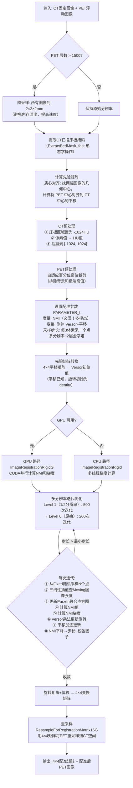
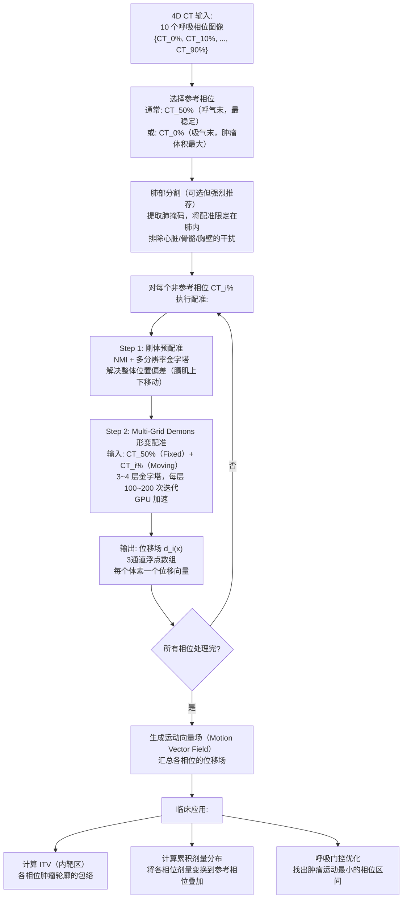
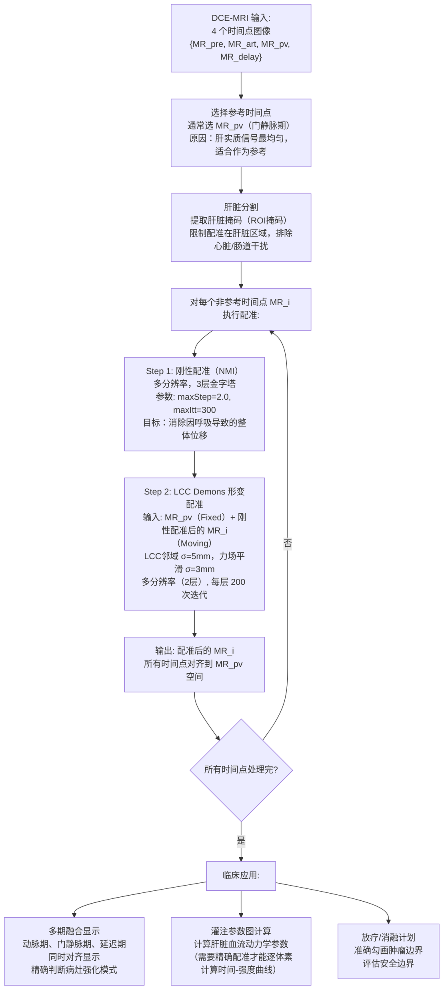

# 医疗影像配准：从零到精通

> 本文档面向完全没有配准基础的读者，用"为什么这么做"的视角，把配准的每一个概念、每一个设计决策讲清楚。所有代码示例均来自本项目的真实实现（`include/ct_pet_registration.hpp`、`配准算法详细文档.md`、`CT_PET刚体配准详细文档.md`）。

---

## 目录

1. [什么是配准？为什么需要它？](#1-什么是配准为什么需要它)
2. [配准的三大核心组件](#2-配准的三大核心组件)
3. [变换模型：我们在优化什么？](#3-变换模型我们在优化什么)
4. [相似度量：怎么衡量"对齐好了"？](#4-相似度量怎么衡量对齐好了)
5. [归一化互信息（NMI）深度解析](#5-归一化互信息nmi深度解析)
6. [优化器：怎么找到最佳变换？](#6-优化器怎么找到最佳变换)
7. [Versor：为什么用四元数表示旋转？](#7-versor为什么用四元数表示旋转)
8. [多分辨率金字塔：为什么从粗到细？](#8-多分辨率金字塔为什么从粗到细)
9. [图像预处理：为什么在配准前要处理图像？](#9-图像预处理为什么在配准前要处理图像)
10. [刚体配准完整流程（CT-PET 案例）](#10-刚体配准完整流程ct-pet-案例)
11. [仿射配准：刚体之外多了什么？](#11-仿射配准刚体之外多了什么)
12. [形变配准：当刚体不够用时](#12-形变配准当刚体不够用时)
13. [Demons 配准：把配准想象成流体](#13-demons-配准把配准想象成流体)
14. [B-Spline FFD：用控制点描述形变](#14-b-spline-ffd用控制点描述形变)
15. [SyN 对称归一化配准](#15-syn-对称归一化配准)
16. [GPU 加速：为什么配准需要 GPU？](#16-gpu-加速为什么配准需要-gpu)
17. [深度学习配准](#17-深度学习配准)
18. [常见误区与调参指南](#18-常见误区与调参指南)

---

## 1. 什么是配准？为什么需要它？

### 1.1 一个直观的例子

想象你拍了两张同一场景的照片：一张在早上，一张在晚上。它们记录的是同一个地方，但由于相机位置稍有不同、角度稍有变化，两张照片里的建筑物并不在完全相同的像素位置上。

如果你想把这两张照片叠加比较（比如找出"哪里的灯亮了"），你就需要先把它们"对齐"——这个对齐的过程就叫**配准（Registration）**。

### 1.2 医学影像为什么需要配准？

在医疗影像领域，配准是一个极其基础且普遍的需求：

**场景 1：CT + PET 融合**  
- CT 显示解剖结构（骨骼、器官的位置和形状）
- PET 显示代谢活性（哪里的葡萄糖消耗多 = 可能是肿瘤）
- 两次扫描时间不同、病人体位可能不同 → 需要配准才能准确判断"这个高代谢点在哪个解剖位置"

**场景 2：手术前后对比**  
- 肿瘤手术前后的 MR 图像，需要配准才能量化肿瘤体积变化

**场景 3：放疗靶区勾画**  
- 放疗计划需要在 CT 上勾画，但同时参考 MR 的软组织对比度 → 多模态配准

**场景 4：运动校正**  
- 心脏 4D CT 中，同一患者在不同心动周期的图像之间存在运动 → 需要配准消除运动伪影

### 1.3 配准的输出是什么？

配准的输出不是一张新图像（那叫重采样），而是一个**变换 T**，描述"把图像 B 变换到与图像 A 对齐所需要的操作"。

$$T: \mathbf{x}_{A空间} \leftrightarrow \mathbf{x}_{B空间}$$

有了变换 T，你就可以：
- 把图像 B 重采样到图像 A 的空间（用于可视化叠加）
- 把在 A 上勾画的轮廓映射到 B 的空间（用于剂量计算）
- 量化两个图像之间的形状差异

---

## 2. 配准的三大核心组件

任何配准算法，无论多复杂，都由以下三个部分组成：

```
┌─────────────────────────────────────────────────────────┐
│                    配准系统框架                          │
│                                                         │
│  Fixed Image (参考图像/固定图像)                         │
│    + Moving Image (浮动图像/待配准图像)                  │
│         │                                               │
│         ▼                                               │
│  ┌──────────────┐    ┌──────────────┐    ┌───────────┐  │
│  │  变换模型 T   │ ←→ │  相似度量 M  │ ←→ │  优化器 O │  │
│  │ (描述如何移动)│    │ (衡量对齐程度)│    │(找最优 T) │  │
│  └──────────────┘    └──────────────┘    └───────────┘  │
│         │                                               │
│         ▼                                               │
│  输出: 最优变换 T*                                       │
└─────────────────────────────────────────────────────────┘
```

### 2.1 Fixed Image（参考图像/固定图像）

**它是谁：** 配准的"基准"，坐标空间保持不变。  
**为什么叫 Fixed：** 它在配准过程中"固定不动"，所有变换都作用在 Moving Image 上，让 Moving 向 Fixed 靠近。

在 CT-PET 配准中，CT 始终是 Fixed（参考）图像：
```cpp
// 来自 FusionRegistrationCT_PET::AutoRegistration
// refImage ← CT，movImage ← PET
bool AutoRegistration(
    const CVolumeDataInfo& refImage,   // CT = Fixed（基准）
    const CVolumeDataInfo& movImage,   // PET = Moving（要被变换的）
    ...
);
```

**为什么 CT 做参考而不是 PET？**  
因为放疗计划、手术导航等后续流程都建立在 CT 空间的坐标系上。CT 分辨率也通常高于 PET，用高分辨率图像做基准可以减少插值误差。

### 2.2 Moving Image（浮动图像）

<!-- **它是谁：** 需要被变换以匹配 Fixed Image 的图像。   -->
**它在配准后发生什么：** 用找到的最优变换 T 进行重采样（Resample），生成一张和 Fixed Image 在同一空间的新图像。

### 2.3 变换 T（Transform）

**它是什么：** 一个数学函数，把 Moving Image 坐标系中的点映射到 Fixed Image 坐标系中的点（或反之）。

$$T(\mathbf{x}_{moving}) = \mathbf{x}_{fixed}$$

变换的复杂度从简单到复杂：
- **刚体（Rigid）**：只有平移+旋转，形状不变（6个参数）
- **仿射（Affine）**：平移+旋转+缩放+剪切，平行线保持平行（12个参数）
- **形变（Deformable）**：每个体素都可以独立移动（数千~数百万个参数）

---

## 3. 变换模型：我们在优化什么？

### 3.1 刚体变换（Rigid Transform）

**直觉：** 想象你拿着一块积木，可以在三维空间里移动它（平移）、转动它（旋转），但不能拉伸它、压扁它。这就是刚体变换。

**数学形式：**

$$\mathbf{x}_{fixed} = R \cdot \mathbf{x}_{moving} + \mathbf{t}$$

其中：
- $R$ 是 $3 \times 3$ 旋转矩阵（满足 $R^T R = I$，$\det(R) = 1$）
- $\mathbf{t}$ 是平移向量（3个数）

**自由度：6**（3个旋转角度 + 3个平移分量）

**适用场景：**
- 同一患者的多次扫描（头部、骨骼等刚性结构）
- CT-PET 配准（全身扫描，假设骨骼是刚性的）
- MR-MR 脑配准

**不适用场景：**
- 有明显形变的器官（肝脏、肺受呼吸影响）
- 腹部在不同充盈状态下的配准

### 3.2 3D 旋转的参数化困境

问题来了：怎么用数字表示"旋转"？

**方案1：欧拉角（Euler Angles）**

用三个角度 $(\theta_x, \theta_y, \theta_z)$ 分别表示绕 X、Y、Z 轴的旋转。

优点：直观，好理解。  
**缺点1：万向节锁（Gimbal Lock）**——当某个旋转角达到 90° 时，会导致两个旋转轴重合，损失一个自由度。  
**缺点2：不同顺序（XYZ vs ZYX）结果不同，容易出错。**  
**缺点3：不适合插值**——两组欧拉角之间直接线性插值会产生奇怪的路径。

**方案2：四元数 / Versor（本项目使用）**

四元数是复数的推广：$q = w + xi + yj + zk$，单位四元数（$|q|=1$）表示旋转。

Versor 是单位四元数的另一个名字（强调单位约束）。只存储虚部 $(q_x, q_y, q_z)$，实部 $q_w = \sqrt{1 - q_x^2 - q_y^2 - q_z^2}$ 自动计算。

```cpp
// 来自 include/ct_pet_registration.hpp §1
struct VersorTransform {
    float qx = 0.0f, qy = 0.0f, qz = 0.0f;  // 四元数虚部（3个参数表示旋转）
    float tx = 0.0f, ty = 0.0f, tz = 0.0f;  // 平移（3个参数）
    // qw = sqrt(1 - qx²-qy²-qz²) 自动保证单位约束
};
```

**为什么用四元数？详见[第7节](#7-versor为什么用四元数表示旋转)**

### 3.3 仿射变换（Affine Transform）

**直觉：** 在刚体的基础上，再允许"拉伸"和"剪切"。平行线经过仿射变换后仍然平行，但长度和角度会改变。

$$\mathbf{x}_{fixed} = A \cdot \mathbf{x}_{moving} + \mathbf{t}$$

其中 $A$ 是任意可逆的 $3 \times 3$ 矩阵（不要求 $A^TA=I$）。

**自由度：12**（矩阵 A 的9个元素 + 平移3个）

**适用场景：**
- 不同扫描仪之间存在系统性缩放误差（比如扫描仪在某方向有轻微几何畸变）
- MR 多序列配准（T1/T2 之间可能存在轻微的几何扭曲）

### 3.4 形变变换（Deformable Transform）

**直觉：** 每个体素都有自己的位移向量，整个图像像一块橡皮泥，可以局部变形。

$$\mathbf{x}_{fixed}(\mathbf{x}) = \mathbf{x} + \mathbf{d}(\mathbf{x})$$

其中 $\mathbf{d}(\mathbf{x})$ 是位移场（displacement field），每个体素都有一个三维位移向量。

**参数数量：** $3 \times W \times H \times D$（典型医学图像可达数百万到数千万个参数）

**适用场景：**
- 肿瘤放疗前后的器官形变量化
- 肺/肝脏在不同呼吸相位之间的运动
- 脑图谱配准（不同个体的脑形态差异）

---

## 4. 相似度量：怎么衡量"对齐好了"？

相似度量（Similarity Metric）是配准的核心：它告诉优化器"当前的变换好不好"，优化器依据这个反馈调整变换参数。

### 4.1 均方误差（MSE）：最简单的方案

$$MSE = \frac{1}{N} \sum_{i=1}^{N} \left(I_{fixed}(\mathbf{x}_i) - I_{moving}(T(\mathbf{x}_i))\right)^2$$

**直觉：** 对齐好的像素，强度值应该相近，差的平方应该小。

**优点：** 简单、快速、梯度解析可导。

**大缺陷：MSE 只适用于同模态配准！**

为什么？考虑 CT 和 PET 图像：
- CT 的骨骼区域：HU = +1000（高亮白色）
- PET 的骨骼区域：SUV 接近于 0（暗色，骨骼代谢低）

即使两张图像完美对齐，CT 骨骼和 PET 骨骼的强度值也完全不同，MSE 会非常大。优化器会错误地认为"对齐不好"，然后朝错误方向移动图像——配准结果完全错误。

**结论：多模态配准（CT-PET、CT-MR）不能用 MSE，必须用 NMI。**

### 4.2 互信息（MI）和归一化互信息（NMI）

**核心思想：** 不比较强度值本身，而是比较两幅图像的**统计关系**。

**直觉：** 当两幅图像对齐时，它们的强度值之间存在某种统计规律（不一定是"相等"，但一定是"有规律的对应关系"）：
- CT 高强度区域（骨骼） → PET 低强度区域（骨骼代谢低）
- CT 中等强度区域（软组织） → PET 中等强度区域（正常代谢）
- CT 低强度区域（空气/脂肪） → PET 极低强度区域（无代谢）

当两幅图像对齐好时，这种对应关系最"确定"、最"有规律"——用信息论的语言说，就是**互信息最大**。

**当对齐不好时，** 一个 CT 位置对应了什么 PET 强度？完全随机！强度关系变得混乱，互信息下降。

**详细数学见[第5节](#5-归一化互信息nmi深度解析)**

### 4.3 为什么要"归一化"？NMI vs MI

互信息有一个问题：如果两幅图像重叠区域很大（图像大），计算出的 MI 值天然就大；重叠区域小（图像小），MI 值天然就小。这会导致优化器偏好让两张图像尽量多地重叠（重叠越多 MI 越大），而不是真正地"对齐"。

归一化互信息（NMI）消除了这个偏差：

$$NMI = \frac{H(I_{fixed}) + H(I_{moving})}{H(I_{fixed}, I_{moving})}$$

其中 $H(\cdot)$ 是信息熵，$H(\cdot,\cdot)$ 是联合熵。

NMI 的值域在 $[1, 2]$ 之间，不受重叠区域大小影响，因此本项目的 CT-PET 配准使用 NMI。

### 4.4 局部互相关（LCC）

在 Demons 形变配准中，有时使用局部互相关（Local Cross Correlation）：

$$LCC(\mathbf{x}) = \frac{\sum_{y \in N(x)} (I_f(y)-\bar{I}_f)(I_m(y)-\bar{I}_m)}{\sqrt{\sum(I_f-\bar{I}_f)^2 \cdot \sum(I_m-\bar{I}_m)^2}}$$

**直觉：** 在每个体素的局部邻域内，检查两幅图像的强度变化模式是否相似（而非绝对值是否相同）。适用于多模态配准中的形变场估计。

---

## 5. 归一化互信息（NMI）深度解析

这一节是配准最核心、也最难理解的部分，我们一步一步来。

### 5.1 信息熵是什么？

**直觉：** 熵衡量"不确定性"或"信息量"。

- 一枚公平硬币：正反各 50% 概率 → 熵最大（完全不确定）
- 一枚两面都是正面的硬币：正面 100% 概率 → 熵为 0（完全确定）

$$H(X) = -\sum_{k} p_k \log p_k$$

对于图像，把强度值分成若干区间（bin），统计每个区间的概率，就得到图像的熵。

- **高熵图像**：强度分布均匀（比如自然图像），各种灰度值都有
- **低熵图像**：强度集中在少数几个值（比如全黑或全白）

### 5.2 联合熵是什么？

把两幅图像的强度值配对看：$(I_{fixed}(x_1), I_{moving}(T(x_1)))$，$(I_{fixed}(x_2), I_{moving}(T(x_2)))$……

把这些配对的分布可视化，就得到一个二维直方图（联合直方图，Joint Histogram）：
- 横轴：Fixed Image 的强度值（分成 N 个 bin）
- 纵轴：Moving Image 的强度值（分成 N 个 bin）
- 颜色深浅：这个强度对 $(a, b)$ 同时出现的频率

**对齐好时的联合直方图：** 分布集中在少数几条"脊线"上（比如 CT=骨骼强度的位置对应 PET=低代谢强度），结构清晰，联合熵 $H(I_f, I_m)$ **小**。

**对齐不好时的联合直方图：** 分布散乱，像随机噪声，联合熵 $H(I_f, I_m)$ **大**。

$$NMI = \frac{H(I_f) + H(I_m)}{H(I_f, I_m)} \quad \xrightarrow{\text{对齐好}} \text{最大化}$$

### 5.3 为什么用 Parzen 窗口（B-Spline 核）估计联合直方图？

**问题：** 直接用"落进哪个 bin"统计直方图（硬分配），会导致**不可导**！

为什么不可导？当一个强度值从 99.9 跳到 100.0，如果 100 是一个 bin 的边界，这个值就从一个 bin "跳"到了另一个 bin，直方图不连续 → 梯度不存在 → 优化器无法计算梯度 → 无法做梯度下降。

**解决方案：Parzen 窗口估计（Kernel Density Estimation）**

不再硬分配每个样本到一个 bin，而是用连续光滑的函数（B-Spline 核）把每个样本的贡献"分散"到相邻的 bin 中：

$$\hat{p}(k) = \frac{1}{N} \sum_{i=1}^{N} \beta^3\left(\frac{I(x_i)}{w} - k\right)$$

其中 $\beta^3$ 是三阶 B-Spline（三次样条），$w$ 是 bin 的宽度，$k$ 是 bin 编号。

```cpp
// 来自 include/ct_pet_registration.hpp §2
// 三阶 B-spline β³(x) — 用于 Moving Image（浮动图像）的 Parzen 窗口
inline float bspline3(float x) {
    float ax = std::abs(x);
    if (ax < 1.0f)      return (2.0f/3.0f) - ax*ax + 0.5f*ax*ax*ax;
    else if (ax < 2.0f) { float t = 2.0f - ax; return t*t*t / 6.0f; }
    else                 return 0.0f;
}

// 二阶 B-spline β²(x) — 用于 Fixed Image（参考图像）
// 注意：Fixed Image 用低阶核，Moving Image 用高阶核
// 这样梯度可以对 Moving Image 的强度求导
inline float bspline2(float x) {
    float ax = std::abs(x);
    if (ax < 0.5f)      return 0.75f - x * x;
    else if (ax < 1.5f) { float t = 1.5f - ax; return 0.5f * t * t; }
    else                 return 0.0f;
}
```

**为什么 Fixed 和 Moving 用不同阶次的 B-Spline？**

配准的梯度是对变换参数 $\theta$（平移、旋转）求导：

$$\frac{\partial NMI}{\partial \theta} = \frac{\partial NMI}{\partial p_{jk}} \cdot \frac{\partial p_{jk}}{\partial I_{mov}} \cdot \frac{\partial I_{mov}}{\partial \mathbf{x}} \cdot \frac{\partial \mathbf{x}}{\partial \theta}$$

其中对 $I_{mov}$ 求导需要 B-Spline 的导数 $\beta^{3'}$（三阶的导数恰好是二阶 B-Spline 的差分）：

```cpp
// β³'(x) = β²(x+0.5) - β²(x-0.5)  — 直方图对 Moving Image 强度的梯度
inline float bspline3_deriv(float x) {
    return bspline2(x + 0.5f) - bspline2(x - 0.5f);
}
```

而 Fixed Image 的直方图在优化过程中不需要对参数求导（它是固定的），所以用低阶核（盒函数/二阶 B-Spline）就够了，节省计算量。

这就是 **Mattes Mutual Information** 的核心思想（ITK 中著名的 MattesMutualInformationImageToImageMetric）。

### 5.4 采样策略

计算 NMI 不需要遍历所有体素（太慢了），而是随机采样一部分体素：

```cpp
struct RegConfig {
    int numBins    = 32;     // 直方图 bin 数（bin 越多，NMI 越精确，但计算越慢）
    int numSamples = 3000;   // 采样点数（典型值 3000~50000）
};
```

**为什么随机采样就够？** 因为 NMI 估计的是统计分布，随机采样出的样本集（哪怕只有 3000 个）在统计上已经足够代表整个体积的强度分布，只要样本量足够（中心极限定理）。

---

## 6. 优化器：怎么找到最佳变换？

### 6.1 优化问题的本质

配准是一个优化问题：

$$\theta^* = \arg\max_{\theta} \; NMI\left(I_{fixed}, \; T(I_{moving};\theta)\right)$$

其中 $\theta$ 是变换参数（比如刚体配准的 6 个参数：3 旋转 + 3 平移）。

这是一个高维非线性优化问题，没有解析解，必须用迭代方法。

### 6.2 梯度下降（Gradient Descent）

**最基本的迭代优化方法：**

$$\theta^{t+1} = \theta^t + \eta \cdot \nabla_\theta NMI$$

每次沿着使 NMI 增大的方向（梯度方向）移动一小步 $\eta$。

**问题：梯度怎么算？**

通常使用**有限差分**近似：对每个参数分量 $\theta_i$，分别扰动 $+\epsilon$ 和 $-\epsilon$，计算 NMI 的变化：

$$\frac{\partial NMI}{\partial \theta_i} \approx \frac{NMI(\theta + \epsilon e_i) - NMI(\theta - \epsilon e_i)}{2\epsilon}$$

这需要每个参数计算两次 NMI，对于 6 个参数的刚体就需要 13 次 NMI 计算（1次当前值 + 12次扰动）——这就是为什么 Parzen 窗口的解析梯度很重要，它可以一次性算出所有分量的梯度，效率高得多。

### 6.3 松弛因子（Relaxation Factor）——步长自适应

**问题：** 如果步长固定，优化可能出现两种情况：
- 步长太大：在最优点附近来回震荡，无法收敛
- 步长太小：收敛极慢，需要几千次迭代

**解决方案：** 松弛策略（Relaxation Strategy）

观察 NMI 值的变化：
- 如果 NMI 增大（当前方向是对的）→ 步长不变，继续走
- 如果 NMI 减小（走过头了，方向反了）→ 步长乘以松弛因子（< 1），缩小步长

```cpp
struct RegConfig {
    float maxStep    = 3.0f;    // 初始步长（较大，快速移动）
    float minStep    = 0.01f;   // 最小步长（终止条件：步长缩小到这里就停止）
    float relaxFactor = 0.9f;   // 松弛因子（每次方向反转，步长 × 0.9）
};
```

**步长演变过程：**

```
迭代 1-50：步长 = 3.0（快速靠近最优区域）
迭代 51（方向反转）：步长 = 3.0 × 0.9 = 2.7
迭代 52-100：步长 = 2.7
迭代 101（方向反转）：步长 = 2.7 × 0.9 = 2.43
...
最终步长 < 0.01 → 停止（已收敛到局部最优）
```

**终止条件：**

```
迭代次数 > maxIterations = 200  →  停止
步长 < minStep = 0.01           →  停止
梯度模长 < magnitudeTol = 0.001 →  停止
```

### 6.4 参数缩放（Parameter Scaling）——非常重要的细节

在刚体配准中，旋转参数和平移参数的"量纲"完全不同：
- 旋转：通常在 $[-\pi, \pi]$ 范围内（四元数分量更小，通常 $<0.1$）
- 平移：可能在 $[-200, 200]$ mm 范围内

如果不做缩放，梯度下降的步长对旋转来说会很大（0.01 弧度已经是明显旋转），对平移来说会很小（0.01 mm 可以忽略不计），导致两种参数的收敛速度严重不匹配。

**解决方案：** 对不同类型的参数使用不同的缩放系数

```cpp
struct RegConfig {
    float transScale = 0.01f;    // 平移缩放：0.01 mm 为 1 个"步长单位"
    float rotScale   = 1000.0f;  // 旋转缩放：让四元数微小变化 = 1 个"步长单位"
};
```

这来自源码 `PARAMETER_t::Init(3, 1000, 0.01)` 中的参数：
- 第二个参数 `1000` = 旋转缩放（`rotScale`）
- 第三个参数 `0.01` = 平移缩放（`transScale`）

**物理意义：** 经过缩放后，"1个步长单位"对旋转参数约等于 $\frac{1}{1000}$ 弧度 ≈ 0.057°，对平移参数约等于 $\frac{1}{0.01}$ = 100 mm 的 $\frac{1}{100}$ = 1 mm。两者在优化空间中的"尺度"变得相当。

### 6.5 L-BFGS 优化器（高级方法）

梯度下降虽然简单，但收敛速度有时太慢。FFD 形变配准等参数量巨大的情况通常使用 L-BFGS（Limited-memory Broyden–Fletcher–Goldfarb–Shanno）优化器。

L-BFGS 是牛顿法的近似：它不仅用一阶梯度，还用梯度的历史变化来近似二阶导数（曲率信息），从而估计出"最速下降方向"之外更好的下降方向。

$$\theta^{t+1} = \theta^t - H_t^{-1} \nabla_\theta NMI$$

其中 $H_t$ 是 Hessian 矩阵的近似（由历史梯度信息构建，通常保留最近 5-20 步的历史）。

**优点：** 收敛速度比普通梯度下降快几倍到几十倍。  
**缺点：** 需要额外内存存储历史梯度，实现更复杂。

---

## 7. Versor：为什么用四元数表示旋转？

### 7.1 欧拉角的三个问题

**问题1：万向节锁（Gimbal Lock）**

设旋转顺序为 Z→Y→X（常见约定）。当绕 Y 轴旋转 90° 时，X 轴和 Z 轴在全局坐标系中重合，原来的3个独立自由度变成了2个。这在航空/机器人中可能导致飞行器/机械臂失控，在医学配准中会导致优化失败。

**问题2：不连续性**

欧拉角在某些区域（比如 $\theta_y = \pm 90°$）不连续，优化器走到这些区域会产生梯度跳变。

**问题3：旋转插值不自然**

两组欧拉角 $(0°,0°,0°)$ 和 $(180°,180°,180°)$ 之间线性插值，中间会经过奇怪的旋转路径，而不是最短弧线。

### 7.2 四元数的优势

**单位四元数** $q = (q_w, q_x, q_y, q_z)$，$q_w^2 + q_x^2 + q_y^2 + q_z^2 = 1$，表示绕单位轴 $\hat{n} = (n_x, n_y, n_z)$ 旋转角度 $\theta$：

$$q = \left(\cos\frac{\theta}{2}, \; n_x\sin\frac{\theta}{2}, \; n_y\sin\frac{\theta}{2}, \; n_z\sin\frac{\theta}{2}\right)$$

**优势1：无万向节锁** ——四元数参数化在整个旋转空间中是光滑的（除了 $q$ 和 $-q$ 表示同一旋转这个等价关系）。

**优势2：旋转复合简单** ——两次旋转的复合 = 四元数乘法，数值稳定、不累积误差。

**优势3：自然的优化更新** ——在 Versor 更新规则中，新的旋转 = 旧的旋转 × 增量旋转（四元数乘法），自动保持单位约束，无需每步归一化。

### 7.3 Versor 更新规则

在优化中，Versor 的参数更新不是加法，而是**乘法**：

$$q^{t+1} = q_{\Delta} \cdot q^t$$

其中增量旋转 $q_{\Delta}$ 由梯度步长决定：

$$q_{\Delta} = \left(\sqrt{1-\|\delta\|^2}, \; \delta_x, \; \delta_y, \; \delta_z\right)$$

$\delta = \eta \cdot \nabla_{(q_x,q_y,q_z)} NMI$

**为什么用乘法而不是加法？**  
加法会破坏单位约束（两个单位四元数相加不再是单位四元数），需要额外归一化（引入精度损失）。乘法天然保持单位约束，数值更稳定。

```cpp
// 四元数乘法（来自 include/ct_pet_registration.hpp §4）
// 实现 q_new = q_delta × q_old
// 这保证了旋转始终是有效的单位旋转，无需归一化
VersorTransform composeVersor(const VersorTransform& delta, const VersorTransform& base) {
    float dw = std::sqrt(std::max(0.0f, 1.0f - delta.qx*delta.qx - delta.qy*delta.qy - delta.qz*delta.qz));
    float bw = std::sqrt(std::max(0.0f, 1.0f - base.qx*base.qx  - base.qy*base.qy  - base.qz*base.qz));
    VersorTransform r;
    r.qx = dw*base.qx + delta.qx*bw  + delta.qy*base.qz - delta.qz*base.qy;
    r.qy = dw*base.qy - delta.qx*base.qz + delta.qy*bw  + delta.qz*base.qx;
    r.qz = dw*base.qz + delta.qx*base.qy - delta.qy*base.qx + delta.qz*bw;
    r.tx = delta.tx + base.tx;
    r.ty = delta.ty + base.ty;
    r.tz = delta.tz + base.tz;
    return r;
}
```

### 7.4 Versor → 旋转矩阵

在重采样阶段，需要把 Versor 转换成旋转矩阵来变换每个体素坐标：

$$R = \begin{pmatrix}
1-2(q_y^2+q_z^2) & 2(q_xq_y-q_wq_z) & 2(q_xq_z+q_wq_y) \\
2(q_xq_y+q_wq_z) & 1-2(q_x^2+q_z^2) & 2(q_yq_z-q_wq_x) \\
2(q_xq_z-q_wq_y) & 2(q_yq_z+q_wq_x) & 1-2(q_x^2+q_y^2)
\end{pmatrix}$$

---

## 8. 多分辨率金字塔：为什么从粗到细？

### 8.1 配准的局部最优问题

梯度下降是一个"贪心"算法：它只朝当前位置的上坡方向走，无法翻越山头去找更高的山峰。这意味着它容易陷入**局部最优**（Local Optimum），特别是：

- 初始位置离全局最优很远时（比如两张图像初始偏移超过50mm）
- NMI 曲面存在多个峰值时（不同的"错误对齐"方式也可能产生高 NMI）

**举例：** 头部 CT-PET 配准，初始位置可能差了 30mm。在原始分辨率下，图像的高频细节会形成很多小的局部最优，优化器在其中随机游走，无法爬到真正的全局最优。

### 8.2 金字塔策略（Coarse-to-Fine）

**解决方案：** 先在低分辨率下配准（特征粗犷，少局部最优），然后用低分辨率的结果作为初始值，在更高分辨率下精细配准。

```
金字塔层级（Level）：
Level 2（最粗）: 图像降采样到 1/4，体素尺寸 = 4mm
    → 捕获大范围的平移和旋转
Level 1（中等）: 图像降采样到 1/2，体素尺寸 = 2mm
    → 精化中等尺度的配准
Level 0（最细）: 原始分辨率，体素尺寸 = 1mm
    → 精细调整亚毫米精度
```

**为什么低分辨率有更少的局部最优？**  
高斯降采样相当于对图像做低通滤波，消除高频细节（小的局部结构），只保留低频信息（整体轮廓和大的解剖结构）。NMI 曲面在低频图像上更"平滑"，局部最优更少，更容易找到全局最优方向。

### 8.3 代码中的多分辨率设置

```cpp
struct RegConfig {
    int numLevels = 2;  // 金字塔层数（来自源码 bMultiResolution=true）
};
```

对应源码参数：

```cpp
// 来自 PARAMETER_t
param.SetUseMultiResolution(true);  // 开启多分辨率

// 来自 SynParameter（SyN 配准）
struct SynParameter {
    float m_shrinkFactor = 2.0f;       // 降采样因子（每层分辨率降为 1/2）
    float m_ImgSmoothSigma = 1.0f;     // 每层降采样前的高斯平滑 σ
    unsigned m_iterNum = 200;          // 每层的迭代次数
};
```

**典型配置：**

| 层级 | 缩放因子 | 迭代次数 | 作用 |
|------|---------|---------|------|
| Level 2 | 1/4 | 500 次 | 粗配准：解决大范围位移 |
| Level 1 | 1/2 | 300 次 | 中配准：精化位移和旋转 |
| Level 0 | 原始 | 200 次 | 精配准：亚体素精度 |

---

## 9. 图像预处理：为什么在配准前要处理图像？

### 9.1 为什么要预处理？

配准的相似度量（NMI）基于强度值的统计分布。如果图像中包含：
- **极端异常值**（金属植入物 HU > 3000）：会导致直方图分布极度不均，NMI 计算不稳定
- **无关结构**（CT 扫描床板）：床板在 CT 和 PET 中的表现不同，会干扰互信息的计算，拖偏配准
- **动态范围过大**（PET 背景接近 0，高代谢区域可达数万）：直方图 bin 几乎全部集中在 0 附近，有效信息被"淹没"

### 9.2 CT 预处理：三步流程

**步骤1：去除扫描床板**

```cpp
// 来自 CT_PET刚体配准详细文档.md §5.1
for(int i = 0; i < refImageLen; ++i) {
    if (m_pCTBedMask[i] != 0) {       // 床板区域
        pRefImageNoBed_HU_clip[i] = ct_HU_down;  // 设为 -1024（空气值）
    }
}
```

**为什么：** CT 扫描床板是高密度塑料或碳纤维，在 CT 图像中有特定 HU 值（约 -100 到 +100），但在 PET 中床板区域是背景（接近 0）。这种"假对应关系"会误导互信息的计算。将床板区域设为空气值，让它在配准中"消失"。

**步骤2：HU 值转换（Rescale）**

```cpp
// DICOM 像素值 → HU 值
short v = pixel_value * RescaleSlope + RescaleIntercept;
```

**为什么：** 不同 CT 扫描仪存储的原始像素值（灰度值）各不相同，但都可以通过 DICOM 标签中的 `RescaleSlope` 和 `RescaleIntercept` 转换到标准的 Hounsfield Unit（HU）。HU 值有物理意义（空气=-1000，水=0，骨骼≈+1000），不同扫描仪之间可比较。

**步骤3：窗位裁剪 [-1024, 1024]**

```cpp
const short ct_HU_down = -1024;
const short ct_HU_up   = 1024;
v = std::clamp(v, ct_HU_down, ct_HU_up);
```

**为什么：** 金属植入物（牙齿、骨钉）的 HU 值可达 +3000 以上，会在直方图中产生极度稀疏的"长尾"，导致大部分直方图 bin 资源浪费在 bin 的末端，降低了有效的 bin 分辨率。裁剪到 [-1024, 1024] 后，直方图的 32 或 64 个 bin 可以均匀覆盖有临床意义的强度范围。

### 9.3 PET 预处理：自适应百分位裁剪

PET 图像的动态范围问题更严重：
- 背景（空气/骨骼）：接近 0
- 正常组织：1000-5000（取决于 SUV 归一化方式）
- 高代谢肿瘤：10000-50000+

如果直接使用，99% 的直方图 bin 都是背景像素，1% 的 bin 包含了所有有意义的信号。

**自适应百分位方案（代码出处：CT_PET刚体配准详细文档.md §5.2）：**

```
Step 1: 降采样至 10mm 分辨率（快速统计，不需要原始分辨率）
Step 2: 计算 1% ~ 100% 区间，获取初始强度范围
Step 3: 统计背景像素比例 back_ratio（低于 1% 百分位的像素占比）
Step 4: 自适应上界 = back_ratio + (1 - back_ratio) × 0.99
        → 等价于：在非背景像素中，排除最高的 1% 极端值
Step 5: 按计算出的上界对原始分辨率 PET 进行裁剪
```

**为什么先降采样再统计？**  
10mm 分辨率的 PET（典型 512×512×200 降为约 50×50×20 = 5万体素 vs 原始 5000万体素），统计速度快 1000 倍，但统计结果基本一致（像素强度分布不随分辨率显著改变）。

---

## 10. 刚体配准完整流程（CT-PET 案例）

现在把所有概念串联起来，看一次完整的 CT-PET 刚体配准是怎么运行的：



### 10.1 先验矩阵：初始化不可忽视

**什么是先验矩阵（Prior Matrix）？**  
配准优化的起始点。一个好的初始值可以让优化器少走很多弯路。

**为什么 CT-PET 要特别处理初始值？**  
CT 和 PET 来自不同的扫描设备，扫描时间不同，患者体位不同，两幅图像的坐标系可能差了数十毫米。如果从"无旋转、无平移"的 identity 变换开始优化，梯度下降可能根本找不到正确方向（距离全局最优太远）。

**自动计算先验矩阵：质心对齐**

```
CT 图像质心 = (Σ x_i·I(x_i)) / (Σ I(x_i))
PET 图像质心 = (Σ x_i·I(x_i)) / (Σ I(x_i))

先验平移 = CT质心 - PET质心
先验旋转 = Identity（无旋转先验）
```

这样优化从两图像质心对齐的状态开始，通常只需要微调旋转和精确平移，大大提高收敛速度和成功率。

---

## 11. 仿射配准：刚体之外多了什么？

### 11.1 什么时候用仿射？

刚体变换保持距离和角度不变（骨骼是刚性的）。但有些情况下：
- 不同扫描仪有系统性的几何畸变（MR 梯度非线性导致几何变形）
- 同一扫描仪在不同参数下图像尺度略有不同
- 需要粗略对齐来为后续形变配准提供好的初始值

这时用仿射配准（在刚体基础上增加缩放+剪切自由度）更合适。

### 11.2 开启仿射配准

```cpp
// 来自 PARAMETER_t
param.SetAffine(true);   // true = 仿射，false = 刚体
param.SetRotate(true);   // 包含旋转分量
```

仿射配准的变换矩阵 $A$（3×3）可以分解为：

$$A = R \cdot S \cdot K$$

其中：
- $R$ = 旋转矩阵
- $S$ = 对角缩放矩阵 $\text{diag}(s_x, s_y, s_z)$
- $K$ = 剪切矩阵

优化时对 $A$ 的全部 9 个元素梯度更新，不再约束 $A^TA=I$。

---

## 12. 形变配准：当刚体不够用时

### 12.1 局部形变的本质

人体器官是"软体"：
- 肝脏在不同呼吸相位时体积可变化 15-20%，位置偏移可达 20mm
- 前列腺受膀胱充盈程度影响，形状和位置都会变化
- 脑瘤放疗后，周围正常组织会有局部萎缩

刚体变换把整个器官当成一个整体移动，无法描述这种局部形变。需要**形变场**（Deformation Field）：每个体素都有独立的位移向量。

### 12.2 形变配准的约束

如果直接优化每个体素的位移（无约束），可以产生完全任意的形变（甚至拓扑扭转——把一个球变成甜甜圈），这在医学上是没有物理意义的。

因此形变配准必须加入**正则化约束（Regularization）**，限制形变场的"物理可行性"：
- **平滑性约束**：相邻体素的位移应该差不多（形变场空间上平滑）
- **可逆性约束**（SyN 配准）：正向变换和逆向变换互为逆运算
- **参数化约束**（B-Spline FFD）：形变场由稀疏控制点定义，控制点之间通过样条插值，天然平滑

---

## 13. Demons 配准：把配准想象成流体

### 13.1 物理直觉

Demons（恶魔，取 Maxwell's Demon 的典故）算法由 Thirion（1998）提出，核心思想是：

> 想象 Fixed Image 上住着无数小"恶魔"，每个恶魔站在固定图像的某个位置，看到 Moving Image 经过时，它会推动 Moving Image 的像素，让移动图像的强度值更接近自己所在位置的强度值。

这个"推力"由**光流方程**决定：

$$\mathbf{f}(\mathbf{x}) = \frac{(I_f(\mathbf{x}) - I_m(\mathbf{x})) \cdot \nabla I_f(\mathbf{x})}{|\nabla I_f(\mathbf{x})|^2 + \alpha^2 (I_f(\mathbf{x}) - I_m(\mathbf{x}))^2}$$

- 分子 $(I_f - I_m) \cdot \nabla I_f$：强度差异 × 图像梯度方向 = "沿梯度方向消除强度差异所需的位移"
- 分母 $|\nabla I_f|^2 + \alpha^2 (I_f - I_m)^2$：归一化因子（防止在平坦区域或强度差很大时产生不合理的大位移）

参数 $\alpha$ 控制"强度差异"和"梯度大小"的相对权重（典型值 1.0）。

### 13.2 位移场更新与高斯平滑

每次迭代：
1. 计算每个体素的光流力 $\mathbf{f}(\mathbf{x})$
2. 用高斯核平滑力场（保证位移场连续可微）
3. 更新位移场：$\mathbf{d}^{t+1} = G_\sigma * (\mathbf{d}^t + s \cdot \mathbf{f})$

高斯平滑是关键的正则化手段：
- $\sigma$ 越大 → 形变越平滑，但精度越低
- $\sigma$ 越小 → 形变可以更局部化，但可能过拟合噪声

```cpp
// 来自配准算法详细文档.md §6
BaseDemons demons(
    1.0f,   // alpha: 力归一化系数
    3.0f,   // sigma: 高斯平滑 σ（单位：体素）
    0.5f,   // step: 更新步长
    0.001f, // criteria: 收敛阈值
    200,    // maxItt: 最大迭代次数
    false   // bRelax: 是否自适应步长
);
```

### 13.3 Demons 的类层次与变种

```
BaseDemons（基础 Demons）
├── MultiGridDemons（多分辨率 Demons）
│     → 金字塔策略：从粗到细，解决大形变问题
├── InertialDemons（惯性 Demons）
│     → 加入"动量"：位移场更新考虑历史方向，避免震荡
├── InertialNMIDemons（NMI 惯性 Demons）
│     → 把力函数替换为 NMI 梯度，适合多模态形变配准
└── LCCDemons（局部互相关 Demons）
      → 用局部互相关替代强度差，对噪声和对比度变化更鲁棒
```

**LCC 的直觉：** 不比较两张图像在某个位置的绝对亮度值，而是比较"该位置周围邻域的亮度变化模式"（纹理相似性）。对于 MR 序列间的多模态形变配准特别有效。

---

## 14. B-Spline FFD：用控制点描述形变

### 14.1 什么是自由形变（Free-Form Deformation）？

**直觉：** 把图像想象成印在一块橡皮上。在橡皮上放一个均匀的网格（控制点），通过移动这些控制点来弯曲/拉伸橡皮，橡皮上的图像随之形变。

控制点之间的形变通过三次 B-Spline 插值，所以形变场天然平滑连续可导。

**数学形式：**

$$\mathbf{T}(\mathbf{x}) = \mathbf{x} + \sum_{l,m,n \in \{0,1,2,3\}} \beta^3\left(\frac{x}{\delta} - i + l\right) \cdot \beta^3\left(\frac{y}{\delta} - j + m\right) \cdot \beta^3\left(\frac{z}{\delta} - k + n\right) \cdot \mathbf{c}_{i+l, j+m, k+n}$$

其中：
- $\delta$ = 控制点间距（格网间距）
- $\mathbf{c}_{i,j,k}$ = 控制点的位移向量
- $\beta^3$ = 三阶 B-Spline 核函数
- 每个体素的形变是周围 $4 \times 4 \times 4 = 64$ 个控制点的加权平均

### 14.2 Multi-Grid 策略：从稀疏到密集

```
格网间距 32mm（4个控制点/维）
    → 优化完成后，细化格网到 16mm（8个控制点/维）
    → 优化完成后，继续细化到 8mm（16个控制点/维）
    → 优化完成后，继续细化到 4mm（32个控制点/维）
```

**为什么从稀疏开始？**
- 稀疏格网（大间距）：参数少，优化空间小，易于收敛；只能捕获大范围的低频形变
- 密集格网（小间距）：参数多，可以描述局部细节形变；但初始化不好会陷入局部最优

从稀疏到密集，把粗配准的结果作为精配准的初始值，是 Multi-Grid 策略的精髓：类似于在低频"骨架"对齐后再添加高频"细节"。

```cpp
// 来自配准算法详细文档.md §5
MultiGridSetting setting;
setting.dim = 3;
setting.PyramidOrder = 3;        // 3 层图像金字塔
setting.MultiGridDensity = 4;    // 从格网密度 2^4 = 16 个控制点/维 开始
setting.OptimizationOrder = 3;   // 从最密格网的第 3 层开始优化

// 级联：先刚体配准，再形变配准
if (hasRigidResult) {
    setting.SetIfUseInitialDeformation(true);
    setting.SetInitialDeformation(pRigidDeformField);
}
```

### 14.3 为什么 FFD 优先用 L-BFGS？

刚体配准有 6 个参数，梯度下降够用。但 FFD 的控制点数量巨大（$32 \times 32 \times 32$ 格网 = 32768 个控制点 × 3 = 约 10 万个参数），普通梯度下降需要数千次迭代才能收敛。

L-BFGS 通过维护历史梯度信息来近似 Hessian 矩阵，收敛速度比梯度下降快 10-50 倍，是大参数量优化问题的首选。

---

## 15. SyN 对称归一化配准

### 15.1 为什么要"对称"？

传统配准（包括 Demons 和 FFD）是**不对称的**：Fixed Image 固定，Moving Image 变形以匹配 Fixed Image。

这产生一个问题：如果把两幅图像对调（原来的 Moving 变成 Fixed，反之亦然），得到的变换应该是逆变换——但在非对称配准中，这两个结果通常不互为逆运算（因为插值误差在不同方向的积累不同）。

在医学图像配准中，经常需要双向变换：
- 把靶区（在 MR 上勾画）变换到 CT 空间
- 把剂量分布（在 CT 上计算）变换回 MR 空间比较

对称配准保证这两个方向的精度一致。

### 15.2 SyN 的核心思想

SyN（Symmetric Normalization）维护两个变换：
- $\phi_1(t)$：从中间状态（时刻 $t=0.5$）到 Fixed Image 的变换
- $\phi_2(t)$：从中间状态（时刻 $t=0.5$）到 Moving Image 的变换

两个变换同时迭代优化，保证：
$$\phi_1 \circ \phi_2^{-1} = \text{正向变换}, \quad \phi_2 \circ \phi_1^{-1} = \text{逆向变换}$$

由于两个方向都在"做一半"的工作，形变量更小，插值精度更高，且天然互为逆运算。

```cpp
// 来自配准算法详细文档.md §9
struct SynParameter {
    float m_shrinkFactor = 2.0f;        // 每层降采样因子
    float m_ImgSmoothSigma = 1.0f;      // 图像平滑 σ
    float m_varForUpdateField = 1.5f;   // 更新场平滑方差（控制每步形变的局部性）
    float m_varForTotalField = 3.0f;    // 总场平滑方差（控制总形变场的全局平滑度）
    float m_learningRate = 0.25f;       // 学习率（步长）
    unsigned m_iterNum = 200;           // 每层迭代次数
};
```

**两个平滑方差的作用：**
- `varForUpdateField`：控制每一步更新量的平滑程度（小 = 局部精细更新，大 = 全局平滑更新）
- `varForTotalField`：控制累积形变场的平滑程度（防止形变场随迭代积累而变得不规则）

---

## 16. GPU 加速：为什么配准需要 GPU？

### 16.1 配准的计算瓶颈在哪里？

在每次优化迭代中，最耗时的步骤是**NMI 值及其梯度的计算**：

1. **采样**：从 Fixed Image 采样 $N$ 个点（$N$ = 3000 ~ 50000）
2. **插值**：对每个采样点，用三线性插值查询 Moving Image（变换后的坐标）的强度值
3. **直方图更新**：用 B-Spline 核把每个强度对 $(I_f, I_m)$ 分配到联合直方图
4. **熵计算**：从联合直方图计算边缘概率和联合概率，求 NMI
5. **梯度计算**：对每个采样点计算 NMI 对变换参数的梯度（6 个方向各一次有限差分）

步骤 2-5 在 CPU 上是串行的，每次迭代约需 10-100ms（取决于采样数和图像大小）。总迭代次数 200-2000 次，总计 2-200 秒。

在 GPU 上，步骤 1-3 可以完全并行：
- 每个采样点的插值和直方图更新相互独立 → 完全并行
- CUDA 的原子加（atomic add）解决直方图的并发写入问题

GPU 加速通常可使配准速度提高 5-20 倍。

### 16.2 GPU 实现架构（本项目）

```cpp
// 来自 CT_PET刚体配准详细文档.md §11
// GPU 配准：hardcoded 为默认路径
bool bUseGPU = true;  // 硬编码

// CUDA 内核分工：
// MutualInformationMetricG.cu  ← GPU 上计算 NMI 和梯度
// TransformModelG.cu           ← GPU 上执行 Versor 变换（批量变换采样点坐标）
// ResampleG.cu                 ← GPU 上对结果图像重采样（每个体素并行处理）
```

---

## 17. 深度学习配准

### 17.1 为什么需要深度学习配准？

传统配准（迭代优化）的局限：
- **速度慢**：每对图像都需要独立优化（分钟级），无法用于实时场景
- **局部最优**：依赖良好初始值，对大形变配准容易失败
- **难以利用先验知识**：无法"学习"特定解剖结构的形变规律

深度学习配准的优势：
- **推理速度快**：网络推理仅需秒级（相比迭代优化分钟级）
- **可以学习形变分布**：从训练数据中学习"合理的形变场"，作为隐式正则化
- **端到端可微分**：整个流程可以用反向传播训练

### 17.2 VoxelMorph 架构原理

```
输入: [Fixed, Moving] 拼接为 6 通道体积数据
         │
         ▼
┌─────────────────────────────┐
│   U-Net 编解码器            │
│  编码器: 下采样提取特征      │
│  解码器: 上采样恢复分辨率    │
│  跳跃连接: 保留细节信息      │
└─────────────────────────────┘
         │
         ▼ 输出: 3通道位移场 (dx, dy, dz)
         │
         ▼
┌─────────────────────────────┐
│  Spatial Transformer (可微) │
│  用预测的位移场变换 Moving  │
│  支持反向传播               │
└─────────────────────────────┘
         │
         ▼
输出: 配准后的 Moving Image
```

**训练损失函数：**
$$\mathcal{L} = \underbrace{-NMI(I_f, I_m \circ \phi)}_{\text{相似性}} + \lambda \underbrace{\int |\nabla \mathbf{u}|^2 d\mathbf{x}}_{\text{平滑正则化}}$$

**Spatial Transformer Network（STN）为什么是关键？**  
普通的图像扭曲（warp）操作是不可微分的（涉及索引采样），无法参与反向传播。STN 用可微分的双线性插值实现图像变形，让整个配准流程端到端可训练。

```python
# 来自 dl_medical/train_registration.py（项目深度学习部分）
# Spatial Transformer 的核心：可微分的网格采样
grid = F.affine_grid(theta, size)      # 生成变换网格
output = F.grid_sample(moving, grid)   # 双线性插值采样（可微分）
```

---

## 18. 常见误区与调参指南

### 18.1 常见误区

**误区1：多模态配准用 MSE**

❌ 错误：CT-MR 配准用均方误差  
✅ 正确：多模态配准必须用 NMI（或 LCC 用于形变配准）

原因：不同模态的强度值之间没有线性关系，MSE 会产生误导性的梯度。

---

**误区2：直方图 bin 数越多越好**

❌ 错误：把 `numBins` 设成 256 获得"更精确"的 NMI  
✅ 正确：32-64 个 bin 通常最合适

原因：太多 bin → 每个 bin 的样本数太少 → 概率估计方差大 → NMI 曲面噪声大 → 优化器震荡。通常 32-64 个 bin 已经足够捕获强度分布的主要特征。

---

**误区3：初始步长越小越安全**

❌ 错误：把 `maxStep` 设很小（如 0.001）避免跳过最优点  
✅ 正确：初始步长应该足够大，让优化器能快速移动到最优区域附近，然后由松弛策略自动缩小步长

原因：步长过小 → 梯度下降陷入局部最优（因为无法"翻越"相邻的小山头到达更高的山峰）→ 配准失败。

---

**误区4：不做图像预处理**

❌ 错误：直接用原始 DICOM 像素值做配准  
✅ 正确：必须进行 HU 转换、窗位裁剪、去除无关结构（床板）

原因：原始像素值受扫描仪设置影响大，不做预处理的 NMI 曲面有更多假峰值。

---

**误区5：形变配准不需要刚体预配准**

❌ 错误：直接用 FFD 或 Demons 从零开始配准  
✅ 正确：先刚体配准，用刚体结果初始化形变配准

原因：形变配准的优化空间巨大（数万个参数），从 identity 变换开始容易在大偏移情况下陷入局部最优。先刚体配准可以解决大范围的位移和旋转，形变配准只需要处理剩余的局部形变。

### 18.2 参数调优指南

**刚体配准参数（本项目推荐值）：**

| 参数 | 推荐值 | 调整说明 |
|------|--------|--------|
| `numBins` | 32-64 | 图像对比度低时用 32，高时用 64 |
| `numSamples` | 3000-10000 | 图像大时增加，速度-精度 trade-off |
| `maxStep` | 2.0-5.0 | 初始偏移大时增大 |
| `minStep` | 0.01-0.001 | 需要高精度时减小 |
| `relaxFactor` | 0.90-0.98 | 接近 1 = 步长缩减慢，迭代多但精细 |
| `maxIterations` | 200-1000 | 图像对比差时增加 |
| `numLevels` | 2-3 | 初始偏移大时增加金字塔层数 |

**Demons 形变配准参数：**

| 参数 | 推荐值 | 调整说明 |
|------|--------|--------|
| `alpha` | 1.0 | 提高 = 更稳定但更慢 |
| `sigma`（平滑σ） | 3.0-10.0 | 大器官用大值，精细结构用小值 |
| `step` | 0.1-1.0 | 形变量小时增大 |
| `maxItt` | 100-500 | 形变复杂时增加 |

**SyN 配准参数：**

| 参数 | 推荐值 | 调整说明 |
|------|--------|--------|
| `learningRate` | 0.1-0.5 | 太大震荡，太小收敛慢 |
| `varForUpdateField` | 1.0-3.0 | 小 = 局部形变，大 = 全局形变 |
| `varForTotalField` | 2.0-6.0 | 通常设为 updateField 的 2 倍 |
| `shrinkFactor` | 2.0 | 每层降为 1/2 分辨率 |

---

---

## 19. 肺部非刚体配准：4D CT 呼吸运动

### 19.1 为什么肺部配准是形变配准领域最难的问题之一？

肺部是医学影像配准中最具挑战性的器官，原因如下：

**挑战1：形变量极大**  
正常人在平静呼吸时，膈肌上下移动 15-20mm，深呼吸时可达 40mm 以上。肺尖和肺底之间的运动差异可达 5 倍以上——肺尖几乎不动，肺底随膈肌大幅移动。这种空间不均匀的大形变对配准算法提出了极高要求。

**挑战2：强度值在配准过程中会变化**  
普通 CT-CT 配准假设同一解剖结构在两张图像中强度相同。但肺部在吸气末（肺充气，HU ≈ -800）和呼气末（肺含气少，HU ≈ -600）的强度值不同——同一个肺组织体素，在不同相位的 HU 值可以相差 200 以上。

这意味着 MSE 在这里也不可靠，需要使用对强度变化鲁棒的相似度量，或者做**强度校正**。

**挑战3：滑动边界（Sliding Motion）**  
肺脏和胸壁之间存在胸膜腔，肺在呼吸时会在胸壁上"滑动"。这导致肺边界处的位移场存在**间断性**——肺内部的体素向下移动，而紧邻的胸壁体素几乎不动。传统的平滑位移场假设在这里失效，因为平滑约束会把肺边界的不连续"抹平"，导致边界附近配准不准确。

### 19.2 4D CT 的概念

**什么是 4D CT？**  
4D CT（时间维度 + 3D 空间 = 4D）通过在放疗定位时用呼吸监测设备（腹部压力带或外置红外标记）同步记录呼吸信号，同时进行 CT 扫描，然后把采集到的图像按呼吸相位（通常 0%=吸气末、50%=呼气末，共 10 个相位）重建，得到一组描述呼吸全周期运动的 CT 图像序列。

```
4D CT = { CT_0%, CT_10%, CT_20%, ..., CT_90% }
              ↑吸气末                 ↑呼气末
```

**为什么放疗需要 4D CT？**  
放疗时需要把高剂量集中在肿瘤上，同时保护周围正常组织。但肺部肿瘤随呼吸在三维空间中移动，如果只用一个静态 CT 计划，可能导致：
- 呼气末肿瘤跑出照射野 → 肿瘤漏照（治疗失败）
- 吸气末照射野包含了更多正常肺组织 → 放射性肺炎

4D CT 配准可以精确量化肿瘤在整个呼吸周期内的运动范围，从而设计合理的照射野边界（ITV = Internal Target Volume，内靶区）。

### 19.3 4D CT 配准的算法选择

来自本项目 `配准算法详细文档.md §16.2`：

| 需求 | 推荐算法 | 原因 |
|------|---------|------|
| 4D CT 相位间配准（同模态） | **GPU Multi-Grid Demons** | 10个时相×大体积，速度是首要考量 |
| 精度优先（如子厘米肿瘤运动分析） | **B-Spline FFD** 或 **SyN** | 更高精度，可接受更慢速度 |
| 肺部 MR 功能成像配准 | **LCC Demons** | MR 肺成像对比度变化大，需 LCC |

**为什么肺部配准优先用 Multi-Grid Demons 而不是 FFD？**  
- 4D CT 有 10 个相位，需要对每一对相位都进行配准（或以呼气末为参考，对其他 9 个相位分别配准）
- FFD 优化时间较长（需要多格网 L-BFGS），9 次配准 × 几分钟 = 等待时间过长
- Demons 在 GPU 上并行速度快得多，且精度对于治疗计划通常已足够

### 19.4 4D CT 配准的完整流程



### 19.5 滑动边界问题的处理

标准 Demons 假设位移场是全局平滑的（用全局高斯平滑），这在肺边界处会产生误差。

**处理方案：**

**方案1：分区域平滑（本项目实现方式）**  
对肺掩码区域内和区域外分别使用不同的平滑参数：
```
肺内部：小 σ（如 1.0mm）→ 允许大局部形变
肺外围（胸壁）：大 σ（如 5.0mm）→ 强制平滑（胸壁几乎刚性）
```
在掩码边界处，通过掩码权重逐渐过渡，避免硬边界造成的伪影。

**方案2：SyN + 滑动约束（研究级方法）**  
ANTs（Advanced Normalization Tools）等研究工具专门为肺部滑动运动设计了修改版的 SyN，在胸膜处允许切向方向的不连续性。本项目目前未实现此变种。

### 19.6 肺部配准参数推荐

```cpp
// 4D CT 肺部 GPU Multi-Grid Demons 推荐参数
// 来自 配准算法详细文档.md §16
BaseDemons lungDemons(
    1.0f,    // alpha: 力归一化（标准值）
    2.0f,    // sigma: 较小的平滑 σ（肺变形剧烈，不能过度平滑）
    0.5f,    // step: 更新步长
    0.001f,  // criteria: 收敛阈值
    150,     // maxItt: 每层迭代次数（配合 3-4 层金字塔）
    true     // bRelax: 开启自适应步长（肺部梯度变化大，避免震荡）
);

// 金字塔配置（3 层，从粗到细）
MultiGridDemonsGeneral lungMG(3, 1, demons_array);
// 层3（1/8分辨率）: 解决膈肌大位移（20-40mm）
// 层2（1/4分辨率）: 解决叶间裂/支气管中等形变
// 层1（原始）:     精细化肺血管/肿瘤边界
```

**为什么 sigma 要小（2.0）？**  
肺部的运动梯度很大——相邻几毫米的肺底和肺尖之间位移差可达几毫米。大的 σ 会把这个位移梯度"模糊掉"，导致肺底配准不准。

**为什么要开启 bRelax？**  
肺部 CT 在肺血管、支气管等细节结构处梯度很大，这些地方的光流力可能非常强，容易导致步长过大和震荡。自适应步长在检测到误差不降时自动减半步长，保证稳定收敛。

---

## 20. 肝脏非刚体配准：呼吸运动与动态增强

### 20.1 肝脏配准的独特挑战

肝脏配准在难度上比脑部/头颈部高得多，但比肺部稍容易（没有滑动边界问题），主要挑战来自：

**挑战1：位移量大但不均匀**  
- 肝脏整体随膈肌运动，上下位移 15-25mm（平静呼吸），横向位移 5-10mm
- 但肝脏内部不同区域的运动幅度不同：肝右叶（靠近膈肌）比肝左叶位移更大
- 这种内部不均匀性排除了刚体假设，必须用形变配准

**挑战2：动态增强 MRI（DCE-MRI）的对比度变化**  
肝脏 MR 动态增强扫描是肝癌重要的诊断手段：注射对比剂后，在不同时间点（动脉期、门静脉期、延迟期）分别扫描，每次扫描间隔约 30-60 秒。

问题：每个时间点的图像对比度完全不同：
- 动脉期：肝动脉亮，门静脉暗
- 门静脉期：门静脉亮，肝实质强化
- 延迟期：强化逐渐消退，病灶可能呈现"廓清"

同一块肝脏组织，在这三个时期的 MR 强度值可以差异很大 → 不能用 MSE，不能用普通 Demons → 必须用 **LCC Demons** 或 **SyN**。

**挑战3：肝脏形状的个体差异**  
不同患者肝脏形状差异极大，无法用刚性模板对齐。且同一患者在不同检查时间（如化疗前后），肝脏体积本身会变化。

### 20.2 本项目的肝脏配准流程

来自 `配准算法详细文档.md §12.4` 和 `§16.2`：

```
// 文件：McsfAlgoRegistrationApplicationLiver.cpp
// 使用 Demons 形变配准，针对肝脏形态变化优化参数

两阶段配准策略：
  阶段1 → 刚性配准（NMI）：对齐肝脏整体位置（处理膈肌位移）
  阶段2 → LCC Demons：捕捉肝脏内部的局部形变（血管分布差异）
```

**为什么分两阶段？**

直接用 LCC Demons 从头配准，如果初始位移过大（>20mm），Demons 的光流力可能无法覆盖这么大的范围，容易陷入局部最优。先用刚性配准把肝脏"搬"到大致正确的位置，LCC Demons 只需要处理剩余的局部形变（通常 <5mm），收敛快且精度高。

### 20.3 LCC Demons 在肝脏配准中的作用

**标准 Demons 的问题：**  
光流力 $\mathbf{f} \propto (I_f - I_m)$ 依赖强度差。在动态 MR 中，不同时间点的肝脏强度本身就不同（对比剂效果），即使完全对齐，$I_f \neq I_m$，强度差 $(I_f - I_m)$ 也不为零，Demons 会继续"错误地"推动图像。

**LCC Demons 的解决方案：**  
不比较强度绝对值，而是比较局部强度变化的相关性：

$$\mathbf{f}_{LCC}(\mathbf{x}) \propto -\frac{\partial LCC(\mathbf{x})}{\partial \mathbf{d}}$$

LCC 在对比度均匀变化的情况下不受影响（整体亮了 / 暗了不影响相关性），因此对动态 MR 中的对比剂效应天然鲁棒。

```cpp
// 来自配准算法详细文档.md §7.2
LCCDemons liverDemons(
    5.0f,    // sigma: 局部窗口 σ（肝脏纹理尺度约 5-10mm）
    0.3f,    // step: 更新步长（肝脏形变相对平滑，步长可以稍小保证稳定）
    0.001f,  // criteria: 收敛阈值
    300,     // maxItt: 迭代次数（肝脏形变比肺小，300 次够了）
    3.0f,    // smooth_sigma: 力场平滑 σ
    true     // bRelax: 开启自适应步长
);
```

**`sigma=5.0`（局部窗口大小）的选择原因：**  
LCC 的邻域大小 $\sigma$ 决定了相关性是"局部"还是"全局"。
- 太小（如 2mm）：窗口内只有几个体素，统计不稳定，噪声大
- 太大（如 20mm）：窗口包含了不同器官的混合，相关性不能反映局部结构
- 5-10mm 对应肝脏血管分支的尺度，是最合适的邻域大小

### 20.4 肝脏 MR 动态增强配准的完整流程



### 20.5 肝脏 vs 肺部配准的关键差异对比

| 对比维度 | 肺部配准 | 肝脏配准 |
|---------|---------|---------|
| **主要挑战** | 大位移 + 滑动边界 + 强度变化 | 对比度变化（动态增强） + 中等位移 |
| **相似度量** | MSE（同 CT）/ NMI（跨相位） | LCC（动态 MR）/ NMI（跨模态） |
| **形变类型** | 大、不均匀（肺底>>肺尖） | 中等、相对均匀 |
| **滑动边界** | 存在（肺/胸壁边界处间断） | 不存在（肝脏边界是软组织接触） |
| **推荐算法** | GPU Multi-Grid Demons / SyN | 刚体 + LCC Demons / SyN |
| **平滑参数 σ** | 小（2-3mm，保留局部梯度） | 中（5-10mm，稳定 LCC 估计） |
| **金字塔层数** | 3-4 层（大位移需要粗层） | 2-3 层（位移适中） |
| **速度要求** | 高（4D CT 有 10 个时相） | 中（通常 3-4 个时间点） |
| **精度要求** | 2-3mm（放疗剂量计划） | 1-2mm（灌注参数计算） |

### 20.6 肝脏配准的实用参数

**两阶段参数配置（基于 `配准算法详细文档.md §16.2`）：**

```cpp
// === 阶段1：刚性预配准 ===
Mcsf::PARAMETER_t rigidParam;
rigidParam.Init(3, 1000, 0.01);
rigidParam.SetMaxIterationStep(2.0);     // 初始步长，能处理 20mm 级位移
rigidParam.SetMinIterationStep(0.1);     // 精度要求不高（形变配准会补足）
rigidParam.SetRelaxationFactor(0.95);
rigidParam.SetMaxIterationNum(300);
rigidParam.SetUseMultiResolution(true);
rigidParam.SetMetricOption(1);           // NMI（不同时间点 MR 对比度差异大）

// === 阶段2：LCC Demons 形变配准 ===
LCCDemons liverLCC(
    5.0f,    // sigma: 局部 LCC 窗口（5mm，匹配肝脏纹理尺度）
    0.3f,    // step: 步长（肝脏变形平滑，步长保守）
    0.001f,  // criteria: 收敛阈值
    300,     // maxItt: 迭代次数
    3.0f,    // smooth_sigma: 位移场平滑
    true     // bRelax: 自适应步长
);

// 配合 2 层多格网 Demons
MultiGridDemonsGeneral liverMG(2, 1, lcc_array);
```

---

## 附录 A：配准算法选择决策树

```
需要配准两幅医学图像
│
├── 相同模态？（CT-CT，MR-MR）
│   ├── 是 → 相似度量：MSE 或 NMI 均可
│   └── 否（CT-MR，CT-PET）→ 相似度量：必须用 NMI
│
├── 形变类型？
│   ├── 骨骼/头部/刚性结构 → 刚体配准（6 DOF）
│   ├── 有轻微尺度差异 → 仿射配准（12 DOF）
│   └── 软组织/呼吸运动/生长形变 → 形变配准
│
└── 如果是形变配准：
    ├── 肺部（4D CT 呼吸门控）→ GPU Multi-Grid Demons（速度优先）
    │     位移大但同模态：小 σ Demons + 肺掩码 + 3-4 层金字塔
    ├── 肝脏（动态增强 MR）→ 刚体初始化 + LCC Demons
    │     对比度变化大：先刚体对齐，再 LCC 形变（σ=5mm）
    ├── 其他多模态 → 先刚体，再 LCC-Demons 或 SyN
    ├── 同模态大形变 → MultiGridDemons 或 SyN
    ├── 同模态精细形变 → B-Spline FFD
    └── 需要双向可逆变换 → SyN（对称归一化）
```

## 附录 B：关键公式速查

| 公式 | 说明 |
|------|------|
| $\mathbf{x}_f = R\mathbf{x}_m + \mathbf{t}$ | 刚体变换 |
| $H(X) = -\sum_k p_k \log p_k$ | 信息熵 |
| $NMI = (H(I_f)+H(I_m))/H(I_f,I_m)$ | 归一化互信息 |
| $\hat{p}(k) = \frac{1}{N}\sum_i \beta^3(I(x_i)/w - k)$ | Parzen 窗口直方图估计 |
| $\beta^{3'}(x) = \beta^2(x+0.5) - \beta^2(x-0.5)$ | Parzen 梯度（B-Spline 导数） |
| $\theta^{t+1} = \theta^t + \eta \nabla NMI$ | 梯度下降更新 |
| $q^{t+1} = q_\Delta \cdot q^t$ | Versor 旋转更新（四元数乘法） |
| $\mathbf{f} = \frac{(I_f-I_m)\nabla I_f}{\|\nabla I_f\|^2+\alpha^2(I_f-I_m)^2}$ | Demons 光流力 |
| $\mathbf{d}^{t+1} = G_\sigma * (\mathbf{d}^t + s\mathbf{f})$ | Demons 位移场更新 |

---

*本文档基于本项目代码库（`include/ct_pet_registration.hpp`、`配准算法详细文档.md`、`CT_PET刚体配准详细文档.md`）整理，所有代码引用均来自真实实现。*
